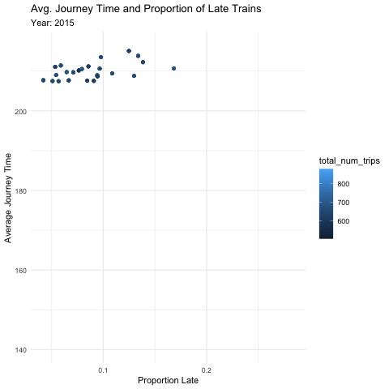
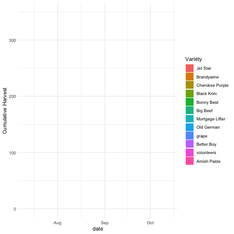
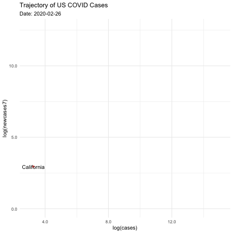

```r
library(tidyverse)     # for data cleaning and plotting
```

```
## ── Attaching packages ─────────────────────────────────────── tidyverse 1.3.0 ──
```

```
## ✓ ggplot2 3.3.3     ✓ purrr   0.3.4
## ✓ tibble  3.0.6     ✓ dplyr   1.0.3
## ✓ tidyr   1.1.2     ✓ stringr 1.4.0
## ✓ readr   1.4.0     ✓ forcats 0.5.0
```

```
## ── Conflicts ────────────────────────────────────────── tidyverse_conflicts() ──
## x dplyr::filter() masks stats::filter()
## x dplyr::lag()    masks stats::lag()
```

```r
library(gardenR)       # for Lisa's garden data
library(babynames)     # I added this one -- babynames
library(lubridate)     # for date manipulation
```

```
## 
## Attaching package: 'lubridate'
```

```
## The following objects are masked from 'package:base':
## 
##     date, intersect, setdiff, union
```

```r
library(openintro)     # for the abbr2state() function
```

```
## Loading required package: airports
```

```
## Loading required package: cherryblossom
```

```
## Loading required package: usdata
```

```
## 
## Attaching package: 'openintro'
```

```
## The following object is masked from 'package:babynames':
## 
##     births
```

```r
library(palmerpenguins)# for Palmer penguin data
library(maps)          # for map data
```

```
## 
## Attaching package: 'maps'
```

```
## The following object is masked from 'package:purrr':
## 
##     map
```

```r
library(ggmap)         # for mapping points on maps
```

```
## Google's Terms of Service: https://cloud.google.com/maps-platform/terms/.
```

```
## Please cite ggmap if you use it! See citation("ggmap") for details.
```

```r
library(gplots)        # for col2hex() function
```

```
## 
## Attaching package: 'gplots'
```

```
## The following object is masked from 'package:stats':
## 
##     lowess
```

```r
library(RColorBrewer)  # for color palettes
library(sf)            # for working with spatial data
```

```
## Linking to GEOS 3.8.1, GDAL 3.1.4, PROJ 6.3.1
```

```r
library(leaflet)       # for highly customizable mapping
library(ggthemes)      # for more themes (including theme_map())
library(plotly)        # for the ggplotly() - basic interactivity
```

```
## 
## Attaching package: 'plotly'
```

```
## The following object is masked from 'package:ggmap':
## 
##     wind
```

```
## The following object is masked from 'package:ggplot2':
## 
##     last_plot
```

```
## The following object is masked from 'package:stats':
## 
##     filter
```

```
## The following object is masked from 'package:graphics':
## 
##     layout
```

```r
library(gganimate)     # for adding animation layers to ggplots
library(transformr)    # for "tweening" (gganimate)
```

```
## 
## Attaching package: 'transformr'
```

```
## The following object is masked from 'package:sf':
## 
##     st_normalize
```

```r
library(gifski)        # need the library for creating gifs but don't need to load each time
library(shiny)         # for creating interactive apps
theme_set(theme_minimal())
```


```r
# SNCF Train data
small_trains <- read_csv("https://raw.githubusercontent.com/rfordatascience/tidytuesday/master/data/2019/2019-02-26/small_trains.csv") 
```

```
## 
## ── Column specification ────────────────────────────────────────────────────────
## cols(
##   year = col_double(),
##   month = col_double(),
##   service = col_character(),
##   departure_station = col_character(),
##   arrival_station = col_character(),
##   journey_time_avg = col_double(),
##   total_num_trips = col_double(),
##   avg_delay_all_departing = col_double(),
##   avg_delay_all_arriving = col_double(),
##   num_late_at_departure = col_double(),
##   num_arriving_late = col_double(),
##   delay_cause = col_character(),
##   delayed_number = col_double()
## )
```

```r
# Lisa's garden data
data("garden_harvest")

# Lisa's Mallorca cycling data
mallorca_bike_day7 <- read_csv("https://www.dropbox.com/s/zc6jan4ltmjtvy0/mallorca_bike_day7.csv?dl=1") %>% 
  select(1:4, speed)
```

```
## 
## ── Column specification ────────────────────────────────────────────────────────
## cols(
##   lon = col_double(),
##   lat = col_double(),
##   ele = col_double(),
##   time = col_datetime(format = ""),
##   extensions = col_double(),
##   ele.num = col_double(),
##   date = col_date(format = ""),
##   hrminsec = col_datetime(format = ""),
##   time_hr = col_double(),
##   dist_km = col_double(),
##   speed = col_double()
## )
```

```r
# Heather Lendway's Ironman 70.3 Pan Am championships Panama data
panama_swim <- read_csv("https://raw.githubusercontent.com/llendway/gps-data/master/data/panama_swim_20160131.csv")
```

```
## 
## ── Column specification ────────────────────────────────────────────────────────
## cols(
##   lon = col_double(),
##   lat = col_double(),
##   time = col_datetime(format = ""),
##   extensions = col_double(),
##   ele = col_logical(),
##   event = col_character(),
##   date = col_date(format = ""),
##   hrminsec = col_datetime(format = "")
## )
```

```r
panama_bike <- read_csv("https://raw.githubusercontent.com/llendway/gps-data/master/data/panama_bike_20160131.csv")
```

```
## 
## ── Column specification ────────────────────────────────────────────────────────
## cols(
##   lon = col_double(),
##   lat = col_double(),
##   ele = col_double(),
##   time = col_datetime(format = ""),
##   extensions = col_double(),
##   event = col_character(),
##   date = col_date(format = ""),
##   hrminsec = col_datetime(format = "")
## )
```

```r
panama_run <- read_csv("https://raw.githubusercontent.com/llendway/gps-data/master/data/panama_run_20160131.csv")
```

```
## 
## ── Column specification ────────────────────────────────────────────────────────
## cols(
##   lon = col_double(),
##   lat = col_double(),
##   ele = col_double(),
##   time = col_datetime(format = ""),
##   extensions = col_double(),
##   event = col_character(),
##   date = col_date(format = ""),
##   hrminsec = col_datetime(format = "")
## )
```

```r
#COVID-19 data from the New York Times
covid19 <- read_csv("https://raw.githubusercontent.com/nytimes/covid-19-data/master/us-states.csv")
```

```
## 
## ── Column specification ────────────────────────────────────────────────────────
## cols(
##   date = col_date(format = ""),
##   state = col_character(),
##   fips = col_character(),
##   cases = col_double(),
##   deaths = col_double()
## )
```

## Put your homework on GitHub!

Go [here](https://github.com/llendway/github_for_collaboration/blob/master/github_for_collaboration.md) or to previous homework to remind yourself how to get set up. 

Once your repository is created, you should always open your **project** rather than just opening an .Rmd file. You can do that by either clicking on the .Rproj file in your repository folder on your computer. Or, by going to the upper right hand corner in R Studio and clicking the arrow next to where it says Project: (None). You should see your project come up in that list if you've used it recently. You could also go to File --> Open Project and navigate to your .Rproj file. 

## Instructions

* Put your name at the top of the document. 

* **For ALL graphs, you should include appropriate labels.** 

* Feel free to change the default theme, which I currently have set to `theme_minimal()`. 

* Use good coding practice. Read the short sections on good code with [pipes](https://style.tidyverse.org/pipes.html) and [ggplot2](https://style.tidyverse.org/ggplot2.html). **This is part of your grade!**

* **NEW!!** With animated graphs, add `eval=FALSE` to the code chunk that creates the animation and saves it using `anim_save()`. Add another code chunk to reread the gif back into the file. See the [tutorial](https://animation-and-interactivity-in-r.netlify.app/) for help. 

* When you are finished with ALL the exercises, uncomment the options at the top so your document looks nicer. Don't do it before then, or else you might miss some important warnings and messages.

## Warm-up exercises from tutorial

  1. Choose 2 graphs you have created for ANY assignment in this class and add interactivity using the `ggplotly()` function.
  

```r
penguins_graph <- penguins %>% 
  ggplot(mapping = aes(x=bill_length_mm,)) +
  geom_histogram(fill = "dodgerblue4") +
  labs(title = "Penguin Bill Length")

ggplotly(penguins_graph)
```

```
## `stat_bin()` using `bins = 30`. Pick better value with `binwidth`.
```

```
## Warning: Removed 2 rows containing non-finite values (stat_bin).
```

```{=html}
<div id="htmlwidget-7374e25fb58e65c60c90" style="width:672px;height:480px;" class="plotly html-widget"></div>
<script type="application/json" data-for="htmlwidget-7374e25fb58e65c60c90">{"x":{"data":[{"orientation":"v","width":[0.948275862068968,0.948275862068968,0.948275862068954,0.948275862068968,0.948275862068968,0.948275862068968,0.948275862068954,0.948275862068968,0.948275862068954,0.948275862068968,0.948275862068968,0.948275862068968,0.948275862068954,0.948275862068968,0.948275862068954,0.948275862068968,0.948275862068968,0.948275862068968,0.948275862068954,0.948275862068954,0.948275862068968,0.948275862068968,0.948275862068968,0.948275862068968,0.948275862068954,0.948275862068954,0.948275862068968,0.948275862068968,0.948275862068968,0.948275862068954],"base":[0,0,0,0,0,0,0,0,0,0,0,0,0,0,0,0,0,0,0,0,0,0,0,0,0,0,0,0,0,0],"x":[32.2413793103448,33.1896551724138,34.1379310344828,35.0862068965517,36.0344827586207,36.9827586206897,37.9310344827586,38.8793103448276,39.8275862068966,40.7758620689655,41.7241379310345,42.6724137931035,43.6206896551724,44.5689655172414,45.5172413793103,46.4655172413793,47.4137931034483,48.3620689655172,49.3103448275862,50.2586206896552,51.2068965517241,52.1551724137931,53.1034482758621,54.051724137931,55,55.948275862069,56.8965517241379,57.8448275862069,58.7931034482759,59.7413793103448],"y":[1,2,6,7,18,13,22,18,19,21,13,15,13,9,27,30,14,15,18,25,16,9,4,2,1,2,0,1,0,1],"text":["count:  1<br />bill_length_mm: 32.24138","count:  2<br />bill_length_mm: 33.18966","count:  6<br />bill_length_mm: 34.13793","count:  7<br />bill_length_mm: 35.08621","count: 18<br />bill_length_mm: 36.03448","count: 13<br />bill_length_mm: 36.98276","count: 22<br />bill_length_mm: 37.93103","count: 18<br />bill_length_mm: 38.87931","count: 19<br />bill_length_mm: 39.82759","count: 21<br />bill_length_mm: 40.77586","count: 13<br />bill_length_mm: 41.72414","count: 15<br />bill_length_mm: 42.67241","count: 13<br />bill_length_mm: 43.62069","count:  9<br />bill_length_mm: 44.56897","count: 27<br />bill_length_mm: 45.51724","count: 30<br />bill_length_mm: 46.46552","count: 14<br />bill_length_mm: 47.41379","count: 15<br />bill_length_mm: 48.36207","count: 18<br />bill_length_mm: 49.31034","count: 25<br />bill_length_mm: 50.25862","count: 16<br />bill_length_mm: 51.20690","count:  9<br />bill_length_mm: 52.15517","count:  4<br />bill_length_mm: 53.10345","count:  2<br />bill_length_mm: 54.05172","count:  1<br />bill_length_mm: 55.00000","count:  2<br />bill_length_mm: 55.94828","count:  0<br />bill_length_mm: 56.89655","count:  1<br />bill_length_mm: 57.84483","count:  0<br />bill_length_mm: 58.79310","count:  1<br />bill_length_mm: 59.74138"],"type":"bar","marker":{"autocolorscale":false,"color":"rgba(16,78,139,1)","line":{"width":1.88976377952756,"color":"transparent"}},"showlegend":false,"xaxis":"x","yaxis":"y","hoverinfo":"text","frame":null}],"layout":{"margin":{"t":43.7625570776256,"r":7.30593607305936,"b":40.1826484018265,"l":37.2602739726027},"font":{"color":"rgba(0,0,0,1)","family":"","size":14.6118721461187},"title":{"text":"Penguin Bill Length","font":{"color":"rgba(0,0,0,1)","family":"","size":17.5342465753425},"x":0,"xref":"paper"},"xaxis":{"domain":[0,1],"automargin":true,"type":"linear","autorange":false,"range":[30.3448275862069,61.6379310344827],"tickmode":"array","ticktext":["40","50","60"],"tickvals":[40,50,60],"categoryorder":"array","categoryarray":["40","50","60"],"nticks":null,"ticks":"","tickcolor":null,"ticklen":3.65296803652968,"tickwidth":0,"showticklabels":true,"tickfont":{"color":"rgba(77,77,77,1)","family":"","size":11.689497716895},"tickangle":-0,"showline":false,"linecolor":null,"linewidth":0,"showgrid":true,"gridcolor":"rgba(235,235,235,1)","gridwidth":0.66417600664176,"zeroline":false,"anchor":"y","title":{"text":"bill_length_mm","font":{"color":"rgba(0,0,0,1)","family":"","size":14.6118721461187}},"hoverformat":".2f"},"yaxis":{"domain":[0,1],"automargin":true,"type":"linear","autorange":false,"range":[-1.5,31.5],"tickmode":"array","ticktext":["0","10","20","30"],"tickvals":[0,10,20,30],"categoryorder":"array","categoryarray":["0","10","20","30"],"nticks":null,"ticks":"","tickcolor":null,"ticklen":3.65296803652968,"tickwidth":0,"showticklabels":true,"tickfont":{"color":"rgba(77,77,77,1)","family":"","size":11.689497716895},"tickangle":-0,"showline":false,"linecolor":null,"linewidth":0,"showgrid":true,"gridcolor":"rgba(235,235,235,1)","gridwidth":0.66417600664176,"zeroline":false,"anchor":"x","title":{"text":"count","font":{"color":"rgba(0,0,0,1)","family":"","size":14.6118721461187}},"hoverformat":".2f"},"shapes":[{"type":"rect","fillcolor":null,"line":{"color":null,"width":0,"linetype":[]},"yref":"paper","xref":"paper","x0":0,"x1":1,"y0":0,"y1":1}],"showlegend":false,"legend":{"bgcolor":null,"bordercolor":null,"borderwidth":0,"font":{"color":"rgba(0,0,0,1)","family":"","size":11.689497716895}},"hovermode":"closest","barmode":"relative"},"config":{"doubleClick":"reset","showSendToCloud":false},"source":"A","attrs":{"e02116bfb00a":{"x":{},"type":"bar"}},"cur_data":"e02116bfb00a","visdat":{"e02116bfb00a":["function (y) ","x"]},"highlight":{"on":"plotly_click","persistent":false,"dynamic":false,"selectize":false,"opacityDim":0.2,"selected":{"opacity":1},"debounce":0},"shinyEvents":["plotly_hover","plotly_click","plotly_selected","plotly_relayout","plotly_brushed","plotly_brushing","plotly_clickannotation","plotly_doubleclick","plotly_deselect","plotly_afterplot","plotly_sunburstclick"],"base_url":"https://plot.ly"},"evals":[],"jsHooks":[]}</script>
```


```r
babynames3.0 <- babynames %>%
  group_by(year, sex) %>%
  arrange(desc(n)) %>%
  slice(1:10)

baby_graph <- babynames3.0 %>%
  group_by(year, sex) %>%
  mutate(top10prop = sum(prop)) %>%
  ggplot(aes(x = year, y = top10prop,color = sex)) +
    geom_line() + 
    labs(title = "Proportion of Babies With the 10 Most Popular Names",
       x = "Year",
       y = "Proportion")

ggplotly(baby_graph)
```

```{=html}
<div id="htmlwidget-82de152b3d9fdb991166" style="width:672px;height:480px;" class="plotly html-widget"></div>
<script type="application/json" data-for="htmlwidget-82de152b3d9fdb991166">{"x":{"data":[{"x":[1880,1880,1880,1880,1880,1880,1880,1880,1880,1880,1881,1881,1881,1881,1881,1881,1881,1881,1881,1881,1882,1882,1882,1882,1882,1882,1882,1882,1882,1882,1883,1883,1883,1883,1883,1883,1883,1883,1883,1883,1884,1884,1884,1884,1884,1884,1884,1884,1884,1884,1885,1885,1885,1885,1885,1885,1885,1885,1885,1885,1886,1886,1886,1886,1886,1886,1886,1886,1886,1886,1887,1887,1887,1887,1887,1887,1887,1887,1887,1887,1888,1888,1888,1888,1888,1888,1888,1888,1888,1888,1889,1889,1889,1889,1889,1889,1889,1889,1889,1889,1890,1890,1890,1890,1890,1890,1890,1890,1890,1890,1891,1891,1891,1891,1891,1891,1891,1891,1891,1891,1892,1892,1892,1892,1892,1892,1892,1892,1892,1892,1893,1893,1893,1893,1893,1893,1893,1893,1893,1893,1894,1894,1894,1894,1894,1894,1894,1894,1894,1894,1895,1895,1895,1895,1895,1895,1895,1895,1895,1895,1896,1896,1896,1896,1896,1896,1896,1896,1896,1896,1897,1897,1897,1897,1897,1897,1897,1897,1897,1897,1898,1898,1898,1898,1898,1898,1898,1898,1898,1898,1899,1899,1899,1899,1899,1899,1899,1899,1899,1899,1900,1900,1900,1900,1900,1900,1900,1900,1900,1900,1901,1901,1901,1901,1901,1901,1901,1901,1901,1901,1902,1902,1902,1902,1902,1902,1902,1902,1902,1902,1903,1903,1903,1903,1903,1903,1903,1903,1903,1903,1904,1904,1904,1904,1904,1904,1904,1904,1904,1904,1905,1905,1905,1905,1905,1905,1905,1905,1905,1905,1906,1906,1906,1906,1906,1906,1906,1906,1906,1906,1907,1907,1907,1907,1907,1907,1907,1907,1907,1907,1908,1908,1908,1908,1908,1908,1908,1908,1908,1908,1909,1909,1909,1909,1909,1909,1909,1909,1909,1909,1910,1910,1910,1910,1910,1910,1910,1910,1910,1910,1911,1911,1911,1911,1911,1911,1911,1911,1911,1911,1912,1912,1912,1912,1912,1912,1912,1912,1912,1912,1913,1913,1913,1913,1913,1913,1913,1913,1913,1913,1914,1914,1914,1914,1914,1914,1914,1914,1914,1914,1915,1915,1915,1915,1915,1915,1915,1915,1915,1915,1916,1916,1916,1916,1916,1916,1916,1916,1916,1916,1917,1917,1917,1917,1917,1917,1917,1917,1917,1917,1918,1918,1918,1918,1918,1918,1918,1918,1918,1918,1919,1919,1919,1919,1919,1919,1919,1919,1919,1919,1920,1920,1920,1920,1920,1920,1920,1920,1920,1920,1921,1921,1921,1921,1921,1921,1921,1921,1921,1921,1922,1922,1922,1922,1922,1922,1922,1922,1922,1922,1923,1923,1923,1923,1923,1923,1923,1923,1923,1923,1924,1924,1924,1924,1924,1924,1924,1924,1924,1924,1925,1925,1925,1925,1925,1925,1925,1925,1925,1925,1926,1926,1926,1926,1926,1926,1926,1926,1926,1926,1927,1927,1927,1927,1927,1927,1927,1927,1927,1927,1928,1928,1928,1928,1928,1928,1928,1928,1928,1928,1929,1929,1929,1929,1929,1929,1929,1929,1929,1929,1930,1930,1930,1930,1930,1930,1930,1930,1930,1930,1931,1931,1931,1931,1931,1931,1931,1931,1931,1931,1932,1932,1932,1932,1932,1932,1932,1932,1932,1932,1933,1933,1933,1933,1933,1933,1933,1933,1933,1933,1934,1934,1934,1934,1934,1934,1934,1934,1934,1934,1935,1935,1935,1935,1935,1935,1935,1935,1935,1935,1936,1936,1936,1936,1936,1936,1936,1936,1936,1936,1937,1937,1937,1937,1937,1937,1937,1937,1937,1937,1938,1938,1938,1938,1938,1938,1938,1938,1938,1938,1939,1939,1939,1939,1939,1939,1939,1939,1939,1939,1940,1940,1940,1940,1940,1940,1940,1940,1940,1940,1941,1941,1941,1941,1941,1941,1941,1941,1941,1941,1942,1942,1942,1942,1942,1942,1942,1942,1942,1942,1943,1943,1943,1943,1943,1943,1943,1943,1943,1943,1944,1944,1944,1944,1944,1944,1944,1944,1944,1944,1945,1945,1945,1945,1945,1945,1945,1945,1945,1945,1946,1946,1946,1946,1946,1946,1946,1946,1946,1946,1947,1947,1947,1947,1947,1947,1947,1947,1947,1947,1948,1948,1948,1948,1948,1948,1948,1948,1948,1948,1949,1949,1949,1949,1949,1949,1949,1949,1949,1949,1950,1950,1950,1950,1950,1950,1950,1950,1950,1950,1951,1951,1951,1951,1951,1951,1951,1951,1951,1951,1952,1952,1952,1952,1952,1952,1952,1952,1952,1952,1953,1953,1953,1953,1953,1953,1953,1953,1953,1953,1954,1954,1954,1954,1954,1954,1954,1954,1954,1954,1955,1955,1955,1955,1955,1955,1955,1955,1955,1955,1956,1956,1956,1956,1956,1956,1956,1956,1956,1956,1957,1957,1957,1957,1957,1957,1957,1957,1957,1957,1958,1958,1958,1958,1958,1958,1958,1958,1958,1958,1959,1959,1959,1959,1959,1959,1959,1959,1959,1959,1960,1960,1960,1960,1960,1960,1960,1960,1960,1960,1961,1961,1961,1961,1961,1961,1961,1961,1961,1961,1962,1962,1962,1962,1962,1962,1962,1962,1962,1962,1963,1963,1963,1963,1963,1963,1963,1963,1963,1963,1964,1964,1964,1964,1964,1964,1964,1964,1964,1964,1965,1965,1965,1965,1965,1965,1965,1965,1965,1965,1966,1966,1966,1966,1966,1966,1966,1966,1966,1966,1967,1967,1967,1967,1967,1967,1967,1967,1967,1967,1968,1968,1968,1968,1968,1968,1968,1968,1968,1968,1969,1969,1969,1969,1969,1969,1969,1969,1969,1969,1970,1970,1970,1970,1970,1970,1970,1970,1970,1970,1971,1971,1971,1971,1971,1971,1971,1971,1971,1971,1972,1972,1972,1972,1972,1972,1972,1972,1972,1972,1973,1973,1973,1973,1973,1973,1973,1973,1973,1973,1974,1974,1974,1974,1974,1974,1974,1974,1974,1974,1975,1975,1975,1975,1975,1975,1975,1975,1975,1975,1976,1976,1976,1976,1976,1976,1976,1976,1976,1976,1977,1977,1977,1977,1977,1977,1977,1977,1977,1977,1978,1978,1978,1978,1978,1978,1978,1978,1978,1978,1979,1979,1979,1979,1979,1979,1979,1979,1979,1979,1980,1980,1980,1980,1980,1980,1980,1980,1980,1980,1981,1981,1981,1981,1981,1981,1981,1981,1981,1981,1982,1982,1982,1982,1982,1982,1982,1982,1982,1982,1983,1983,1983,1983,1983,1983,1983,1983,1983,1983,1984,1984,1984,1984,1984,1984,1984,1984,1984,1984,1985,1985,1985,1985,1985,1985,1985,1985,1985,1985,1986,1986,1986,1986,1986,1986,1986,1986,1986,1986,1987,1987,1987,1987,1987,1987,1987,1987,1987,1987,1988,1988,1988,1988,1988,1988,1988,1988,1988,1988,1989,1989,1989,1989,1989,1989,1989,1989,1989,1989,1990,1990,1990,1990,1990,1990,1990,1990,1990,1990,1991,1991,1991,1991,1991,1991,1991,1991,1991,1991,1992,1992,1992,1992,1992,1992,1992,1992,1992,1992,1993,1993,1993,1993,1993,1993,1993,1993,1993,1993,1994,1994,1994,1994,1994,1994,1994,1994,1994,1994,1995,1995,1995,1995,1995,1995,1995,1995,1995,1995,1996,1996,1996,1996,1996,1996,1996,1996,1996,1996,1997,1997,1997,1997,1997,1997,1997,1997,1997,1997,1998,1998,1998,1998,1998,1998,1998,1998,1998,1998,1999,1999,1999,1999,1999,1999,1999,1999,1999,1999,2000,2000,2000,2000,2000,2000,2000,2000,2000,2000,2001,2001,2001,2001,2001,2001,2001,2001,2001,2001,2002,2002,2002,2002,2002,2002,2002,2002,2002,2002,2003,2003,2003,2003,2003,2003,2003,2003,2003,2003,2004,2004,2004,2004,2004,2004,2004,2004,2004,2004,2005,2005,2005,2005,2005,2005,2005,2005,2005,2005,2006,2006,2006,2006,2006,2006,2006,2006,2006,2006,2007,2007,2007,2007,2007,2007,2007,2007,2007,2007,2008,2008,2008,2008,2008,2008,2008,2008,2008,2008,2009,2009,2009,2009,2009,2009,2009,2009,2009,2009,2010,2010,2010,2010,2010,2010,2010,2010,2010,2010,2011,2011,2011,2011,2011,2011,2011,2011,2011,2011,2012,2012,2012,2012,2012,2012,2012,2012,2012,2012,2013,2013,2013,2013,2013,2013,2013,2013,2013,2013,2014,2014,2014,2014,2014,2014,2014,2014,2014,2014,2015,2015,2015,2015,2015,2015,2015,2015,2015,2015,2016,2016,2016,2016,2016,2016,2016,2016,2016,2016,2017,2017,2017,2017,2017,2017,2017,2017,2017,2017],"y":[0.22979356,0.22979356,0.22979356,0.22979356,0.22979356,0.22979356,0.22979356,0.22979356,0.22979356,0.22979356,0.22468261,0.22468261,0.22468261,0.22468261,0.22468261,0.22468261,0.22468261,0.22468261,0.22468261,0.22468261,0.22317301,0.22317301,0.22317301,0.22317301,0.22317301,0.22317301,0.22317301,0.22317301,0.22317301,0.22317301,0.21912561,0.21912561,0.21912561,0.21912561,0.21912561,0.21912561,0.21912561,0.21912561,0.21912561,0.21912561,0.2170279,0.2170279,0.2170279,0.2170279,0.2170279,0.2170279,0.2170279,0.2170279,0.2170279,0.2170279,0.21233832,0.21233832,0.21233832,0.21233832,0.21233832,0.21233832,0.21233832,0.21233832,0.21233832,0.21233832,0.2087293,0.2087293,0.2087293,0.2087293,0.2087293,0.2087293,0.2087293,0.2087293,0.2087293,0.2087293,0.20583315,0.20583315,0.20583315,0.20583315,0.20583315,0.20583315,0.20583315,0.20583315,0.20583315,0.20583315,0.20138298,0.20138298,0.20138298,0.20138298,0.20138298,0.20138298,0.20138298,0.20138298,0.20138298,0.20138298,0.19967868,0.19967868,0.19967868,0.19967868,0.19967868,0.19967868,0.19967868,0.19967868,0.19967868,0.19967868,0.19586831,0.19586831,0.19586831,0.19586831,0.19586831,0.19586831,0.19586831,0.19586831,0.19586831,0.19586831,0.19551193,0.19551193,0.19551193,0.19551193,0.19551193,0.19551193,0.19551193,0.19551193,0.19551193,0.19551193,0.19480422,0.19480422,0.19480422,0.19480422,0.19480422,0.19480422,0.19480422,0.19480422,0.19480422,0.19480422,0.19647296,0.19647296,0.19647296,0.19647296,0.19647296,0.19647296,0.19647296,0.19647296,0.19647296,0.19647296,0.19068022,0.19068022,0.19068022,0.19068022,0.19068022,0.19068022,0.19068022,0.19068022,0.19068022,0.19068022,0.19153319,0.19153319,0.19153319,0.19153319,0.19153319,0.19153319,0.19153319,0.19153319,0.19153319,0.19153319,0.1915688,0.1915688,0.1915688,0.1915688,0.1915688,0.1915688,0.1915688,0.1915688,0.1915688,0.1915688,0.18992648,0.18992648,0.18992648,0.18992648,0.18992648,0.18992648,0.18992648,0.18992648,0.18992648,0.18992648,0.18906122,0.18906122,0.18906122,0.18906122,0.18906122,0.18906122,0.18906122,0.18906122,0.18906122,0.18906122,0.18972482,0.18972482,0.18972482,0.18972482,0.18972482,0.18972482,0.18972482,0.18972482,0.18972482,0.18972482,0.18383519,0.18383519,0.18383519,0.18383519,0.18383519,0.18383519,0.18383519,0.18383519,0.18383519,0.18383519,0.18469962,0.18469962,0.18469962,0.18469962,0.18469962,0.18469962,0.18469962,0.18469962,0.18469962,0.18469962,0.18618148,0.18618148,0.18618148,0.18618148,0.18618148,0.18618148,0.18618148,0.18618148,0.18618148,0.18618148,0.18717379,0.18717379,0.18717379,0.18717379,0.18717379,0.18717379,0.18717379,0.18717379,0.18717379,0.18717379,0.1880172,0.1880172,0.1880172,0.1880172,0.1880172,0.1880172,0.1880172,0.1880172,0.1880172,0.1880172,0.18759782,0.18759782,0.18759782,0.18759782,0.18759782,0.18759782,0.18759782,0.18759782,0.18759782,0.18759782,0.19361599,0.19361599,0.19361599,0.19361599,0.19361599,0.19361599,0.19361599,0.19361599,0.19361599,0.19361599,0.19225982,0.19225982,0.19225982,0.19225982,0.19225982,0.19225982,0.19225982,0.19225982,0.19225982,0.19225982,0.1965893,0.1965893,0.1965893,0.1965893,0.1965893,0.1965893,0.1965893,0.1965893,0.1965893,0.1965893,0.19868459,0.19868459,0.19868459,0.19868459,0.19868459,0.19868459,0.19868459,0.19868459,0.19868459,0.19868459,0.1989674,0.1989674,0.1989674,0.1989674,0.1989674,0.1989674,0.1989674,0.1989674,0.1989674,0.1989674,0.20743383,0.20743383,0.20743383,0.20743383,0.20743383,0.20743383,0.20743383,0.20743383,0.20743383,0.20743383,0.21151264,0.21151264,0.21151264,0.21151264,0.21151264,0.21151264,0.21151264,0.21151264,0.21151264,0.21151264,0.21599665,0.21599665,0.21599665,0.21599665,0.21599665,0.21599665,0.21599665,0.21599665,0.21599665,0.21599665,0.21884615,0.21884615,0.21884615,0.21884615,0.21884615,0.21884615,0.21884615,0.21884615,0.21884615,0.21884615,0.22268029,0.22268029,0.22268029,0.22268029,0.22268029,0.22268029,0.22268029,0.22268029,0.22268029,0.22268029,0.22260967,0.22260967,0.22260967,0.22260967,0.22260967,0.22260967,0.22260967,0.22260967,0.22260967,0.22260967,0.22397744,0.22397744,0.22397744,0.22397744,0.22397744,0.22397744,0.22397744,0.22397744,0.22397744,0.22397744,0.22418234,0.22418234,0.22418234,0.22418234,0.22418234,0.22418234,0.22418234,0.22418234,0.22418234,0.22418234,0.22126798,0.22126798,0.22126798,0.22126798,0.22126798,0.22126798,0.22126798,0.22126798,0.22126798,0.22126798,0.22391821,0.22391821,0.22391821,0.22391821,0.22391821,0.22391821,0.22391821,0.22391821,0.22391821,0.22391821,0.22542824,0.22542824,0.22542824,0.22542824,0.22542824,0.22542824,0.22542824,0.22542824,0.22542824,0.22542824,0.22414705,0.22414705,0.22414705,0.22414705,0.22414705,0.22414705,0.22414705,0.22414705,0.22414705,0.22414705,0.22562398,0.22562398,0.22562398,0.22562398,0.22562398,0.22562398,0.22562398,0.22562398,0.22562398,0.22562398,0.22452548,0.22452548,0.22452548,0.22452548,0.22452548,0.22452548,0.22452548,0.22452548,0.22452548,0.22452548,0.22153317,0.22153317,0.22153317,0.22153317,0.22153317,0.22153317,0.22153317,0.22153317,0.22153317,0.22153317,0.21700082,0.21700082,0.21700082,0.21700082,0.21700082,0.21700082,0.21700082,0.21700082,0.21700082,0.21700082,0.21632211,0.21632211,0.21632211,0.21632211,0.21632211,0.21632211,0.21632211,0.21632211,0.21632211,0.21632211,0.21575071,0.21575071,0.21575071,0.21575071,0.21575071,0.21575071,0.21575071,0.21575071,0.21575071,0.21575071,0.21477278,0.21477278,0.21477278,0.21477278,0.21477278,0.21477278,0.21477278,0.21477278,0.21477278,0.21477278,0.21516293,0.21516293,0.21516293,0.21516293,0.21516293,0.21516293,0.21516293,0.21516293,0.21516293,0.21516293,0.22047797,0.22047797,0.22047797,0.22047797,0.22047797,0.22047797,0.22047797,0.22047797,0.22047797,0.22047797,0.22139859,0.22139859,0.22139859,0.22139859,0.22139859,0.22139859,0.22139859,0.22139859,0.22139859,0.22139859,0.22005744,0.22005744,0.22005744,0.22005744,0.22005744,0.22005744,0.22005744,0.22005744,0.22005744,0.22005744,0.22586337,0.22586337,0.22586337,0.22586337,0.22586337,0.22586337,0.22586337,0.22586337,0.22586337,0.22586337,0.23864412,0.23864412,0.23864412,0.23864412,0.23864412,0.23864412,0.23864412,0.23864412,0.23864412,0.23864412,0.23350356,0.23350356,0.23350356,0.23350356,0.23350356,0.23350356,0.23350356,0.23350356,0.23350356,0.23350356,0.22777423,0.22777423,0.22777423,0.22777423,0.22777423,0.22777423,0.22777423,0.22777423,0.22777423,0.22777423,0.2248793,0.2248793,0.2248793,0.2248793,0.2248793,0.2248793,0.2248793,0.2248793,0.2248793,0.2248793,0.22273935,0.22273935,0.22273935,0.22273935,0.22273935,0.22273935,0.22273935,0.22273935,0.22273935,0.22273935,0.22344062,0.22344062,0.22344062,0.22344062,0.22344062,0.22344062,0.22344062,0.22344062,0.22344062,0.22344062,0.22790095,0.22790095,0.22790095,0.22790095,0.22790095,0.22790095,0.22790095,0.22790095,0.22790095,0.22790095,0.2330699,0.2330699,0.2330699,0.2330699,0.2330699,0.2330699,0.2330699,0.2330699,0.2330699,0.2330699,0.23746965,0.23746965,0.23746965,0.23746965,0.23746965,0.23746965,0.23746965,0.23746965,0.23746965,0.23746965,0.23510324,0.23510324,0.23510324,0.23510324,0.23510324,0.23510324,0.23510324,0.23510324,0.23510324,0.23510324,0.23152837,0.23152837,0.23152837,0.23152837,0.23152837,0.23152837,0.23152837,0.23152837,0.23152837,0.23152837,0.23828328,0.23828328,0.23828328,0.23828328,0.23828328,0.23828328,0.23828328,0.23828328,0.23828328,0.23828328,0.25096173,0.25096173,0.25096173,0.25096173,0.25096173,0.25096173,0.25096173,0.25096173,0.25096173,0.25096173,0.24825317,0.24825317,0.24825317,0.24825317,0.24825317,0.24825317,0.24825317,0.24825317,0.24825317,0.24825317,0.24109766,0.24109766,0.24109766,0.24109766,0.24109766,0.24109766,0.24109766,0.24109766,0.24109766,0.24109766,0.23477525,0.23477525,0.23477525,0.23477525,0.23477525,0.23477525,0.23477525,0.23477525,0.23477525,0.23477525,0.2337289,0.2337289,0.2337289,0.2337289,0.2337289,0.2337289,0.2337289,0.2337289,0.2337289,0.2337289,0.22631418,0.22631418,0.22631418,0.22631418,0.22631418,0.22631418,0.22631418,0.22631418,0.22631418,0.22631418,0.22531969,0.22531969,0.22531969,0.22531969,0.22531969,0.22531969,0.22531969,0.22531969,0.22531969,0.22531969,0.22451187,0.22451187,0.22451187,0.22451187,0.22451187,0.22451187,0.22451187,0.22451187,0.22451187,0.22451187,0.21734938,0.21734938,0.21734938,0.21734938,0.21734938,0.21734938,0.21734938,0.21734938,0.21734938,0.21734938,0.20899573,0.20899573,0.20899573,0.20899573,0.20899573,0.20899573,0.20899573,0.20899573,0.20899573,0.20899573,0.19606569,0.19606569,0.19606569,0.19606569,0.19606569,0.19606569,0.19606569,0.19606569,0.19606569,0.19606569,0.1809198,0.1809198,0.1809198,0.1809198,0.1809198,0.1809198,0.1809198,0.1809198,0.1809198,0.1809198,0.17403132,0.17403132,0.17403132,0.17403132,0.17403132,0.17403132,0.17403132,0.17403132,0.17403132,0.17403132,0.16492942,0.16492942,0.16492942,0.16492942,0.16492942,0.16492942,0.16492942,0.16492942,0.16492942,0.16492942,0.15812077,0.15812077,0.15812077,0.15812077,0.15812077,0.15812077,0.15812077,0.15812077,0.15812077,0.15812077,0.15469394,0.15469394,0.15469394,0.15469394,0.15469394,0.15469394,0.15469394,0.15469394,0.15469394,0.15469394,0.15577532,0.15577532,0.15577532,0.15577532,0.15577532,0.15577532,0.15577532,0.15577532,0.15577532,0.15577532,0.15075044,0.15075044,0.15075044,0.15075044,0.15075044,0.15075044,0.15075044,0.15075044,0.15075044,0.15075044,0.15495253,0.15495253,0.15495253,0.15495253,0.15495253,0.15495253,0.15495253,0.15495253,0.15495253,0.15495253,0.15372868,0.15372868,0.15372868,0.15372868,0.15372868,0.15372868,0.15372868,0.15372868,0.15372868,0.15372868,0.15162238,0.15162238,0.15162238,0.15162238,0.15162238,0.15162238,0.15162238,0.15162238,0.15162238,0.15162238,0.1548654,0.1548654,0.1548654,0.1548654,0.1548654,0.1548654,0.1548654,0.1548654,0.1548654,0.1548654,0.15231671,0.15231671,0.15231671,0.15231671,0.15231671,0.15231671,0.15231671,0.15231671,0.15231671,0.15231671,0.15527197,0.15527197,0.15527197,0.15527197,0.15527197,0.15527197,0.15527197,0.15527197,0.15527197,0.15527197,0.15934581,0.15934581,0.15934581,0.15934581,0.15934581,0.15934581,0.15934581,0.15934581,0.15934581,0.15934581,0.16596836,0.16596836,0.16596836,0.16596836,0.16596836,0.16596836,0.16596836,0.16596836,0.16596836,0.16596836,0.16563592,0.16563592,0.16563592,0.16563592,0.16563592,0.16563592,0.16563592,0.16563592,0.16563592,0.16563592,0.16664814,0.16664814,0.16664814,0.16664814,0.16664814,0.16664814,0.16664814,0.16664814,0.16664814,0.16664814,0.16234179,0.16234179,0.16234179,0.16234179,0.16234179,0.16234179,0.16234179,0.16234179,0.16234179,0.16234179,0.16030587,0.16030587,0.16030587,0.16030587,0.16030587,0.16030587,0.16030587,0.16030587,0.16030587,0.16030587,0.15595474,0.15595474,0.15595474,0.15595474,0.15595474,0.15595474,0.15595474,0.15595474,0.15595474,0.15595474,0.15414448,0.15414448,0.15414448,0.15414448,0.15414448,0.15414448,0.15414448,0.15414448,0.15414448,0.15414448,0.15841959,0.15841959,0.15841959,0.15841959,0.15841959,0.15841959,0.15841959,0.15841959,0.15841959,0.15841959,0.1594525,0.1594525,0.1594525,0.1594525,0.1594525,0.1594525,0.1594525,0.1594525,0.1594525,0.1594525,0.16167403,0.16167403,0.16167403,0.16167403,0.16167403,0.16167403,0.16167403,0.16167403,0.16167403,0.16167403,0.16102837,0.16102837,0.16102837,0.16102837,0.16102837,0.16102837,0.16102837,0.16102837,0.16102837,0.16102837,0.1691605,0.1691605,0.1691605,0.1691605,0.1691605,0.1691605,0.1691605,0.1691605,0.1691605,0.1691605,0.16862094,0.16862094,0.16862094,0.16862094,0.16862094,0.16862094,0.16862094,0.16862094,0.16862094,0.16862094,0.16785824,0.16785824,0.16785824,0.16785824,0.16785824,0.16785824,0.16785824,0.16785824,0.16785824,0.16785824,0.16818985,0.16818985,0.16818985,0.16818985,0.16818985,0.16818985,0.16818985,0.16818985,0.16818985,0.16818985,0.16848586,0.16848586,0.16848586,0.16848586,0.16848586,0.16848586,0.16848586,0.16848586,0.16848586,0.16848586,0.16015093,0.16015093,0.16015093,0.16015093,0.16015093,0.16015093,0.16015093,0.16015093,0.16015093,0.16015093,0.15602771,0.15602771,0.15602771,0.15602771,0.15602771,0.15602771,0.15602771,0.15602771,0.15602771,0.15602771,0.14751587,0.14751587,0.14751587,0.14751587,0.14751587,0.14751587,0.14751587,0.14751587,0.14751587,0.14751587,0.13765028,0.13765028,0.13765028,0.13765028,0.13765028,0.13765028,0.13765028,0.13765028,0.13765028,0.13765028,0.12684598,0.12684598,0.12684598,0.12684598,0.12684598,0.12684598,0.12684598,0.12684598,0.12684598,0.12684598,0.12169797,0.12169797,0.12169797,0.12169797,0.12169797,0.12169797,0.12169797,0.12169797,0.12169797,0.12169797,0.11460042,0.11460042,0.11460042,0.11460042,0.11460042,0.11460042,0.11460042,0.11460042,0.11460042,0.11460042,0.10846454,0.10846454,0.10846454,0.10846454,0.10846454,0.10846454,0.10846454,0.10846454,0.10846454,0.10846454,0.10488439,0.10488439,0.10488439,0.10488439,0.10488439,0.10488439,0.10488439,0.10488439,0.10488439,0.10488439,0.10289772,0.10289772,0.10289772,0.10289772,0.10289772,0.10289772,0.10289772,0.10289772,0.10289772,0.10289772,0.10168017,0.10168017,0.10168017,0.10168017,0.10168017,0.10168017,0.10168017,0.10168017,0.10168017,0.10168017,0.09781451,0.09781451,0.09781451,0.09781451,0.09781451,0.09781451,0.09781451,0.09781451,0.09781451,0.09781451,0.09297298,0.09297298,0.09297298,0.09297298,0.09297298,0.09297298,0.09297298,0.09297298,0.09297298,0.09297298,0.08898052,0.08898052,0.08898052,0.08898052,0.08898052,0.08898052,0.08898052,0.08898052,0.08898052,0.08898052,0.08709309,0.08709309,0.08709309,0.08709309,0.08709309,0.08709309,0.08709309,0.08709309,0.08709309,0.08709309,0.08758327,0.08758327,0.08758327,0.08758327,0.08758327,0.08758327,0.08758327,0.08758327,0.08758327,0.08758327,0.0848583,0.0848583,0.0848583,0.0848583,0.0848583,0.0848583,0.0848583,0.0848583,0.0848583,0.0848583,0.08176072,0.08176072,0.08176072,0.08176072,0.08176072,0.08176072,0.08176072,0.08176072,0.08176072,0.08176072,0.07942707,0.07942707,0.07942707,0.07942707,0.07942707,0.07942707,0.07942707,0.07942707,0.07942707,0.07942707,0.07957835,0.07957835,0.07957835,0.07957835,0.07957835,0.07957835,0.07957835,0.07957835,0.07957835,0.07957835,0.07735872,0.07735872,0.07735872,0.07735872,0.07735872,0.07735872,0.07735872,0.07735872,0.07735872,0.07735872,0.0784621,0.0784621,0.0784621,0.0784621,0.0784621,0.0784621,0.0784621,0.0784621,0.0784621,0.0784621,0.08038006,0.08038006,0.08038006,0.08038006,0.08038006,0.08038006,0.08038006,0.08038006,0.08038006,0.08038006,0.08048693,0.08048693,0.08048693,0.08048693,0.08048693,0.08048693,0.08048693,0.08048693,0.08048693,0.08048693,0.07985945,0.07985945,0.07985945,0.07985945,0.07985945,0.07985945,0.07985945,0.07985945,0.07985945,0.07985945,0.07909012,0.07909012,0.07909012,0.07909012,0.07909012,0.07909012,0.07909012,0.07909012,0.07909012,0.07909012,0.07722637,0.07722637,0.07722637,0.07722637,0.07722637,0.07722637,0.07722637,0.07722637,0.07722637,0.07722637,0.07721312,0.07721312,0.07721312,0.07721312,0.07721312,0.07721312,0.07721312,0.07721312,0.07721312,0.07721312,0.07619483,0.07619483,0.07619483,0.07619483,0.07619483,0.07619483,0.07619483,0.07619483,0.07619483,0.07619483,0.07656892,0.07656892,0.07656892,0.07656892,0.07656892,0.07656892,0.07656892,0.07656892,0.07656892,0.07656892],"text":["year: 1880<br />top10prop: 0.22979356<br />sex: F","year: 1880<br />top10prop: 0.22979356<br />sex: F","year: 1880<br />top10prop: 0.22979356<br />sex: F","year: 1880<br />top10prop: 0.22979356<br />sex: F","year: 1880<br />top10prop: 0.22979356<br />sex: F","year: 1880<br />top10prop: 0.22979356<br />sex: F","year: 1880<br />top10prop: 0.22979356<br />sex: F","year: 1880<br />top10prop: 0.22979356<br />sex: F","year: 1880<br />top10prop: 0.22979356<br />sex: F","year: 1880<br />top10prop: 0.22979356<br />sex: F","year: 1881<br />top10prop: 0.22468261<br />sex: F","year: 1881<br />top10prop: 0.22468261<br />sex: F","year: 1881<br />top10prop: 0.22468261<br />sex: F","year: 1881<br />top10prop: 0.22468261<br />sex: F","year: 1881<br />top10prop: 0.22468261<br />sex: F","year: 1881<br />top10prop: 0.22468261<br />sex: F","year: 1881<br />top10prop: 0.22468261<br />sex: F","year: 1881<br />top10prop: 0.22468261<br />sex: F","year: 1881<br />top10prop: 0.22468261<br />sex: F","year: 1881<br />top10prop: 0.22468261<br />sex: F","year: 1882<br />top10prop: 0.22317301<br />sex: F","year: 1882<br />top10prop: 0.22317301<br />sex: F","year: 1882<br />top10prop: 0.22317301<br />sex: F","year: 1882<br />top10prop: 0.22317301<br />sex: F","year: 1882<br />top10prop: 0.22317301<br />sex: F","year: 1882<br />top10prop: 0.22317301<br />sex: F","year: 1882<br />top10prop: 0.22317301<br />sex: F","year: 1882<br />top10prop: 0.22317301<br />sex: F","year: 1882<br />top10prop: 0.22317301<br />sex: F","year: 1882<br />top10prop: 0.22317301<br />sex: F","year: 1883<br />top10prop: 0.21912561<br />sex: F","year: 1883<br />top10prop: 0.21912561<br />sex: F","year: 1883<br />top10prop: 0.21912561<br />sex: F","year: 1883<br />top10prop: 0.21912561<br />sex: F","year: 1883<br />top10prop: 0.21912561<br />sex: F","year: 1883<br />top10prop: 0.21912561<br />sex: F","year: 1883<br />top10prop: 0.21912561<br />sex: F","year: 1883<br />top10prop: 0.21912561<br />sex: F","year: 1883<br />top10prop: 0.21912561<br />sex: F","year: 1883<br />top10prop: 0.21912561<br />sex: F","year: 1884<br />top10prop: 0.21702790<br />sex: F","year: 1884<br />top10prop: 0.21702790<br />sex: F","year: 1884<br />top10prop: 0.21702790<br />sex: F","year: 1884<br />top10prop: 0.21702790<br />sex: F","year: 1884<br />top10prop: 0.21702790<br />sex: F","year: 1884<br />top10prop: 0.21702790<br />sex: F","year: 1884<br />top10prop: 0.21702790<br />sex: F","year: 1884<br />top10prop: 0.21702790<br />sex: F","year: 1884<br />top10prop: 0.21702790<br />sex: F","year: 1884<br />top10prop: 0.21702790<br />sex: F","year: 1885<br />top10prop: 0.21233832<br />sex: F","year: 1885<br />top10prop: 0.21233832<br />sex: F","year: 1885<br />top10prop: 0.21233832<br />sex: F","year: 1885<br />top10prop: 0.21233832<br />sex: F","year: 1885<br />top10prop: 0.21233832<br />sex: F","year: 1885<br />top10prop: 0.21233832<br />sex: F","year: 1885<br />top10prop: 0.21233832<br />sex: F","year: 1885<br />top10prop: 0.21233832<br />sex: F","year: 1885<br />top10prop: 0.21233832<br />sex: F","year: 1885<br />top10prop: 0.21233832<br />sex: F","year: 1886<br />top10prop: 0.20872930<br />sex: F","year: 1886<br />top10prop: 0.20872930<br />sex: F","year: 1886<br />top10prop: 0.20872930<br />sex: F","year: 1886<br />top10prop: 0.20872930<br />sex: F","year: 1886<br />top10prop: 0.20872930<br />sex: F","year: 1886<br />top10prop: 0.20872930<br />sex: F","year: 1886<br />top10prop: 0.20872930<br />sex: F","year: 1886<br />top10prop: 0.20872930<br />sex: F","year: 1886<br />top10prop: 0.20872930<br />sex: F","year: 1886<br />top10prop: 0.20872930<br />sex: F","year: 1887<br />top10prop: 0.20583315<br />sex: F","year: 1887<br />top10prop: 0.20583315<br />sex: F","year: 1887<br />top10prop: 0.20583315<br />sex: F","year: 1887<br />top10prop: 0.20583315<br />sex: F","year: 1887<br />top10prop: 0.20583315<br />sex: F","year: 1887<br />top10prop: 0.20583315<br />sex: F","year: 1887<br />top10prop: 0.20583315<br />sex: F","year: 1887<br />top10prop: 0.20583315<br />sex: F","year: 1887<br />top10prop: 0.20583315<br />sex: F","year: 1887<br />top10prop: 0.20583315<br />sex: F","year: 1888<br />top10prop: 0.20138298<br />sex: F","year: 1888<br />top10prop: 0.20138298<br />sex: F","year: 1888<br />top10prop: 0.20138298<br />sex: F","year: 1888<br />top10prop: 0.20138298<br />sex: F","year: 1888<br />top10prop: 0.20138298<br />sex: F","year: 1888<br />top10prop: 0.20138298<br />sex: F","year: 1888<br />top10prop: 0.20138298<br />sex: F","year: 1888<br />top10prop: 0.20138298<br />sex: F","year: 1888<br />top10prop: 0.20138298<br />sex: F","year: 1888<br />top10prop: 0.20138298<br />sex: F","year: 1889<br />top10prop: 0.19967868<br />sex: F","year: 1889<br />top10prop: 0.19967868<br />sex: F","year: 1889<br />top10prop: 0.19967868<br />sex: F","year: 1889<br />top10prop: 0.19967868<br />sex: F","year: 1889<br />top10prop: 0.19967868<br />sex: F","year: 1889<br />top10prop: 0.19967868<br />sex: F","year: 1889<br />top10prop: 0.19967868<br />sex: F","year: 1889<br />top10prop: 0.19967868<br />sex: F","year: 1889<br />top10prop: 0.19967868<br />sex: F","year: 1889<br />top10prop: 0.19967868<br />sex: F","year: 1890<br />top10prop: 0.19586831<br />sex: F","year: 1890<br />top10prop: 0.19586831<br />sex: F","year: 1890<br />top10prop: 0.19586831<br />sex: F","year: 1890<br />top10prop: 0.19586831<br />sex: F","year: 1890<br />top10prop: 0.19586831<br />sex: F","year: 1890<br />top10prop: 0.19586831<br />sex: F","year: 1890<br />top10prop: 0.19586831<br />sex: F","year: 1890<br />top10prop: 0.19586831<br />sex: F","year: 1890<br />top10prop: 0.19586831<br />sex: F","year: 1890<br />top10prop: 0.19586831<br />sex: F","year: 1891<br />top10prop: 0.19551193<br />sex: F","year: 1891<br />top10prop: 0.19551193<br />sex: F","year: 1891<br />top10prop: 0.19551193<br />sex: F","year: 1891<br />top10prop: 0.19551193<br />sex: F","year: 1891<br />top10prop: 0.19551193<br />sex: F","year: 1891<br />top10prop: 0.19551193<br />sex: F","year: 1891<br />top10prop: 0.19551193<br />sex: F","year: 1891<br />top10prop: 0.19551193<br />sex: F","year: 1891<br />top10prop: 0.19551193<br />sex: F","year: 1891<br />top10prop: 0.19551193<br />sex: F","year: 1892<br />top10prop: 0.19480422<br />sex: F","year: 1892<br />top10prop: 0.19480422<br />sex: F","year: 1892<br />top10prop: 0.19480422<br />sex: F","year: 1892<br />top10prop: 0.19480422<br />sex: F","year: 1892<br />top10prop: 0.19480422<br />sex: F","year: 1892<br />top10prop: 0.19480422<br />sex: F","year: 1892<br />top10prop: 0.19480422<br />sex: F","year: 1892<br />top10prop: 0.19480422<br />sex: F","year: 1892<br />top10prop: 0.19480422<br />sex: F","year: 1892<br />top10prop: 0.19480422<br />sex: F","year: 1893<br />top10prop: 0.19647296<br />sex: F","year: 1893<br />top10prop: 0.19647296<br />sex: F","year: 1893<br />top10prop: 0.19647296<br />sex: F","year: 1893<br />top10prop: 0.19647296<br />sex: F","year: 1893<br />top10prop: 0.19647296<br />sex: F","year: 1893<br />top10prop: 0.19647296<br />sex: F","year: 1893<br />top10prop: 0.19647296<br />sex: F","year: 1893<br />top10prop: 0.19647296<br />sex: F","year: 1893<br />top10prop: 0.19647296<br />sex: F","year: 1893<br />top10prop: 0.19647296<br />sex: F","year: 1894<br />top10prop: 0.19068022<br />sex: F","year: 1894<br />top10prop: 0.19068022<br />sex: F","year: 1894<br />top10prop: 0.19068022<br />sex: F","year: 1894<br />top10prop: 0.19068022<br />sex: F","year: 1894<br />top10prop: 0.19068022<br />sex: F","year: 1894<br />top10prop: 0.19068022<br />sex: F","year: 1894<br />top10prop: 0.19068022<br />sex: F","year: 1894<br />top10prop: 0.19068022<br />sex: F","year: 1894<br />top10prop: 0.19068022<br />sex: F","year: 1894<br />top10prop: 0.19068022<br />sex: F","year: 1895<br />top10prop: 0.19153319<br />sex: F","year: 1895<br />top10prop: 0.19153319<br />sex: F","year: 1895<br />top10prop: 0.19153319<br />sex: F","year: 1895<br />top10prop: 0.19153319<br />sex: F","year: 1895<br />top10prop: 0.19153319<br />sex: F","year: 1895<br />top10prop: 0.19153319<br />sex: F","year: 1895<br />top10prop: 0.19153319<br />sex: F","year: 1895<br />top10prop: 0.19153319<br />sex: F","year: 1895<br />top10prop: 0.19153319<br />sex: F","year: 1895<br />top10prop: 0.19153319<br />sex: F","year: 1896<br />top10prop: 0.19156880<br />sex: F","year: 1896<br />top10prop: 0.19156880<br />sex: F","year: 1896<br />top10prop: 0.19156880<br />sex: F","year: 1896<br />top10prop: 0.19156880<br />sex: F","year: 1896<br />top10prop: 0.19156880<br />sex: F","year: 1896<br />top10prop: 0.19156880<br />sex: F","year: 1896<br />top10prop: 0.19156880<br />sex: F","year: 1896<br />top10prop: 0.19156880<br />sex: F","year: 1896<br />top10prop: 0.19156880<br />sex: F","year: 1896<br />top10prop: 0.19156880<br />sex: F","year: 1897<br />top10prop: 0.18992648<br />sex: F","year: 1897<br />top10prop: 0.18992648<br />sex: F","year: 1897<br />top10prop: 0.18992648<br />sex: F","year: 1897<br />top10prop: 0.18992648<br />sex: F","year: 1897<br />top10prop: 0.18992648<br />sex: F","year: 1897<br />top10prop: 0.18992648<br />sex: F","year: 1897<br />top10prop: 0.18992648<br />sex: F","year: 1897<br />top10prop: 0.18992648<br />sex: F","year: 1897<br />top10prop: 0.18992648<br />sex: F","year: 1897<br />top10prop: 0.18992648<br />sex: F","year: 1898<br />top10prop: 0.18906122<br />sex: F","year: 1898<br />top10prop: 0.18906122<br />sex: F","year: 1898<br />top10prop: 0.18906122<br />sex: F","year: 1898<br />top10prop: 0.18906122<br />sex: F","year: 1898<br />top10prop: 0.18906122<br />sex: F","year: 1898<br />top10prop: 0.18906122<br />sex: F","year: 1898<br />top10prop: 0.18906122<br />sex: F","year: 1898<br />top10prop: 0.18906122<br />sex: F","year: 1898<br />top10prop: 0.18906122<br />sex: F","year: 1898<br />top10prop: 0.18906122<br />sex: F","year: 1899<br />top10prop: 0.18972482<br />sex: F","year: 1899<br />top10prop: 0.18972482<br />sex: F","year: 1899<br />top10prop: 0.18972482<br />sex: F","year: 1899<br />top10prop: 0.18972482<br />sex: F","year: 1899<br />top10prop: 0.18972482<br />sex: F","year: 1899<br />top10prop: 0.18972482<br />sex: F","year: 1899<br />top10prop: 0.18972482<br />sex: F","year: 1899<br />top10prop: 0.18972482<br />sex: F","year: 1899<br />top10prop: 0.18972482<br />sex: F","year: 1899<br />top10prop: 0.18972482<br />sex: F","year: 1900<br />top10prop: 0.18383519<br />sex: F","year: 1900<br />top10prop: 0.18383519<br />sex: F","year: 1900<br />top10prop: 0.18383519<br />sex: F","year: 1900<br />top10prop: 0.18383519<br />sex: F","year: 1900<br />top10prop: 0.18383519<br />sex: F","year: 1900<br />top10prop: 0.18383519<br />sex: F","year: 1900<br />top10prop: 0.18383519<br />sex: F","year: 1900<br />top10prop: 0.18383519<br />sex: F","year: 1900<br />top10prop: 0.18383519<br />sex: F","year: 1900<br />top10prop: 0.18383519<br />sex: F","year: 1901<br />top10prop: 0.18469962<br />sex: F","year: 1901<br />top10prop: 0.18469962<br />sex: F","year: 1901<br />top10prop: 0.18469962<br />sex: F","year: 1901<br />top10prop: 0.18469962<br />sex: F","year: 1901<br />top10prop: 0.18469962<br />sex: F","year: 1901<br />top10prop: 0.18469962<br />sex: F","year: 1901<br />top10prop: 0.18469962<br />sex: F","year: 1901<br />top10prop: 0.18469962<br />sex: F","year: 1901<br />top10prop: 0.18469962<br />sex: F","year: 1901<br />top10prop: 0.18469962<br />sex: F","year: 1902<br />top10prop: 0.18618148<br />sex: F","year: 1902<br />top10prop: 0.18618148<br />sex: F","year: 1902<br />top10prop: 0.18618148<br />sex: F","year: 1902<br />top10prop: 0.18618148<br />sex: F","year: 1902<br />top10prop: 0.18618148<br />sex: F","year: 1902<br />top10prop: 0.18618148<br />sex: F","year: 1902<br />top10prop: 0.18618148<br />sex: F","year: 1902<br />top10prop: 0.18618148<br />sex: F","year: 1902<br />top10prop: 0.18618148<br />sex: F","year: 1902<br />top10prop: 0.18618148<br />sex: F","year: 1903<br />top10prop: 0.18717379<br />sex: F","year: 1903<br />top10prop: 0.18717379<br />sex: F","year: 1903<br />top10prop: 0.18717379<br />sex: F","year: 1903<br />top10prop: 0.18717379<br />sex: F","year: 1903<br />top10prop: 0.18717379<br />sex: F","year: 1903<br />top10prop: 0.18717379<br />sex: F","year: 1903<br />top10prop: 0.18717379<br />sex: F","year: 1903<br />top10prop: 0.18717379<br />sex: F","year: 1903<br />top10prop: 0.18717379<br />sex: F","year: 1903<br />top10prop: 0.18717379<br />sex: F","year: 1904<br />top10prop: 0.18801720<br />sex: F","year: 1904<br />top10prop: 0.18801720<br />sex: F","year: 1904<br />top10prop: 0.18801720<br />sex: F","year: 1904<br />top10prop: 0.18801720<br />sex: F","year: 1904<br />top10prop: 0.18801720<br />sex: F","year: 1904<br />top10prop: 0.18801720<br />sex: F","year: 1904<br />top10prop: 0.18801720<br />sex: F","year: 1904<br />top10prop: 0.18801720<br />sex: F","year: 1904<br />top10prop: 0.18801720<br />sex: F","year: 1904<br />top10prop: 0.18801720<br />sex: F","year: 1905<br />top10prop: 0.18759782<br />sex: F","year: 1905<br />top10prop: 0.18759782<br />sex: F","year: 1905<br />top10prop: 0.18759782<br />sex: F","year: 1905<br />top10prop: 0.18759782<br />sex: F","year: 1905<br />top10prop: 0.18759782<br />sex: F","year: 1905<br />top10prop: 0.18759782<br />sex: F","year: 1905<br />top10prop: 0.18759782<br />sex: F","year: 1905<br />top10prop: 0.18759782<br />sex: F","year: 1905<br />top10prop: 0.18759782<br />sex: F","year: 1905<br />top10prop: 0.18759782<br />sex: F","year: 1906<br />top10prop: 0.19361599<br />sex: F","year: 1906<br />top10prop: 0.19361599<br />sex: F","year: 1906<br />top10prop: 0.19361599<br />sex: F","year: 1906<br />top10prop: 0.19361599<br />sex: F","year: 1906<br />top10prop: 0.19361599<br />sex: F","year: 1906<br />top10prop: 0.19361599<br />sex: F","year: 1906<br />top10prop: 0.19361599<br />sex: F","year: 1906<br />top10prop: 0.19361599<br />sex: F","year: 1906<br />top10prop: 0.19361599<br />sex: F","year: 1906<br />top10prop: 0.19361599<br />sex: F","year: 1907<br />top10prop: 0.19225982<br />sex: F","year: 1907<br />top10prop: 0.19225982<br />sex: F","year: 1907<br />top10prop: 0.19225982<br />sex: F","year: 1907<br />top10prop: 0.19225982<br />sex: F","year: 1907<br />top10prop: 0.19225982<br />sex: F","year: 1907<br />top10prop: 0.19225982<br />sex: F","year: 1907<br />top10prop: 0.19225982<br />sex: F","year: 1907<br />top10prop: 0.19225982<br />sex: F","year: 1907<br />top10prop: 0.19225982<br />sex: F","year: 1907<br />top10prop: 0.19225982<br />sex: F","year: 1908<br />top10prop: 0.19658930<br />sex: F","year: 1908<br />top10prop: 0.19658930<br />sex: F","year: 1908<br />top10prop: 0.19658930<br />sex: F","year: 1908<br />top10prop: 0.19658930<br />sex: F","year: 1908<br />top10prop: 0.19658930<br />sex: F","year: 1908<br />top10prop: 0.19658930<br />sex: F","year: 1908<br />top10prop: 0.19658930<br />sex: F","year: 1908<br />top10prop: 0.19658930<br />sex: F","year: 1908<br />top10prop: 0.19658930<br />sex: F","year: 1908<br />top10prop: 0.19658930<br />sex: F","year: 1909<br />top10prop: 0.19868459<br />sex: F","year: 1909<br />top10prop: 0.19868459<br />sex: F","year: 1909<br />top10prop: 0.19868459<br />sex: F","year: 1909<br />top10prop: 0.19868459<br />sex: F","year: 1909<br />top10prop: 0.19868459<br />sex: F","year: 1909<br />top10prop: 0.19868459<br />sex: F","year: 1909<br />top10prop: 0.19868459<br />sex: F","year: 1909<br />top10prop: 0.19868459<br />sex: F","year: 1909<br />top10prop: 0.19868459<br />sex: F","year: 1909<br />top10prop: 0.19868459<br />sex: F","year: 1910<br />top10prop: 0.19896740<br />sex: F","year: 1910<br />top10prop: 0.19896740<br />sex: F","year: 1910<br />top10prop: 0.19896740<br />sex: F","year: 1910<br />top10prop: 0.19896740<br />sex: F","year: 1910<br />top10prop: 0.19896740<br />sex: F","year: 1910<br />top10prop: 0.19896740<br />sex: F","year: 1910<br />top10prop: 0.19896740<br />sex: F","year: 1910<br />top10prop: 0.19896740<br />sex: F","year: 1910<br />top10prop: 0.19896740<br />sex: F","year: 1910<br />top10prop: 0.19896740<br />sex: F","year: 1911<br />top10prop: 0.20743383<br />sex: F","year: 1911<br />top10prop: 0.20743383<br />sex: F","year: 1911<br />top10prop: 0.20743383<br />sex: F","year: 1911<br />top10prop: 0.20743383<br />sex: F","year: 1911<br />top10prop: 0.20743383<br />sex: F","year: 1911<br />top10prop: 0.20743383<br />sex: F","year: 1911<br />top10prop: 0.20743383<br />sex: F","year: 1911<br />top10prop: 0.20743383<br />sex: F","year: 1911<br />top10prop: 0.20743383<br />sex: F","year: 1911<br />top10prop: 0.20743383<br />sex: F","year: 1912<br />top10prop: 0.21151264<br />sex: F","year: 1912<br />top10prop: 0.21151264<br />sex: F","year: 1912<br />top10prop: 0.21151264<br />sex: F","year: 1912<br />top10prop: 0.21151264<br />sex: F","year: 1912<br />top10prop: 0.21151264<br />sex: F","year: 1912<br />top10prop: 0.21151264<br />sex: F","year: 1912<br />top10prop: 0.21151264<br />sex: F","year: 1912<br />top10prop: 0.21151264<br />sex: F","year: 1912<br />top10prop: 0.21151264<br />sex: F","year: 1912<br />top10prop: 0.21151264<br />sex: F","year: 1913<br />top10prop: 0.21599665<br />sex: F","year: 1913<br />top10prop: 0.21599665<br />sex: F","year: 1913<br />top10prop: 0.21599665<br />sex: F","year: 1913<br />top10prop: 0.21599665<br />sex: F","year: 1913<br />top10prop: 0.21599665<br />sex: F","year: 1913<br />top10prop: 0.21599665<br />sex: F","year: 1913<br />top10prop: 0.21599665<br />sex: F","year: 1913<br />top10prop: 0.21599665<br />sex: F","year: 1913<br />top10prop: 0.21599665<br />sex: F","year: 1913<br />top10prop: 0.21599665<br />sex: F","year: 1914<br />top10prop: 0.21884615<br />sex: F","year: 1914<br />top10prop: 0.21884615<br />sex: F","year: 1914<br />top10prop: 0.21884615<br />sex: F","year: 1914<br />top10prop: 0.21884615<br />sex: F","year: 1914<br />top10prop: 0.21884615<br />sex: F","year: 1914<br />top10prop: 0.21884615<br />sex: F","year: 1914<br />top10prop: 0.21884615<br />sex: F","year: 1914<br />top10prop: 0.21884615<br />sex: F","year: 1914<br />top10prop: 0.21884615<br />sex: F","year: 1914<br />top10prop: 0.21884615<br />sex: F","year: 1915<br />top10prop: 0.22268029<br />sex: F","year: 1915<br />top10prop: 0.22268029<br />sex: F","year: 1915<br />top10prop: 0.22268029<br />sex: F","year: 1915<br />top10prop: 0.22268029<br />sex: F","year: 1915<br />top10prop: 0.22268029<br />sex: F","year: 1915<br />top10prop: 0.22268029<br />sex: F","year: 1915<br />top10prop: 0.22268029<br />sex: F","year: 1915<br />top10prop: 0.22268029<br />sex: F","year: 1915<br />top10prop: 0.22268029<br />sex: F","year: 1915<br />top10prop: 0.22268029<br />sex: F","year: 1916<br />top10prop: 0.22260967<br />sex: F","year: 1916<br />top10prop: 0.22260967<br />sex: F","year: 1916<br />top10prop: 0.22260967<br />sex: F","year: 1916<br />top10prop: 0.22260967<br />sex: F","year: 1916<br />top10prop: 0.22260967<br />sex: F","year: 1916<br />top10prop: 0.22260967<br />sex: F","year: 1916<br />top10prop: 0.22260967<br />sex: F","year: 1916<br />top10prop: 0.22260967<br />sex: F","year: 1916<br />top10prop: 0.22260967<br />sex: F","year: 1916<br />top10prop: 0.22260967<br />sex: F","year: 1917<br />top10prop: 0.22397744<br />sex: F","year: 1917<br />top10prop: 0.22397744<br />sex: F","year: 1917<br />top10prop: 0.22397744<br />sex: F","year: 1917<br />top10prop: 0.22397744<br />sex: F","year: 1917<br />top10prop: 0.22397744<br />sex: F","year: 1917<br />top10prop: 0.22397744<br />sex: F","year: 1917<br />top10prop: 0.22397744<br />sex: F","year: 1917<br />top10prop: 0.22397744<br />sex: F","year: 1917<br />top10prop: 0.22397744<br />sex: F","year: 1917<br />top10prop: 0.22397744<br />sex: F","year: 1918<br />top10prop: 0.22418234<br />sex: F","year: 1918<br />top10prop: 0.22418234<br />sex: F","year: 1918<br />top10prop: 0.22418234<br />sex: F","year: 1918<br />top10prop: 0.22418234<br />sex: F","year: 1918<br />top10prop: 0.22418234<br />sex: F","year: 1918<br />top10prop: 0.22418234<br />sex: F","year: 1918<br />top10prop: 0.22418234<br />sex: F","year: 1918<br />top10prop: 0.22418234<br />sex: F","year: 1918<br />top10prop: 0.22418234<br />sex: F","year: 1918<br />top10prop: 0.22418234<br />sex: F","year: 1919<br />top10prop: 0.22126798<br />sex: F","year: 1919<br />top10prop: 0.22126798<br />sex: F","year: 1919<br />top10prop: 0.22126798<br />sex: F","year: 1919<br />top10prop: 0.22126798<br />sex: F","year: 1919<br />top10prop: 0.22126798<br />sex: F","year: 1919<br />top10prop: 0.22126798<br />sex: F","year: 1919<br />top10prop: 0.22126798<br />sex: F","year: 1919<br />top10prop: 0.22126798<br />sex: F","year: 1919<br />top10prop: 0.22126798<br />sex: F","year: 1919<br />top10prop: 0.22126798<br />sex: F","year: 1920<br />top10prop: 0.22391821<br />sex: F","year: 1920<br />top10prop: 0.22391821<br />sex: F","year: 1920<br />top10prop: 0.22391821<br />sex: F","year: 1920<br />top10prop: 0.22391821<br />sex: F","year: 1920<br />top10prop: 0.22391821<br />sex: F","year: 1920<br />top10prop: 0.22391821<br />sex: F","year: 1920<br />top10prop: 0.22391821<br />sex: F","year: 1920<br />top10prop: 0.22391821<br />sex: F","year: 1920<br />top10prop: 0.22391821<br />sex: F","year: 1920<br />top10prop: 0.22391821<br />sex: F","year: 1921<br />top10prop: 0.22542824<br />sex: F","year: 1921<br />top10prop: 0.22542824<br />sex: F","year: 1921<br />top10prop: 0.22542824<br />sex: F","year: 1921<br />top10prop: 0.22542824<br />sex: F","year: 1921<br />top10prop: 0.22542824<br />sex: F","year: 1921<br />top10prop: 0.22542824<br />sex: F","year: 1921<br />top10prop: 0.22542824<br />sex: F","year: 1921<br />top10prop: 0.22542824<br />sex: F","year: 1921<br />top10prop: 0.22542824<br />sex: F","year: 1921<br />top10prop: 0.22542824<br />sex: F","year: 1922<br />top10prop: 0.22414705<br />sex: F","year: 1922<br />top10prop: 0.22414705<br />sex: F","year: 1922<br />top10prop: 0.22414705<br />sex: F","year: 1922<br />top10prop: 0.22414705<br />sex: F","year: 1922<br />top10prop: 0.22414705<br />sex: F","year: 1922<br />top10prop: 0.22414705<br />sex: F","year: 1922<br />top10prop: 0.22414705<br />sex: F","year: 1922<br />top10prop: 0.22414705<br />sex: F","year: 1922<br />top10prop: 0.22414705<br />sex: F","year: 1922<br />top10prop: 0.22414705<br />sex: F","year: 1923<br />top10prop: 0.22562398<br />sex: F","year: 1923<br />top10prop: 0.22562398<br />sex: F","year: 1923<br />top10prop: 0.22562398<br />sex: F","year: 1923<br />top10prop: 0.22562398<br />sex: F","year: 1923<br />top10prop: 0.22562398<br />sex: F","year: 1923<br />top10prop: 0.22562398<br />sex: F","year: 1923<br />top10prop: 0.22562398<br />sex: F","year: 1923<br />top10prop: 0.22562398<br />sex: F","year: 1923<br />top10prop: 0.22562398<br />sex: F","year: 1923<br />top10prop: 0.22562398<br />sex: F","year: 1924<br />top10prop: 0.22452548<br />sex: F","year: 1924<br />top10prop: 0.22452548<br />sex: F","year: 1924<br />top10prop: 0.22452548<br />sex: F","year: 1924<br />top10prop: 0.22452548<br />sex: F","year: 1924<br />top10prop: 0.22452548<br />sex: F","year: 1924<br />top10prop: 0.22452548<br />sex: F","year: 1924<br />top10prop: 0.22452548<br />sex: F","year: 1924<br />top10prop: 0.22452548<br />sex: F","year: 1924<br />top10prop: 0.22452548<br />sex: F","year: 1924<br />top10prop: 0.22452548<br />sex: F","year: 1925<br />top10prop: 0.22153317<br />sex: F","year: 1925<br />top10prop: 0.22153317<br />sex: F","year: 1925<br />top10prop: 0.22153317<br />sex: F","year: 1925<br />top10prop: 0.22153317<br />sex: F","year: 1925<br />top10prop: 0.22153317<br />sex: F","year: 1925<br />top10prop: 0.22153317<br />sex: F","year: 1925<br />top10prop: 0.22153317<br />sex: F","year: 1925<br />top10prop: 0.22153317<br />sex: F","year: 1925<br />top10prop: 0.22153317<br />sex: F","year: 1925<br />top10prop: 0.22153317<br />sex: F","year: 1926<br />top10prop: 0.21700082<br />sex: F","year: 1926<br />top10prop: 0.21700082<br />sex: F","year: 1926<br />top10prop: 0.21700082<br />sex: F","year: 1926<br />top10prop: 0.21700082<br />sex: F","year: 1926<br />top10prop: 0.21700082<br />sex: F","year: 1926<br />top10prop: 0.21700082<br />sex: F","year: 1926<br />top10prop: 0.21700082<br />sex: F","year: 1926<br />top10prop: 0.21700082<br />sex: F","year: 1926<br />top10prop: 0.21700082<br />sex: F","year: 1926<br />top10prop: 0.21700082<br />sex: F","year: 1927<br />top10prop: 0.21632211<br />sex: F","year: 1927<br />top10prop: 0.21632211<br />sex: F","year: 1927<br />top10prop: 0.21632211<br />sex: F","year: 1927<br />top10prop: 0.21632211<br />sex: F","year: 1927<br />top10prop: 0.21632211<br />sex: F","year: 1927<br />top10prop: 0.21632211<br />sex: F","year: 1927<br />top10prop: 0.21632211<br />sex: F","year: 1927<br />top10prop: 0.21632211<br />sex: F","year: 1927<br />top10prop: 0.21632211<br />sex: F","year: 1927<br />top10prop: 0.21632211<br />sex: F","year: 1928<br />top10prop: 0.21575071<br />sex: F","year: 1928<br />top10prop: 0.21575071<br />sex: F","year: 1928<br />top10prop: 0.21575071<br />sex: F","year: 1928<br />top10prop: 0.21575071<br />sex: F","year: 1928<br />top10prop: 0.21575071<br />sex: F","year: 1928<br />top10prop: 0.21575071<br />sex: F","year: 1928<br />top10prop: 0.21575071<br />sex: F","year: 1928<br />top10prop: 0.21575071<br />sex: F","year: 1928<br />top10prop: 0.21575071<br />sex: F","year: 1928<br />top10prop: 0.21575071<br />sex: F","year: 1929<br />top10prop: 0.21477278<br />sex: F","year: 1929<br />top10prop: 0.21477278<br />sex: F","year: 1929<br />top10prop: 0.21477278<br />sex: F","year: 1929<br />top10prop: 0.21477278<br />sex: F","year: 1929<br />top10prop: 0.21477278<br />sex: F","year: 1929<br />top10prop: 0.21477278<br />sex: F","year: 1929<br />top10prop: 0.21477278<br />sex: F","year: 1929<br />top10prop: 0.21477278<br />sex: F","year: 1929<br />top10prop: 0.21477278<br />sex: F","year: 1929<br />top10prop: 0.21477278<br />sex: F","year: 1930<br />top10prop: 0.21516293<br />sex: F","year: 1930<br />top10prop: 0.21516293<br />sex: F","year: 1930<br />top10prop: 0.21516293<br />sex: F","year: 1930<br />top10prop: 0.21516293<br />sex: F","year: 1930<br />top10prop: 0.21516293<br />sex: F","year: 1930<br />top10prop: 0.21516293<br />sex: F","year: 1930<br />top10prop: 0.21516293<br />sex: F","year: 1930<br />top10prop: 0.21516293<br />sex: F","year: 1930<br />top10prop: 0.21516293<br />sex: F","year: 1930<br />top10prop: 0.21516293<br />sex: F","year: 1931<br />top10prop: 0.22047797<br />sex: F","year: 1931<br />top10prop: 0.22047797<br />sex: F","year: 1931<br />top10prop: 0.22047797<br />sex: F","year: 1931<br />top10prop: 0.22047797<br />sex: F","year: 1931<br />top10prop: 0.22047797<br />sex: F","year: 1931<br />top10prop: 0.22047797<br />sex: F","year: 1931<br />top10prop: 0.22047797<br />sex: F","year: 1931<br />top10prop: 0.22047797<br />sex: F","year: 1931<br />top10prop: 0.22047797<br />sex: F","year: 1931<br />top10prop: 0.22047797<br />sex: F","year: 1932<br />top10prop: 0.22139859<br />sex: F","year: 1932<br />top10prop: 0.22139859<br />sex: F","year: 1932<br />top10prop: 0.22139859<br />sex: F","year: 1932<br />top10prop: 0.22139859<br />sex: F","year: 1932<br />top10prop: 0.22139859<br />sex: F","year: 1932<br />top10prop: 0.22139859<br />sex: F","year: 1932<br />top10prop: 0.22139859<br />sex: F","year: 1932<br />top10prop: 0.22139859<br />sex: F","year: 1932<br />top10prop: 0.22139859<br />sex: F","year: 1932<br />top10prop: 0.22139859<br />sex: F","year: 1933<br />top10prop: 0.22005744<br />sex: F","year: 1933<br />top10prop: 0.22005744<br />sex: F","year: 1933<br />top10prop: 0.22005744<br />sex: F","year: 1933<br />top10prop: 0.22005744<br />sex: F","year: 1933<br />top10prop: 0.22005744<br />sex: F","year: 1933<br />top10prop: 0.22005744<br />sex: F","year: 1933<br />top10prop: 0.22005744<br />sex: F","year: 1933<br />top10prop: 0.22005744<br />sex: F","year: 1933<br />top10prop: 0.22005744<br />sex: F","year: 1933<br />top10prop: 0.22005744<br />sex: F","year: 1934<br />top10prop: 0.22586337<br />sex: F","year: 1934<br />top10prop: 0.22586337<br />sex: F","year: 1934<br />top10prop: 0.22586337<br />sex: F","year: 1934<br />top10prop: 0.22586337<br />sex: F","year: 1934<br />top10prop: 0.22586337<br />sex: F","year: 1934<br />top10prop: 0.22586337<br />sex: F","year: 1934<br />top10prop: 0.22586337<br />sex: F","year: 1934<br />top10prop: 0.22586337<br />sex: F","year: 1934<br />top10prop: 0.22586337<br />sex: F","year: 1934<br />top10prop: 0.22586337<br />sex: F","year: 1935<br />top10prop: 0.23864412<br />sex: F","year: 1935<br />top10prop: 0.23864412<br />sex: F","year: 1935<br />top10prop: 0.23864412<br />sex: F","year: 1935<br />top10prop: 0.23864412<br />sex: F","year: 1935<br />top10prop: 0.23864412<br />sex: F","year: 1935<br />top10prop: 0.23864412<br />sex: F","year: 1935<br />top10prop: 0.23864412<br />sex: F","year: 1935<br />top10prop: 0.23864412<br />sex: F","year: 1935<br />top10prop: 0.23864412<br />sex: F","year: 1935<br />top10prop: 0.23864412<br />sex: F","year: 1936<br />top10prop: 0.23350356<br />sex: F","year: 1936<br />top10prop: 0.23350356<br />sex: F","year: 1936<br />top10prop: 0.23350356<br />sex: F","year: 1936<br />top10prop: 0.23350356<br />sex: F","year: 1936<br />top10prop: 0.23350356<br />sex: F","year: 1936<br />top10prop: 0.23350356<br />sex: F","year: 1936<br />top10prop: 0.23350356<br />sex: F","year: 1936<br />top10prop: 0.23350356<br />sex: F","year: 1936<br />top10prop: 0.23350356<br />sex: F","year: 1936<br />top10prop: 0.23350356<br />sex: F","year: 1937<br />top10prop: 0.22777423<br />sex: F","year: 1937<br />top10prop: 0.22777423<br />sex: F","year: 1937<br />top10prop: 0.22777423<br />sex: F","year: 1937<br />top10prop: 0.22777423<br />sex: F","year: 1937<br />top10prop: 0.22777423<br />sex: F","year: 1937<br />top10prop: 0.22777423<br />sex: F","year: 1937<br />top10prop: 0.22777423<br />sex: F","year: 1937<br />top10prop: 0.22777423<br />sex: F","year: 1937<br />top10prop: 0.22777423<br />sex: F","year: 1937<br />top10prop: 0.22777423<br />sex: F","year: 1938<br />top10prop: 0.22487930<br />sex: F","year: 1938<br />top10prop: 0.22487930<br />sex: F","year: 1938<br />top10prop: 0.22487930<br />sex: F","year: 1938<br />top10prop: 0.22487930<br />sex: F","year: 1938<br />top10prop: 0.22487930<br />sex: F","year: 1938<br />top10prop: 0.22487930<br />sex: F","year: 1938<br />top10prop: 0.22487930<br />sex: F","year: 1938<br />top10prop: 0.22487930<br />sex: F","year: 1938<br />top10prop: 0.22487930<br />sex: F","year: 1938<br />top10prop: 0.22487930<br />sex: F","year: 1939<br />top10prop: 0.22273935<br />sex: F","year: 1939<br />top10prop: 0.22273935<br />sex: F","year: 1939<br />top10prop: 0.22273935<br />sex: F","year: 1939<br />top10prop: 0.22273935<br />sex: F","year: 1939<br />top10prop: 0.22273935<br />sex: F","year: 1939<br />top10prop: 0.22273935<br />sex: F","year: 1939<br />top10prop: 0.22273935<br />sex: F","year: 1939<br />top10prop: 0.22273935<br />sex: F","year: 1939<br />top10prop: 0.22273935<br />sex: F","year: 1939<br />top10prop: 0.22273935<br />sex: F","year: 1940<br />top10prop: 0.22344062<br />sex: F","year: 1940<br />top10prop: 0.22344062<br />sex: F","year: 1940<br />top10prop: 0.22344062<br />sex: F","year: 1940<br />top10prop: 0.22344062<br />sex: F","year: 1940<br />top10prop: 0.22344062<br />sex: F","year: 1940<br />top10prop: 0.22344062<br />sex: F","year: 1940<br />top10prop: 0.22344062<br />sex: F","year: 1940<br />top10prop: 0.22344062<br />sex: F","year: 1940<br />top10prop: 0.22344062<br />sex: F","year: 1940<br />top10prop: 0.22344062<br />sex: F","year: 1941<br />top10prop: 0.22790095<br />sex: F","year: 1941<br />top10prop: 0.22790095<br />sex: F","year: 1941<br />top10prop: 0.22790095<br />sex: F","year: 1941<br />top10prop: 0.22790095<br />sex: F","year: 1941<br />top10prop: 0.22790095<br />sex: F","year: 1941<br />top10prop: 0.22790095<br />sex: F","year: 1941<br />top10prop: 0.22790095<br />sex: F","year: 1941<br />top10prop: 0.22790095<br />sex: F","year: 1941<br />top10prop: 0.22790095<br />sex: F","year: 1941<br />top10prop: 0.22790095<br />sex: F","year: 1942<br />top10prop: 0.23306990<br />sex: F","year: 1942<br />top10prop: 0.23306990<br />sex: F","year: 1942<br />top10prop: 0.23306990<br />sex: F","year: 1942<br />top10prop: 0.23306990<br />sex: F","year: 1942<br />top10prop: 0.23306990<br />sex: F","year: 1942<br />top10prop: 0.23306990<br />sex: F","year: 1942<br />top10prop: 0.23306990<br />sex: F","year: 1942<br />top10prop: 0.23306990<br />sex: F","year: 1942<br />top10prop: 0.23306990<br />sex: F","year: 1942<br />top10prop: 0.23306990<br />sex: F","year: 1943<br />top10prop: 0.23746965<br />sex: F","year: 1943<br />top10prop: 0.23746965<br />sex: F","year: 1943<br />top10prop: 0.23746965<br />sex: F","year: 1943<br />top10prop: 0.23746965<br />sex: F","year: 1943<br />top10prop: 0.23746965<br />sex: F","year: 1943<br />top10prop: 0.23746965<br />sex: F","year: 1943<br />top10prop: 0.23746965<br />sex: F","year: 1943<br />top10prop: 0.23746965<br />sex: F","year: 1943<br />top10prop: 0.23746965<br />sex: F","year: 1943<br />top10prop: 0.23746965<br />sex: F","year: 1944<br />top10prop: 0.23510324<br />sex: F","year: 1944<br />top10prop: 0.23510324<br />sex: F","year: 1944<br />top10prop: 0.23510324<br />sex: F","year: 1944<br />top10prop: 0.23510324<br />sex: F","year: 1944<br />top10prop: 0.23510324<br />sex: F","year: 1944<br />top10prop: 0.23510324<br />sex: F","year: 1944<br />top10prop: 0.23510324<br />sex: F","year: 1944<br />top10prop: 0.23510324<br />sex: F","year: 1944<br />top10prop: 0.23510324<br />sex: F","year: 1944<br />top10prop: 0.23510324<br />sex: F","year: 1945<br />top10prop: 0.23152837<br />sex: F","year: 1945<br />top10prop: 0.23152837<br />sex: F","year: 1945<br />top10prop: 0.23152837<br />sex: F","year: 1945<br />top10prop: 0.23152837<br />sex: F","year: 1945<br />top10prop: 0.23152837<br />sex: F","year: 1945<br />top10prop: 0.23152837<br />sex: F","year: 1945<br />top10prop: 0.23152837<br />sex: F","year: 1945<br />top10prop: 0.23152837<br />sex: F","year: 1945<br />top10prop: 0.23152837<br />sex: F","year: 1945<br />top10prop: 0.23152837<br />sex: F","year: 1946<br />top10prop: 0.23828328<br />sex: F","year: 1946<br />top10prop: 0.23828328<br />sex: F","year: 1946<br />top10prop: 0.23828328<br />sex: F","year: 1946<br />top10prop: 0.23828328<br />sex: F","year: 1946<br />top10prop: 0.23828328<br />sex: F","year: 1946<br />top10prop: 0.23828328<br />sex: F","year: 1946<br />top10prop: 0.23828328<br />sex: F","year: 1946<br />top10prop: 0.23828328<br />sex: F","year: 1946<br />top10prop: 0.23828328<br />sex: F","year: 1946<br />top10prop: 0.23828328<br />sex: F","year: 1947<br />top10prop: 0.25096173<br />sex: F","year: 1947<br />top10prop: 0.25096173<br />sex: F","year: 1947<br />top10prop: 0.25096173<br />sex: F","year: 1947<br />top10prop: 0.25096173<br />sex: F","year: 1947<br />top10prop: 0.25096173<br />sex: F","year: 1947<br />top10prop: 0.25096173<br />sex: F","year: 1947<br />top10prop: 0.25096173<br />sex: F","year: 1947<br />top10prop: 0.25096173<br />sex: F","year: 1947<br />top10prop: 0.25096173<br />sex: F","year: 1947<br />top10prop: 0.25096173<br />sex: F","year: 1948<br />top10prop: 0.24825317<br />sex: F","year: 1948<br />top10prop: 0.24825317<br />sex: F","year: 1948<br />top10prop: 0.24825317<br />sex: F","year: 1948<br />top10prop: 0.24825317<br />sex: F","year: 1948<br />top10prop: 0.24825317<br />sex: F","year: 1948<br />top10prop: 0.24825317<br />sex: F","year: 1948<br />top10prop: 0.24825317<br />sex: F","year: 1948<br />top10prop: 0.24825317<br />sex: F","year: 1948<br />top10prop: 0.24825317<br />sex: F","year: 1948<br />top10prop: 0.24825317<br />sex: F","year: 1949<br />top10prop: 0.24109766<br />sex: F","year: 1949<br />top10prop: 0.24109766<br />sex: F","year: 1949<br />top10prop: 0.24109766<br />sex: F","year: 1949<br />top10prop: 0.24109766<br />sex: F","year: 1949<br />top10prop: 0.24109766<br />sex: F","year: 1949<br />top10prop: 0.24109766<br />sex: F","year: 1949<br />top10prop: 0.24109766<br />sex: F","year: 1949<br />top10prop: 0.24109766<br />sex: F","year: 1949<br />top10prop: 0.24109766<br />sex: F","year: 1949<br />top10prop: 0.24109766<br />sex: F","year: 1950<br />top10prop: 0.23477525<br />sex: F","year: 1950<br />top10prop: 0.23477525<br />sex: F","year: 1950<br />top10prop: 0.23477525<br />sex: F","year: 1950<br />top10prop: 0.23477525<br />sex: F","year: 1950<br />top10prop: 0.23477525<br />sex: F","year: 1950<br />top10prop: 0.23477525<br />sex: F","year: 1950<br />top10prop: 0.23477525<br />sex: F","year: 1950<br />top10prop: 0.23477525<br />sex: F","year: 1950<br />top10prop: 0.23477525<br />sex: F","year: 1950<br />top10prop: 0.23477525<br />sex: F","year: 1951<br />top10prop: 0.23372890<br />sex: F","year: 1951<br />top10prop: 0.23372890<br />sex: F","year: 1951<br />top10prop: 0.23372890<br />sex: F","year: 1951<br />top10prop: 0.23372890<br />sex: F","year: 1951<br />top10prop: 0.23372890<br />sex: F","year: 1951<br />top10prop: 0.23372890<br />sex: F","year: 1951<br />top10prop: 0.23372890<br />sex: F","year: 1951<br />top10prop: 0.23372890<br />sex: F","year: 1951<br />top10prop: 0.23372890<br />sex: F","year: 1951<br />top10prop: 0.23372890<br />sex: F","year: 1952<br />top10prop: 0.22631418<br />sex: F","year: 1952<br />top10prop: 0.22631418<br />sex: F","year: 1952<br />top10prop: 0.22631418<br />sex: F","year: 1952<br />top10prop: 0.22631418<br />sex: F","year: 1952<br />top10prop: 0.22631418<br />sex: F","year: 1952<br />top10prop: 0.22631418<br />sex: F","year: 1952<br />top10prop: 0.22631418<br />sex: F","year: 1952<br />top10prop: 0.22631418<br />sex: F","year: 1952<br />top10prop: 0.22631418<br />sex: F","year: 1952<br />top10prop: 0.22631418<br />sex: F","year: 1953<br />top10prop: 0.22531969<br />sex: F","year: 1953<br />top10prop: 0.22531969<br />sex: F","year: 1953<br />top10prop: 0.22531969<br />sex: F","year: 1953<br />top10prop: 0.22531969<br />sex: F","year: 1953<br />top10prop: 0.22531969<br />sex: F","year: 1953<br />top10prop: 0.22531969<br />sex: F","year: 1953<br />top10prop: 0.22531969<br />sex: F","year: 1953<br />top10prop: 0.22531969<br />sex: F","year: 1953<br />top10prop: 0.22531969<br />sex: F","year: 1953<br />top10prop: 0.22531969<br />sex: F","year: 1954<br />top10prop: 0.22451187<br />sex: F","year: 1954<br />top10prop: 0.22451187<br />sex: F","year: 1954<br />top10prop: 0.22451187<br />sex: F","year: 1954<br />top10prop: 0.22451187<br />sex: F","year: 1954<br />top10prop: 0.22451187<br />sex: F","year: 1954<br />top10prop: 0.22451187<br />sex: F","year: 1954<br />top10prop: 0.22451187<br />sex: F","year: 1954<br />top10prop: 0.22451187<br />sex: F","year: 1954<br />top10prop: 0.22451187<br />sex: F","year: 1954<br />top10prop: 0.22451187<br />sex: F","year: 1955<br />top10prop: 0.21734938<br />sex: F","year: 1955<br />top10prop: 0.21734938<br />sex: F","year: 1955<br />top10prop: 0.21734938<br />sex: F","year: 1955<br />top10prop: 0.21734938<br />sex: F","year: 1955<br />top10prop: 0.21734938<br />sex: F","year: 1955<br />top10prop: 0.21734938<br />sex: F","year: 1955<br />top10prop: 0.21734938<br />sex: F","year: 1955<br />top10prop: 0.21734938<br />sex: F","year: 1955<br />top10prop: 0.21734938<br />sex: F","year: 1955<br />top10prop: 0.21734938<br />sex: F","year: 1956<br />top10prop: 0.20899573<br />sex: F","year: 1956<br />top10prop: 0.20899573<br />sex: F","year: 1956<br />top10prop: 0.20899573<br />sex: F","year: 1956<br />top10prop: 0.20899573<br />sex: F","year: 1956<br />top10prop: 0.20899573<br />sex: F","year: 1956<br />top10prop: 0.20899573<br />sex: F","year: 1956<br />top10prop: 0.20899573<br />sex: F","year: 1956<br />top10prop: 0.20899573<br />sex: F","year: 1956<br />top10prop: 0.20899573<br />sex: F","year: 1956<br />top10prop: 0.20899573<br />sex: F","year: 1957<br />top10prop: 0.19606569<br />sex: F","year: 1957<br />top10prop: 0.19606569<br />sex: F","year: 1957<br />top10prop: 0.19606569<br />sex: F","year: 1957<br />top10prop: 0.19606569<br />sex: F","year: 1957<br />top10prop: 0.19606569<br />sex: F","year: 1957<br />top10prop: 0.19606569<br />sex: F","year: 1957<br />top10prop: 0.19606569<br />sex: F","year: 1957<br />top10prop: 0.19606569<br />sex: F","year: 1957<br />top10prop: 0.19606569<br />sex: F","year: 1957<br />top10prop: 0.19606569<br />sex: F","year: 1958<br />top10prop: 0.18091980<br />sex: F","year: 1958<br />top10prop: 0.18091980<br />sex: F","year: 1958<br />top10prop: 0.18091980<br />sex: F","year: 1958<br />top10prop: 0.18091980<br />sex: F","year: 1958<br />top10prop: 0.18091980<br />sex: F","year: 1958<br />top10prop: 0.18091980<br />sex: F","year: 1958<br />top10prop: 0.18091980<br />sex: F","year: 1958<br />top10prop: 0.18091980<br />sex: F","year: 1958<br />top10prop: 0.18091980<br />sex: F","year: 1958<br />top10prop: 0.18091980<br />sex: F","year: 1959<br />top10prop: 0.17403132<br />sex: F","year: 1959<br />top10prop: 0.17403132<br />sex: F","year: 1959<br />top10prop: 0.17403132<br />sex: F","year: 1959<br />top10prop: 0.17403132<br />sex: F","year: 1959<br />top10prop: 0.17403132<br />sex: F","year: 1959<br />top10prop: 0.17403132<br />sex: F","year: 1959<br />top10prop: 0.17403132<br />sex: F","year: 1959<br />top10prop: 0.17403132<br />sex: F","year: 1959<br />top10prop: 0.17403132<br />sex: F","year: 1959<br />top10prop: 0.17403132<br />sex: F","year: 1960<br />top10prop: 0.16492942<br />sex: F","year: 1960<br />top10prop: 0.16492942<br />sex: F","year: 1960<br />top10prop: 0.16492942<br />sex: F","year: 1960<br />top10prop: 0.16492942<br />sex: F","year: 1960<br />top10prop: 0.16492942<br />sex: F","year: 1960<br />top10prop: 0.16492942<br />sex: F","year: 1960<br />top10prop: 0.16492942<br />sex: F","year: 1960<br />top10prop: 0.16492942<br />sex: F","year: 1960<br />top10prop: 0.16492942<br />sex: F","year: 1960<br />top10prop: 0.16492942<br />sex: F","year: 1961<br />top10prop: 0.15812077<br />sex: F","year: 1961<br />top10prop: 0.15812077<br />sex: F","year: 1961<br />top10prop: 0.15812077<br />sex: F","year: 1961<br />top10prop: 0.15812077<br />sex: F","year: 1961<br />top10prop: 0.15812077<br />sex: F","year: 1961<br />top10prop: 0.15812077<br />sex: F","year: 1961<br />top10prop: 0.15812077<br />sex: F","year: 1961<br />top10prop: 0.15812077<br />sex: F","year: 1961<br />top10prop: 0.15812077<br />sex: F","year: 1961<br />top10prop: 0.15812077<br />sex: F","year: 1962<br />top10prop: 0.15469394<br />sex: F","year: 1962<br />top10prop: 0.15469394<br />sex: F","year: 1962<br />top10prop: 0.15469394<br />sex: F","year: 1962<br />top10prop: 0.15469394<br />sex: F","year: 1962<br />top10prop: 0.15469394<br />sex: F","year: 1962<br />top10prop: 0.15469394<br />sex: F","year: 1962<br />top10prop: 0.15469394<br />sex: F","year: 1962<br />top10prop: 0.15469394<br />sex: F","year: 1962<br />top10prop: 0.15469394<br />sex: F","year: 1962<br />top10prop: 0.15469394<br />sex: F","year: 1963<br />top10prop: 0.15577532<br />sex: F","year: 1963<br />top10prop: 0.15577532<br />sex: F","year: 1963<br />top10prop: 0.15577532<br />sex: F","year: 1963<br />top10prop: 0.15577532<br />sex: F","year: 1963<br />top10prop: 0.15577532<br />sex: F","year: 1963<br />top10prop: 0.15577532<br />sex: F","year: 1963<br />top10prop: 0.15577532<br />sex: F","year: 1963<br />top10prop: 0.15577532<br />sex: F","year: 1963<br />top10prop: 0.15577532<br />sex: F","year: 1963<br />top10prop: 0.15577532<br />sex: F","year: 1964<br />top10prop: 0.15075044<br />sex: F","year: 1964<br />top10prop: 0.15075044<br />sex: F","year: 1964<br />top10prop: 0.15075044<br />sex: F","year: 1964<br />top10prop: 0.15075044<br />sex: F","year: 1964<br />top10prop: 0.15075044<br />sex: F","year: 1964<br />top10prop: 0.15075044<br />sex: F","year: 1964<br />top10prop: 0.15075044<br />sex: F","year: 1964<br />top10prop: 0.15075044<br />sex: F","year: 1964<br />top10prop: 0.15075044<br />sex: F","year: 1964<br />top10prop: 0.15075044<br />sex: F","year: 1965<br />top10prop: 0.15495253<br />sex: F","year: 1965<br />top10prop: 0.15495253<br />sex: F","year: 1965<br />top10prop: 0.15495253<br />sex: F","year: 1965<br />top10prop: 0.15495253<br />sex: F","year: 1965<br />top10prop: 0.15495253<br />sex: F","year: 1965<br />top10prop: 0.15495253<br />sex: F","year: 1965<br />top10prop: 0.15495253<br />sex: F","year: 1965<br />top10prop: 0.15495253<br />sex: F","year: 1965<br />top10prop: 0.15495253<br />sex: F","year: 1965<br />top10prop: 0.15495253<br />sex: F","year: 1966<br />top10prop: 0.15372868<br />sex: F","year: 1966<br />top10prop: 0.15372868<br />sex: F","year: 1966<br />top10prop: 0.15372868<br />sex: F","year: 1966<br />top10prop: 0.15372868<br />sex: F","year: 1966<br />top10prop: 0.15372868<br />sex: F","year: 1966<br />top10prop: 0.15372868<br />sex: F","year: 1966<br />top10prop: 0.15372868<br />sex: F","year: 1966<br />top10prop: 0.15372868<br />sex: F","year: 1966<br />top10prop: 0.15372868<br />sex: F","year: 1966<br />top10prop: 0.15372868<br />sex: F","year: 1967<br />top10prop: 0.15162238<br />sex: F","year: 1967<br />top10prop: 0.15162238<br />sex: F","year: 1967<br />top10prop: 0.15162238<br />sex: F","year: 1967<br />top10prop: 0.15162238<br />sex: F","year: 1967<br />top10prop: 0.15162238<br />sex: F","year: 1967<br />top10prop: 0.15162238<br />sex: F","year: 1967<br />top10prop: 0.15162238<br />sex: F","year: 1967<br />top10prop: 0.15162238<br />sex: F","year: 1967<br />top10prop: 0.15162238<br />sex: F","year: 1967<br />top10prop: 0.15162238<br />sex: F","year: 1968<br />top10prop: 0.15486540<br />sex: F","year: 1968<br />top10prop: 0.15486540<br />sex: F","year: 1968<br />top10prop: 0.15486540<br />sex: F","year: 1968<br />top10prop: 0.15486540<br />sex: F","year: 1968<br />top10prop: 0.15486540<br />sex: F","year: 1968<br />top10prop: 0.15486540<br />sex: F","year: 1968<br />top10prop: 0.15486540<br />sex: F","year: 1968<br />top10prop: 0.15486540<br />sex: F","year: 1968<br />top10prop: 0.15486540<br />sex: F","year: 1968<br />top10prop: 0.15486540<br />sex: F","year: 1969<br />top10prop: 0.15231671<br />sex: F","year: 1969<br />top10prop: 0.15231671<br />sex: F","year: 1969<br />top10prop: 0.15231671<br />sex: F","year: 1969<br />top10prop: 0.15231671<br />sex: F","year: 1969<br />top10prop: 0.15231671<br />sex: F","year: 1969<br />top10prop: 0.15231671<br />sex: F","year: 1969<br />top10prop: 0.15231671<br />sex: F","year: 1969<br />top10prop: 0.15231671<br />sex: F","year: 1969<br />top10prop: 0.15231671<br />sex: F","year: 1969<br />top10prop: 0.15231671<br />sex: F","year: 1970<br />top10prop: 0.15527197<br />sex: F","year: 1970<br />top10prop: 0.15527197<br />sex: F","year: 1970<br />top10prop: 0.15527197<br />sex: F","year: 1970<br />top10prop: 0.15527197<br />sex: F","year: 1970<br />top10prop: 0.15527197<br />sex: F","year: 1970<br />top10prop: 0.15527197<br />sex: F","year: 1970<br />top10prop: 0.15527197<br />sex: F","year: 1970<br />top10prop: 0.15527197<br />sex: F","year: 1970<br />top10prop: 0.15527197<br />sex: F","year: 1970<br />top10prop: 0.15527197<br />sex: F","year: 1971<br />top10prop: 0.15934581<br />sex: F","year: 1971<br />top10prop: 0.15934581<br />sex: F","year: 1971<br />top10prop: 0.15934581<br />sex: F","year: 1971<br />top10prop: 0.15934581<br />sex: F","year: 1971<br />top10prop: 0.15934581<br />sex: F","year: 1971<br />top10prop: 0.15934581<br />sex: F","year: 1971<br />top10prop: 0.15934581<br />sex: F","year: 1971<br />top10prop: 0.15934581<br />sex: F","year: 1971<br />top10prop: 0.15934581<br />sex: F","year: 1971<br />top10prop: 0.15934581<br />sex: F","year: 1972<br />top10prop: 0.16596836<br />sex: F","year: 1972<br />top10prop: 0.16596836<br />sex: F","year: 1972<br />top10prop: 0.16596836<br />sex: F","year: 1972<br />top10prop: 0.16596836<br />sex: F","year: 1972<br />top10prop: 0.16596836<br />sex: F","year: 1972<br />top10prop: 0.16596836<br />sex: F","year: 1972<br />top10prop: 0.16596836<br />sex: F","year: 1972<br />top10prop: 0.16596836<br />sex: F","year: 1972<br />top10prop: 0.16596836<br />sex: F","year: 1972<br />top10prop: 0.16596836<br />sex: F","year: 1973<br />top10prop: 0.16563592<br />sex: F","year: 1973<br />top10prop: 0.16563592<br />sex: F","year: 1973<br />top10prop: 0.16563592<br />sex: F","year: 1973<br />top10prop: 0.16563592<br />sex: F","year: 1973<br />top10prop: 0.16563592<br />sex: F","year: 1973<br />top10prop: 0.16563592<br />sex: F","year: 1973<br />top10prop: 0.16563592<br />sex: F","year: 1973<br />top10prop: 0.16563592<br />sex: F","year: 1973<br />top10prop: 0.16563592<br />sex: F","year: 1973<br />top10prop: 0.16563592<br />sex: F","year: 1974<br />top10prop: 0.16664814<br />sex: F","year: 1974<br />top10prop: 0.16664814<br />sex: F","year: 1974<br />top10prop: 0.16664814<br />sex: F","year: 1974<br />top10prop: 0.16664814<br />sex: F","year: 1974<br />top10prop: 0.16664814<br />sex: F","year: 1974<br />top10prop: 0.16664814<br />sex: F","year: 1974<br />top10prop: 0.16664814<br />sex: F","year: 1974<br />top10prop: 0.16664814<br />sex: F","year: 1974<br />top10prop: 0.16664814<br />sex: F","year: 1974<br />top10prop: 0.16664814<br />sex: F","year: 1975<br />top10prop: 0.16234179<br />sex: F","year: 1975<br />top10prop: 0.16234179<br />sex: F","year: 1975<br />top10prop: 0.16234179<br />sex: F","year: 1975<br />top10prop: 0.16234179<br />sex: F","year: 1975<br />top10prop: 0.16234179<br />sex: F","year: 1975<br />top10prop: 0.16234179<br />sex: F","year: 1975<br />top10prop: 0.16234179<br />sex: F","year: 1975<br />top10prop: 0.16234179<br />sex: F","year: 1975<br />top10prop: 0.16234179<br />sex: F","year: 1975<br />top10prop: 0.16234179<br />sex: F","year: 1976<br />top10prop: 0.16030587<br />sex: F","year: 1976<br />top10prop: 0.16030587<br />sex: F","year: 1976<br />top10prop: 0.16030587<br />sex: F","year: 1976<br />top10prop: 0.16030587<br />sex: F","year: 1976<br />top10prop: 0.16030587<br />sex: F","year: 1976<br />top10prop: 0.16030587<br />sex: F","year: 1976<br />top10prop: 0.16030587<br />sex: F","year: 1976<br />top10prop: 0.16030587<br />sex: F","year: 1976<br />top10prop: 0.16030587<br />sex: F","year: 1976<br />top10prop: 0.16030587<br />sex: F","year: 1977<br />top10prop: 0.15595474<br />sex: F","year: 1977<br />top10prop: 0.15595474<br />sex: F","year: 1977<br />top10prop: 0.15595474<br />sex: F","year: 1977<br />top10prop: 0.15595474<br />sex: F","year: 1977<br />top10prop: 0.15595474<br />sex: F","year: 1977<br />top10prop: 0.15595474<br />sex: F","year: 1977<br />top10prop: 0.15595474<br />sex: F","year: 1977<br />top10prop: 0.15595474<br />sex: F","year: 1977<br />top10prop: 0.15595474<br />sex: F","year: 1977<br />top10prop: 0.15595474<br />sex: F","year: 1978<br />top10prop: 0.15414448<br />sex: F","year: 1978<br />top10prop: 0.15414448<br />sex: F","year: 1978<br />top10prop: 0.15414448<br />sex: F","year: 1978<br />top10prop: 0.15414448<br />sex: F","year: 1978<br />top10prop: 0.15414448<br />sex: F","year: 1978<br />top10prop: 0.15414448<br />sex: F","year: 1978<br />top10prop: 0.15414448<br />sex: F","year: 1978<br />top10prop: 0.15414448<br />sex: F","year: 1978<br />top10prop: 0.15414448<br />sex: F","year: 1978<br />top10prop: 0.15414448<br />sex: F","year: 1979<br />top10prop: 0.15841959<br />sex: F","year: 1979<br />top10prop: 0.15841959<br />sex: F","year: 1979<br />top10prop: 0.15841959<br />sex: F","year: 1979<br />top10prop: 0.15841959<br />sex: F","year: 1979<br />top10prop: 0.15841959<br />sex: F","year: 1979<br />top10prop: 0.15841959<br />sex: F","year: 1979<br />top10prop: 0.15841959<br />sex: F","year: 1979<br />top10prop: 0.15841959<br />sex: F","year: 1979<br />top10prop: 0.15841959<br />sex: F","year: 1979<br />top10prop: 0.15841959<br />sex: F","year: 1980<br />top10prop: 0.15945250<br />sex: F","year: 1980<br />top10prop: 0.15945250<br />sex: F","year: 1980<br />top10prop: 0.15945250<br />sex: F","year: 1980<br />top10prop: 0.15945250<br />sex: F","year: 1980<br />top10prop: 0.15945250<br />sex: F","year: 1980<br />top10prop: 0.15945250<br />sex: F","year: 1980<br />top10prop: 0.15945250<br />sex: F","year: 1980<br />top10prop: 0.15945250<br />sex: F","year: 1980<br />top10prop: 0.15945250<br />sex: F","year: 1980<br />top10prop: 0.15945250<br />sex: F","year: 1981<br />top10prop: 0.16167403<br />sex: F","year: 1981<br />top10prop: 0.16167403<br />sex: F","year: 1981<br />top10prop: 0.16167403<br />sex: F","year: 1981<br />top10prop: 0.16167403<br />sex: F","year: 1981<br />top10prop: 0.16167403<br />sex: F","year: 1981<br />top10prop: 0.16167403<br />sex: F","year: 1981<br />top10prop: 0.16167403<br />sex: F","year: 1981<br />top10prop: 0.16167403<br />sex: F","year: 1981<br />top10prop: 0.16167403<br />sex: F","year: 1981<br />top10prop: 0.16167403<br />sex: F","year: 1982<br />top10prop: 0.16102837<br />sex: F","year: 1982<br />top10prop: 0.16102837<br />sex: F","year: 1982<br />top10prop: 0.16102837<br />sex: F","year: 1982<br />top10prop: 0.16102837<br />sex: F","year: 1982<br />top10prop: 0.16102837<br />sex: F","year: 1982<br />top10prop: 0.16102837<br />sex: F","year: 1982<br />top10prop: 0.16102837<br />sex: F","year: 1982<br />top10prop: 0.16102837<br />sex: F","year: 1982<br />top10prop: 0.16102837<br />sex: F","year: 1982<br />top10prop: 0.16102837<br />sex: F","year: 1983<br />top10prop: 0.16916050<br />sex: F","year: 1983<br />top10prop: 0.16916050<br />sex: F","year: 1983<br />top10prop: 0.16916050<br />sex: F","year: 1983<br />top10prop: 0.16916050<br />sex: F","year: 1983<br />top10prop: 0.16916050<br />sex: F","year: 1983<br />top10prop: 0.16916050<br />sex: F","year: 1983<br />top10prop: 0.16916050<br />sex: F","year: 1983<br />top10prop: 0.16916050<br />sex: F","year: 1983<br />top10prop: 0.16916050<br />sex: F","year: 1983<br />top10prop: 0.16916050<br />sex: F","year: 1984<br />top10prop: 0.16862094<br />sex: F","year: 1984<br />top10prop: 0.16862094<br />sex: F","year: 1984<br />top10prop: 0.16862094<br />sex: F","year: 1984<br />top10prop: 0.16862094<br />sex: F","year: 1984<br />top10prop: 0.16862094<br />sex: F","year: 1984<br />top10prop: 0.16862094<br />sex: F","year: 1984<br />top10prop: 0.16862094<br />sex: F","year: 1984<br />top10prop: 0.16862094<br />sex: F","year: 1984<br />top10prop: 0.16862094<br />sex: F","year: 1984<br />top10prop: 0.16862094<br />sex: F","year: 1985<br />top10prop: 0.16785824<br />sex: F","year: 1985<br />top10prop: 0.16785824<br />sex: F","year: 1985<br />top10prop: 0.16785824<br />sex: F","year: 1985<br />top10prop: 0.16785824<br />sex: F","year: 1985<br />top10prop: 0.16785824<br />sex: F","year: 1985<br />top10prop: 0.16785824<br />sex: F","year: 1985<br />top10prop: 0.16785824<br />sex: F","year: 1985<br />top10prop: 0.16785824<br />sex: F","year: 1985<br />top10prop: 0.16785824<br />sex: F","year: 1985<br />top10prop: 0.16785824<br />sex: F","year: 1986<br />top10prop: 0.16818985<br />sex: F","year: 1986<br />top10prop: 0.16818985<br />sex: F","year: 1986<br />top10prop: 0.16818985<br />sex: F","year: 1986<br />top10prop: 0.16818985<br />sex: F","year: 1986<br />top10prop: 0.16818985<br />sex: F","year: 1986<br />top10prop: 0.16818985<br />sex: F","year: 1986<br />top10prop: 0.16818985<br />sex: F","year: 1986<br />top10prop: 0.16818985<br />sex: F","year: 1986<br />top10prop: 0.16818985<br />sex: F","year: 1986<br />top10prop: 0.16818985<br />sex: F","year: 1987<br />top10prop: 0.16848586<br />sex: F","year: 1987<br />top10prop: 0.16848586<br />sex: F","year: 1987<br />top10prop: 0.16848586<br />sex: F","year: 1987<br />top10prop: 0.16848586<br />sex: F","year: 1987<br />top10prop: 0.16848586<br />sex: F","year: 1987<br />top10prop: 0.16848586<br />sex: F","year: 1987<br />top10prop: 0.16848586<br />sex: F","year: 1987<br />top10prop: 0.16848586<br />sex: F","year: 1987<br />top10prop: 0.16848586<br />sex: F","year: 1987<br />top10prop: 0.16848586<br />sex: F","year: 1988<br />top10prop: 0.16015093<br />sex: F","year: 1988<br />top10prop: 0.16015093<br />sex: F","year: 1988<br />top10prop: 0.16015093<br />sex: F","year: 1988<br />top10prop: 0.16015093<br />sex: F","year: 1988<br />top10prop: 0.16015093<br />sex: F","year: 1988<br />top10prop: 0.16015093<br />sex: F","year: 1988<br />top10prop: 0.16015093<br />sex: F","year: 1988<br />top10prop: 0.16015093<br />sex: F","year: 1988<br />top10prop: 0.16015093<br />sex: F","year: 1988<br />top10prop: 0.16015093<br />sex: F","year: 1989<br />top10prop: 0.15602771<br />sex: F","year: 1989<br />top10prop: 0.15602771<br />sex: F","year: 1989<br />top10prop: 0.15602771<br />sex: F","year: 1989<br />top10prop: 0.15602771<br />sex: F","year: 1989<br />top10prop: 0.15602771<br />sex: F","year: 1989<br />top10prop: 0.15602771<br />sex: F","year: 1989<br />top10prop: 0.15602771<br />sex: F","year: 1989<br />top10prop: 0.15602771<br />sex: F","year: 1989<br />top10prop: 0.15602771<br />sex: F","year: 1989<br />top10prop: 0.15602771<br />sex: F","year: 1990<br />top10prop: 0.14751587<br />sex: F","year: 1990<br />top10prop: 0.14751587<br />sex: F","year: 1990<br />top10prop: 0.14751587<br />sex: F","year: 1990<br />top10prop: 0.14751587<br />sex: F","year: 1990<br />top10prop: 0.14751587<br />sex: F","year: 1990<br />top10prop: 0.14751587<br />sex: F","year: 1990<br />top10prop: 0.14751587<br />sex: F","year: 1990<br />top10prop: 0.14751587<br />sex: F","year: 1990<br />top10prop: 0.14751587<br />sex: F","year: 1990<br />top10prop: 0.14751587<br />sex: F","year: 1991<br />top10prop: 0.13765028<br />sex: F","year: 1991<br />top10prop: 0.13765028<br />sex: F","year: 1991<br />top10prop: 0.13765028<br />sex: F","year: 1991<br />top10prop: 0.13765028<br />sex: F","year: 1991<br />top10prop: 0.13765028<br />sex: F","year: 1991<br />top10prop: 0.13765028<br />sex: F","year: 1991<br />top10prop: 0.13765028<br />sex: F","year: 1991<br />top10prop: 0.13765028<br />sex: F","year: 1991<br />top10prop: 0.13765028<br />sex: F","year: 1991<br />top10prop: 0.13765028<br />sex: F","year: 1992<br />top10prop: 0.12684598<br />sex: F","year: 1992<br />top10prop: 0.12684598<br />sex: F","year: 1992<br />top10prop: 0.12684598<br />sex: F","year: 1992<br />top10prop: 0.12684598<br />sex: F","year: 1992<br />top10prop: 0.12684598<br />sex: F","year: 1992<br />top10prop: 0.12684598<br />sex: F","year: 1992<br />top10prop: 0.12684598<br />sex: F","year: 1992<br />top10prop: 0.12684598<br />sex: F","year: 1992<br />top10prop: 0.12684598<br />sex: F","year: 1992<br />top10prop: 0.12684598<br />sex: F","year: 1993<br />top10prop: 0.12169797<br />sex: F","year: 1993<br />top10prop: 0.12169797<br />sex: F","year: 1993<br />top10prop: 0.12169797<br />sex: F","year: 1993<br />top10prop: 0.12169797<br />sex: F","year: 1993<br />top10prop: 0.12169797<br />sex: F","year: 1993<br />top10prop: 0.12169797<br />sex: F","year: 1993<br />top10prop: 0.12169797<br />sex: F","year: 1993<br />top10prop: 0.12169797<br />sex: F","year: 1993<br />top10prop: 0.12169797<br />sex: F","year: 1993<br />top10prop: 0.12169797<br />sex: F","year: 1994<br />top10prop: 0.11460042<br />sex: F","year: 1994<br />top10prop: 0.11460042<br />sex: F","year: 1994<br />top10prop: 0.11460042<br />sex: F","year: 1994<br />top10prop: 0.11460042<br />sex: F","year: 1994<br />top10prop: 0.11460042<br />sex: F","year: 1994<br />top10prop: 0.11460042<br />sex: F","year: 1994<br />top10prop: 0.11460042<br />sex: F","year: 1994<br />top10prop: 0.11460042<br />sex: F","year: 1994<br />top10prop: 0.11460042<br />sex: F","year: 1994<br />top10prop: 0.11460042<br />sex: F","year: 1995<br />top10prop: 0.10846454<br />sex: F","year: 1995<br />top10prop: 0.10846454<br />sex: F","year: 1995<br />top10prop: 0.10846454<br />sex: F","year: 1995<br />top10prop: 0.10846454<br />sex: F","year: 1995<br />top10prop: 0.10846454<br />sex: F","year: 1995<br />top10prop: 0.10846454<br />sex: F","year: 1995<br />top10prop: 0.10846454<br />sex: F","year: 1995<br />top10prop: 0.10846454<br />sex: F","year: 1995<br />top10prop: 0.10846454<br />sex: F","year: 1995<br />top10prop: 0.10846454<br />sex: F","year: 1996<br />top10prop: 0.10488439<br />sex: F","year: 1996<br />top10prop: 0.10488439<br />sex: F","year: 1996<br />top10prop: 0.10488439<br />sex: F","year: 1996<br />top10prop: 0.10488439<br />sex: F","year: 1996<br />top10prop: 0.10488439<br />sex: F","year: 1996<br />top10prop: 0.10488439<br />sex: F","year: 1996<br />top10prop: 0.10488439<br />sex: F","year: 1996<br />top10prop: 0.10488439<br />sex: F","year: 1996<br />top10prop: 0.10488439<br />sex: F","year: 1996<br />top10prop: 0.10488439<br />sex: F","year: 1997<br />top10prop: 0.10289772<br />sex: F","year: 1997<br />top10prop: 0.10289772<br />sex: F","year: 1997<br />top10prop: 0.10289772<br />sex: F","year: 1997<br />top10prop: 0.10289772<br />sex: F","year: 1997<br />top10prop: 0.10289772<br />sex: F","year: 1997<br />top10prop: 0.10289772<br />sex: F","year: 1997<br />top10prop: 0.10289772<br />sex: F","year: 1997<br />top10prop: 0.10289772<br />sex: F","year: 1997<br />top10prop: 0.10289772<br />sex: F","year: 1997<br />top10prop: 0.10289772<br />sex: F","year: 1998<br />top10prop: 0.10168017<br />sex: F","year: 1998<br />top10prop: 0.10168017<br />sex: F","year: 1998<br />top10prop: 0.10168017<br />sex: F","year: 1998<br />top10prop: 0.10168017<br />sex: F","year: 1998<br />top10prop: 0.10168017<br />sex: F","year: 1998<br />top10prop: 0.10168017<br />sex: F","year: 1998<br />top10prop: 0.10168017<br />sex: F","year: 1998<br />top10prop: 0.10168017<br />sex: F","year: 1998<br />top10prop: 0.10168017<br />sex: F","year: 1998<br />top10prop: 0.10168017<br />sex: F","year: 1999<br />top10prop: 0.09781451<br />sex: F","year: 1999<br />top10prop: 0.09781451<br />sex: F","year: 1999<br />top10prop: 0.09781451<br />sex: F","year: 1999<br />top10prop: 0.09781451<br />sex: F","year: 1999<br />top10prop: 0.09781451<br />sex: F","year: 1999<br />top10prop: 0.09781451<br />sex: F","year: 1999<br />top10prop: 0.09781451<br />sex: F","year: 1999<br />top10prop: 0.09781451<br />sex: F","year: 1999<br />top10prop: 0.09781451<br />sex: F","year: 1999<br />top10prop: 0.09781451<br />sex: F","year: 2000<br />top10prop: 0.09297298<br />sex: F","year: 2000<br />top10prop: 0.09297298<br />sex: F","year: 2000<br />top10prop: 0.09297298<br />sex: F","year: 2000<br />top10prop: 0.09297298<br />sex: F","year: 2000<br />top10prop: 0.09297298<br />sex: F","year: 2000<br />top10prop: 0.09297298<br />sex: F","year: 2000<br />top10prop: 0.09297298<br />sex: F","year: 2000<br />top10prop: 0.09297298<br />sex: F","year: 2000<br />top10prop: 0.09297298<br />sex: F","year: 2000<br />top10prop: 0.09297298<br />sex: F","year: 2001<br />top10prop: 0.08898052<br />sex: F","year: 2001<br />top10prop: 0.08898052<br />sex: F","year: 2001<br />top10prop: 0.08898052<br />sex: F","year: 2001<br />top10prop: 0.08898052<br />sex: F","year: 2001<br />top10prop: 0.08898052<br />sex: F","year: 2001<br />top10prop: 0.08898052<br />sex: F","year: 2001<br />top10prop: 0.08898052<br />sex: F","year: 2001<br />top10prop: 0.08898052<br />sex: F","year: 2001<br />top10prop: 0.08898052<br />sex: F","year: 2001<br />top10prop: 0.08898052<br />sex: F","year: 2002<br />top10prop: 0.08709309<br />sex: F","year: 2002<br />top10prop: 0.08709309<br />sex: F","year: 2002<br />top10prop: 0.08709309<br />sex: F","year: 2002<br />top10prop: 0.08709309<br />sex: F","year: 2002<br />top10prop: 0.08709309<br />sex: F","year: 2002<br />top10prop: 0.08709309<br />sex: F","year: 2002<br />top10prop: 0.08709309<br />sex: F","year: 2002<br />top10prop: 0.08709309<br />sex: F","year: 2002<br />top10prop: 0.08709309<br />sex: F","year: 2002<br />top10prop: 0.08709309<br />sex: F","year: 2003<br />top10prop: 0.08758327<br />sex: F","year: 2003<br />top10prop: 0.08758327<br />sex: F","year: 2003<br />top10prop: 0.08758327<br />sex: F","year: 2003<br />top10prop: 0.08758327<br />sex: F","year: 2003<br />top10prop: 0.08758327<br />sex: F","year: 2003<br />top10prop: 0.08758327<br />sex: F","year: 2003<br />top10prop: 0.08758327<br />sex: F","year: 2003<br />top10prop: 0.08758327<br />sex: F","year: 2003<br />top10prop: 0.08758327<br />sex: F","year: 2003<br />top10prop: 0.08758327<br />sex: F","year: 2004<br />top10prop: 0.08485830<br />sex: F","year: 2004<br />top10prop: 0.08485830<br />sex: F","year: 2004<br />top10prop: 0.08485830<br />sex: F","year: 2004<br />top10prop: 0.08485830<br />sex: F","year: 2004<br />top10prop: 0.08485830<br />sex: F","year: 2004<br />top10prop: 0.08485830<br />sex: F","year: 2004<br />top10prop: 0.08485830<br />sex: F","year: 2004<br />top10prop: 0.08485830<br />sex: F","year: 2004<br />top10prop: 0.08485830<br />sex: F","year: 2004<br />top10prop: 0.08485830<br />sex: F","year: 2005<br />top10prop: 0.08176072<br />sex: F","year: 2005<br />top10prop: 0.08176072<br />sex: F","year: 2005<br />top10prop: 0.08176072<br />sex: F","year: 2005<br />top10prop: 0.08176072<br />sex: F","year: 2005<br />top10prop: 0.08176072<br />sex: F","year: 2005<br />top10prop: 0.08176072<br />sex: F","year: 2005<br />top10prop: 0.08176072<br />sex: F","year: 2005<br />top10prop: 0.08176072<br />sex: F","year: 2005<br />top10prop: 0.08176072<br />sex: F","year: 2005<br />top10prop: 0.08176072<br />sex: F","year: 2006<br />top10prop: 0.07942707<br />sex: F","year: 2006<br />top10prop: 0.07942707<br />sex: F","year: 2006<br />top10prop: 0.07942707<br />sex: F","year: 2006<br />top10prop: 0.07942707<br />sex: F","year: 2006<br />top10prop: 0.07942707<br />sex: F","year: 2006<br />top10prop: 0.07942707<br />sex: F","year: 2006<br />top10prop: 0.07942707<br />sex: F","year: 2006<br />top10prop: 0.07942707<br />sex: F","year: 2006<br />top10prop: 0.07942707<br />sex: F","year: 2006<br />top10prop: 0.07942707<br />sex: F","year: 2007<br />top10prop: 0.07957835<br />sex: F","year: 2007<br />top10prop: 0.07957835<br />sex: F","year: 2007<br />top10prop: 0.07957835<br />sex: F","year: 2007<br />top10prop: 0.07957835<br />sex: F","year: 2007<br />top10prop: 0.07957835<br />sex: F","year: 2007<br />top10prop: 0.07957835<br />sex: F","year: 2007<br />top10prop: 0.07957835<br />sex: F","year: 2007<br />top10prop: 0.07957835<br />sex: F","year: 2007<br />top10prop: 0.07957835<br />sex: F","year: 2007<br />top10prop: 0.07957835<br />sex: F","year: 2008<br />top10prop: 0.07735872<br />sex: F","year: 2008<br />top10prop: 0.07735872<br />sex: F","year: 2008<br />top10prop: 0.07735872<br />sex: F","year: 2008<br />top10prop: 0.07735872<br />sex: F","year: 2008<br />top10prop: 0.07735872<br />sex: F","year: 2008<br />top10prop: 0.07735872<br />sex: F","year: 2008<br />top10prop: 0.07735872<br />sex: F","year: 2008<br />top10prop: 0.07735872<br />sex: F","year: 2008<br />top10prop: 0.07735872<br />sex: F","year: 2008<br />top10prop: 0.07735872<br />sex: F","year: 2009<br />top10prop: 0.07846210<br />sex: F","year: 2009<br />top10prop: 0.07846210<br />sex: F","year: 2009<br />top10prop: 0.07846210<br />sex: F","year: 2009<br />top10prop: 0.07846210<br />sex: F","year: 2009<br />top10prop: 0.07846210<br />sex: F","year: 2009<br />top10prop: 0.07846210<br />sex: F","year: 2009<br />top10prop: 0.07846210<br />sex: F","year: 2009<br />top10prop: 0.07846210<br />sex: F","year: 2009<br />top10prop: 0.07846210<br />sex: F","year: 2009<br />top10prop: 0.07846210<br />sex: F","year: 2010<br />top10prop: 0.08038006<br />sex: F","year: 2010<br />top10prop: 0.08038006<br />sex: F","year: 2010<br />top10prop: 0.08038006<br />sex: F","year: 2010<br />top10prop: 0.08038006<br />sex: F","year: 2010<br />top10prop: 0.08038006<br />sex: F","year: 2010<br />top10prop: 0.08038006<br />sex: F","year: 2010<br />top10prop: 0.08038006<br />sex: F","year: 2010<br />top10prop: 0.08038006<br />sex: F","year: 2010<br />top10prop: 0.08038006<br />sex: F","year: 2010<br />top10prop: 0.08038006<br />sex: F","year: 2011<br />top10prop: 0.08048693<br />sex: F","year: 2011<br />top10prop: 0.08048693<br />sex: F","year: 2011<br />top10prop: 0.08048693<br />sex: F","year: 2011<br />top10prop: 0.08048693<br />sex: F","year: 2011<br />top10prop: 0.08048693<br />sex: F","year: 2011<br />top10prop: 0.08048693<br />sex: F","year: 2011<br />top10prop: 0.08048693<br />sex: F","year: 2011<br />top10prop: 0.08048693<br />sex: F","year: 2011<br />top10prop: 0.08048693<br />sex: F","year: 2011<br />top10prop: 0.08048693<br />sex: F","year: 2012<br />top10prop: 0.07985945<br />sex: F","year: 2012<br />top10prop: 0.07985945<br />sex: F","year: 2012<br />top10prop: 0.07985945<br />sex: F","year: 2012<br />top10prop: 0.07985945<br />sex: F","year: 2012<br />top10prop: 0.07985945<br />sex: F","year: 2012<br />top10prop: 0.07985945<br />sex: F","year: 2012<br />top10prop: 0.07985945<br />sex: F","year: 2012<br />top10prop: 0.07985945<br />sex: F","year: 2012<br />top10prop: 0.07985945<br />sex: F","year: 2012<br />top10prop: 0.07985945<br />sex: F","year: 2013<br />top10prop: 0.07909012<br />sex: F","year: 2013<br />top10prop: 0.07909012<br />sex: F","year: 2013<br />top10prop: 0.07909012<br />sex: F","year: 2013<br />top10prop: 0.07909012<br />sex: F","year: 2013<br />top10prop: 0.07909012<br />sex: F","year: 2013<br />top10prop: 0.07909012<br />sex: F","year: 2013<br />top10prop: 0.07909012<br />sex: F","year: 2013<br />top10prop: 0.07909012<br />sex: F","year: 2013<br />top10prop: 0.07909012<br />sex: F","year: 2013<br />top10prop: 0.07909012<br />sex: F","year: 2014<br />top10prop: 0.07722637<br />sex: F","year: 2014<br />top10prop: 0.07722637<br />sex: F","year: 2014<br />top10prop: 0.07722637<br />sex: F","year: 2014<br />top10prop: 0.07722637<br />sex: F","year: 2014<br />top10prop: 0.07722637<br />sex: F","year: 2014<br />top10prop: 0.07722637<br />sex: F","year: 2014<br />top10prop: 0.07722637<br />sex: F","year: 2014<br />top10prop: 0.07722637<br />sex: F","year: 2014<br />top10prop: 0.07722637<br />sex: F","year: 2014<br />top10prop: 0.07722637<br />sex: F","year: 2015<br />top10prop: 0.07721312<br />sex: F","year: 2015<br />top10prop: 0.07721312<br />sex: F","year: 2015<br />top10prop: 0.07721312<br />sex: F","year: 2015<br />top10prop: 0.07721312<br />sex: F","year: 2015<br />top10prop: 0.07721312<br />sex: F","year: 2015<br />top10prop: 0.07721312<br />sex: F","year: 2015<br />top10prop: 0.07721312<br />sex: F","year: 2015<br />top10prop: 0.07721312<br />sex: F","year: 2015<br />top10prop: 0.07721312<br />sex: F","year: 2015<br />top10prop: 0.07721312<br />sex: F","year: 2016<br />top10prop: 0.07619483<br />sex: F","year: 2016<br />top10prop: 0.07619483<br />sex: F","year: 2016<br />top10prop: 0.07619483<br />sex: F","year: 2016<br />top10prop: 0.07619483<br />sex: F","year: 2016<br />top10prop: 0.07619483<br />sex: F","year: 2016<br />top10prop: 0.07619483<br />sex: F","year: 2016<br />top10prop: 0.07619483<br />sex: F","year: 2016<br />top10prop: 0.07619483<br />sex: F","year: 2016<br />top10prop: 0.07619483<br />sex: F","year: 2016<br />top10prop: 0.07619483<br />sex: F","year: 2017<br />top10prop: 0.07656892<br />sex: F","year: 2017<br />top10prop: 0.07656892<br />sex: F","year: 2017<br />top10prop: 0.07656892<br />sex: F","year: 2017<br />top10prop: 0.07656892<br />sex: F","year: 2017<br />top10prop: 0.07656892<br />sex: F","year: 2017<br />top10prop: 0.07656892<br />sex: F","year: 2017<br />top10prop: 0.07656892<br />sex: F","year: 2017<br />top10prop: 0.07656892<br />sex: F","year: 2017<br />top10prop: 0.07656892<br />sex: F","year: 2017<br />top10prop: 0.07656892<br />sex: F"],"type":"scatter","mode":"lines","line":{"width":1.88976377952756,"color":"rgba(248,118,109,1)","dash":"solid"},"hoveron":"points","name":"F","legendgroup":"F","showlegend":true,"xaxis":"x","yaxis":"y","hoverinfo":"text","frame":null},{"x":[1880,1880,1880,1880,1880,1880,1880,1880,1880,1880,1881,1881,1881,1881,1881,1881,1881,1881,1881,1881,1882,1882,1882,1882,1882,1882,1882,1882,1882,1882,1883,1883,1883,1883,1883,1883,1883,1883,1883,1883,1884,1884,1884,1884,1884,1884,1884,1884,1884,1884,1885,1885,1885,1885,1885,1885,1885,1885,1885,1885,1886,1886,1886,1886,1886,1886,1886,1886,1886,1886,1887,1887,1887,1887,1887,1887,1887,1887,1887,1887,1888,1888,1888,1888,1888,1888,1888,1888,1888,1888,1889,1889,1889,1889,1889,1889,1889,1889,1889,1889,1890,1890,1890,1890,1890,1890,1890,1890,1890,1890,1891,1891,1891,1891,1891,1891,1891,1891,1891,1891,1892,1892,1892,1892,1892,1892,1892,1892,1892,1892,1893,1893,1893,1893,1893,1893,1893,1893,1893,1893,1894,1894,1894,1894,1894,1894,1894,1894,1894,1894,1895,1895,1895,1895,1895,1895,1895,1895,1895,1895,1896,1896,1896,1896,1896,1896,1896,1896,1896,1896,1897,1897,1897,1897,1897,1897,1897,1897,1897,1897,1898,1898,1898,1898,1898,1898,1898,1898,1898,1898,1899,1899,1899,1899,1899,1899,1899,1899,1899,1899,1900,1900,1900,1900,1900,1900,1900,1900,1900,1900,1901,1901,1901,1901,1901,1901,1901,1901,1901,1901,1902,1902,1902,1902,1902,1902,1902,1902,1902,1902,1903,1903,1903,1903,1903,1903,1903,1903,1903,1903,1904,1904,1904,1904,1904,1904,1904,1904,1904,1904,1905,1905,1905,1905,1905,1905,1905,1905,1905,1905,1906,1906,1906,1906,1906,1906,1906,1906,1906,1906,1907,1907,1907,1907,1907,1907,1907,1907,1907,1907,1908,1908,1908,1908,1908,1908,1908,1908,1908,1908,1909,1909,1909,1909,1909,1909,1909,1909,1909,1909,1910,1910,1910,1910,1910,1910,1910,1910,1910,1910,1911,1911,1911,1911,1911,1911,1911,1911,1911,1911,1912,1912,1912,1912,1912,1912,1912,1912,1912,1912,1913,1913,1913,1913,1913,1913,1913,1913,1913,1913,1914,1914,1914,1914,1914,1914,1914,1914,1914,1914,1915,1915,1915,1915,1915,1915,1915,1915,1915,1915,1916,1916,1916,1916,1916,1916,1916,1916,1916,1916,1917,1917,1917,1917,1917,1917,1917,1917,1917,1917,1918,1918,1918,1918,1918,1918,1918,1918,1918,1918,1919,1919,1919,1919,1919,1919,1919,1919,1919,1919,1920,1920,1920,1920,1920,1920,1920,1920,1920,1920,1921,1921,1921,1921,1921,1921,1921,1921,1921,1921,1922,1922,1922,1922,1922,1922,1922,1922,1922,1922,1923,1923,1923,1923,1923,1923,1923,1923,1923,1923,1924,1924,1924,1924,1924,1924,1924,1924,1924,1924,1925,1925,1925,1925,1925,1925,1925,1925,1925,1925,1926,1926,1926,1926,1926,1926,1926,1926,1926,1926,1927,1927,1927,1927,1927,1927,1927,1927,1927,1927,1928,1928,1928,1928,1928,1928,1928,1928,1928,1928,1929,1929,1929,1929,1929,1929,1929,1929,1929,1929,1930,1930,1930,1930,1930,1930,1930,1930,1930,1930,1931,1931,1931,1931,1931,1931,1931,1931,1931,1931,1932,1932,1932,1932,1932,1932,1932,1932,1932,1932,1933,1933,1933,1933,1933,1933,1933,1933,1933,1933,1934,1934,1934,1934,1934,1934,1934,1934,1934,1934,1935,1935,1935,1935,1935,1935,1935,1935,1935,1935,1936,1936,1936,1936,1936,1936,1936,1936,1936,1936,1937,1937,1937,1937,1937,1937,1937,1937,1937,1937,1938,1938,1938,1938,1938,1938,1938,1938,1938,1938,1939,1939,1939,1939,1939,1939,1939,1939,1939,1939,1940,1940,1940,1940,1940,1940,1940,1940,1940,1940,1941,1941,1941,1941,1941,1941,1941,1941,1941,1941,1942,1942,1942,1942,1942,1942,1942,1942,1942,1942,1943,1943,1943,1943,1943,1943,1943,1943,1943,1943,1944,1944,1944,1944,1944,1944,1944,1944,1944,1944,1945,1945,1945,1945,1945,1945,1945,1945,1945,1945,1946,1946,1946,1946,1946,1946,1946,1946,1946,1946,1947,1947,1947,1947,1947,1947,1947,1947,1947,1947,1948,1948,1948,1948,1948,1948,1948,1948,1948,1948,1949,1949,1949,1949,1949,1949,1949,1949,1949,1949,1950,1950,1950,1950,1950,1950,1950,1950,1950,1950,1951,1951,1951,1951,1951,1951,1951,1951,1951,1951,1952,1952,1952,1952,1952,1952,1952,1952,1952,1952,1953,1953,1953,1953,1953,1953,1953,1953,1953,1953,1954,1954,1954,1954,1954,1954,1954,1954,1954,1954,1955,1955,1955,1955,1955,1955,1955,1955,1955,1955,1956,1956,1956,1956,1956,1956,1956,1956,1956,1956,1957,1957,1957,1957,1957,1957,1957,1957,1957,1957,1958,1958,1958,1958,1958,1958,1958,1958,1958,1958,1959,1959,1959,1959,1959,1959,1959,1959,1959,1959,1960,1960,1960,1960,1960,1960,1960,1960,1960,1960,1961,1961,1961,1961,1961,1961,1961,1961,1961,1961,1962,1962,1962,1962,1962,1962,1962,1962,1962,1962,1963,1963,1963,1963,1963,1963,1963,1963,1963,1963,1964,1964,1964,1964,1964,1964,1964,1964,1964,1964,1965,1965,1965,1965,1965,1965,1965,1965,1965,1965,1966,1966,1966,1966,1966,1966,1966,1966,1966,1966,1967,1967,1967,1967,1967,1967,1967,1967,1967,1967,1968,1968,1968,1968,1968,1968,1968,1968,1968,1968,1969,1969,1969,1969,1969,1969,1969,1969,1969,1969,1970,1970,1970,1970,1970,1970,1970,1970,1970,1970,1971,1971,1971,1971,1971,1971,1971,1971,1971,1971,1972,1972,1972,1972,1972,1972,1972,1972,1972,1972,1973,1973,1973,1973,1973,1973,1973,1973,1973,1973,1974,1974,1974,1974,1974,1974,1974,1974,1974,1974,1975,1975,1975,1975,1975,1975,1975,1975,1975,1975,1976,1976,1976,1976,1976,1976,1976,1976,1976,1976,1977,1977,1977,1977,1977,1977,1977,1977,1977,1977,1978,1978,1978,1978,1978,1978,1978,1978,1978,1978,1979,1979,1979,1979,1979,1979,1979,1979,1979,1979,1980,1980,1980,1980,1980,1980,1980,1980,1980,1980,1981,1981,1981,1981,1981,1981,1981,1981,1981,1981,1982,1982,1982,1982,1982,1982,1982,1982,1982,1982,1983,1983,1983,1983,1983,1983,1983,1983,1983,1983,1984,1984,1984,1984,1984,1984,1984,1984,1984,1984,1985,1985,1985,1985,1985,1985,1985,1985,1985,1985,1986,1986,1986,1986,1986,1986,1986,1986,1986,1986,1987,1987,1987,1987,1987,1987,1987,1987,1987,1987,1988,1988,1988,1988,1988,1988,1988,1988,1988,1988,1989,1989,1989,1989,1989,1989,1989,1989,1989,1989,1990,1990,1990,1990,1990,1990,1990,1990,1990,1990,1991,1991,1991,1991,1991,1991,1991,1991,1991,1991,1992,1992,1992,1992,1992,1992,1992,1992,1992,1992,1993,1993,1993,1993,1993,1993,1993,1993,1993,1993,1994,1994,1994,1994,1994,1994,1994,1994,1994,1994,1995,1995,1995,1995,1995,1995,1995,1995,1995,1995,1996,1996,1996,1996,1996,1996,1996,1996,1996,1996,1997,1997,1997,1997,1997,1997,1997,1997,1997,1997,1998,1998,1998,1998,1998,1998,1998,1998,1998,1998,1999,1999,1999,1999,1999,1999,1999,1999,1999,1999,2000,2000,2000,2000,2000,2000,2000,2000,2000,2000,2001,2001,2001,2001,2001,2001,2001,2001,2001,2001,2002,2002,2002,2002,2002,2002,2002,2002,2002,2002,2003,2003,2003,2003,2003,2003,2003,2003,2003,2003,2004,2004,2004,2004,2004,2004,2004,2004,2004,2004,2005,2005,2005,2005,2005,2005,2005,2005,2005,2005,2006,2006,2006,2006,2006,2006,2006,2006,2006,2006,2007,2007,2007,2007,2007,2007,2007,2007,2007,2007,2008,2008,2008,2008,2008,2008,2008,2008,2008,2008,2009,2009,2009,2009,2009,2009,2009,2009,2009,2009,2010,2010,2010,2010,2010,2010,2010,2010,2010,2010,2011,2011,2011,2011,2011,2011,2011,2011,2011,2011,2012,2012,2012,2012,2012,2012,2012,2012,2012,2012,2013,2013,2013,2013,2013,2013,2013,2013,2013,2013,2014,2014,2014,2014,2014,2014,2014,2014,2014,2014,2015,2015,2015,2015,2015,2015,2015,2015,2015,2015,2016,2016,2016,2016,2016,2016,2016,2016,2016,2016,2017,2017,2017,2017,2017,2017,2017,2017,2017,2017],"y":[0.4126267,0.4126267,0.4126267,0.4126267,0.4126267,0.4126267,0.4126267,0.4126267,0.4126267,0.4126267,0.40747308,0.40747308,0.40747308,0.40747308,0.40747308,0.40747308,0.40747308,0.40747308,0.40747308,0.40747308,0.39798084,0.39798084,0.39798084,0.39798084,0.39798084,0.39798084,0.39798084,0.39798084,0.39798084,0.39798084,0.39652552,0.39652552,0.39652552,0.39652552,0.39652552,0.39652552,0.39652552,0.39652552,0.39652552,0.39652552,0.38439604,0.38439604,0.38439604,0.38439604,0.38439604,0.38439604,0.38439604,0.38439604,0.38439604,0.38439604,0.37818794,0.37818794,0.37818794,0.37818794,0.37818794,0.37818794,0.37818794,0.37818794,0.37818794,0.37818794,0.37585369,0.37585369,0.37585369,0.37585369,0.37585369,0.37585369,0.37585369,0.37585369,0.37585369,0.37585369,0.37055063,0.37055063,0.37055063,0.37055063,0.37055063,0.37055063,0.37055063,0.37055063,0.37055063,0.37055063,0.36671132,0.36671132,0.36671132,0.36671132,0.36671132,0.36671132,0.36671132,0.36671132,0.36671132,0.36671132,0.36161704,0.36161704,0.36161704,0.36161704,0.36161704,0.36161704,0.36161704,0.36161704,0.36161704,0.36161704,0.35584499,0.35584499,0.35584499,0.35584499,0.35584499,0.35584499,0.35584499,0.35584499,0.35584499,0.35584499,0.34937994,0.34937994,0.34937994,0.34937994,0.34937994,0.34937994,0.34937994,0.34937994,0.34937994,0.34937994,0.34334705,0.34334705,0.34334705,0.34334705,0.34334705,0.34334705,0.34334705,0.34334705,0.34334705,0.34334705,0.34183458,0.34183458,0.34183458,0.34183458,0.34183458,0.34183458,0.34183458,0.34183458,0.34183458,0.34183458,0.33291696,0.33291696,0.33291696,0.33291696,0.33291696,0.33291696,0.33291696,0.33291696,0.33291696,0.33291696,0.33098554,0.33098554,0.33098554,0.33098554,0.33098554,0.33098554,0.33098554,0.33098554,0.33098554,0.33098554,0.32626228,0.32626228,0.32626228,0.32626228,0.32626228,0.32626228,0.32626228,0.32626228,0.32626228,0.32626228,0.32514637,0.32514637,0.32514637,0.32514637,0.32514637,0.32514637,0.32514637,0.32514637,0.32514637,0.32514637,0.32410829,0.32410829,0.32410829,0.32410829,0.32410829,0.32410829,0.32410829,0.32410829,0.32410829,0.32410829,0.31606087,0.31606087,0.31606087,0.31606087,0.31606087,0.31606087,0.31606087,0.31606087,0.31606087,0.31606087,0.31759728,0.31759728,0.31759728,0.31759728,0.31759728,0.31759728,0.31759728,0.31759728,0.31759728,0.31759728,0.3095376,0.3095376,0.3095376,0.3095376,0.3095376,0.3095376,0.3095376,0.3095376,0.3095376,0.3095376,0.31021469,0.31021469,0.31021469,0.31021469,0.31021469,0.31021469,0.31021469,0.31021469,0.31021469,0.31021469,0.30629573,0.30629573,0.30629573,0.30629573,0.30629573,0.30629573,0.30629573,0.30629573,0.30629573,0.30629573,0.30271175,0.30271175,0.30271175,0.30271175,0.30271175,0.30271175,0.30271175,0.30271175,0.30271175,0.30271175,0.29678576,0.29678576,0.29678576,0.29678576,0.29678576,0.29678576,0.29678576,0.29678576,0.29678576,0.29678576,0.29903312,0.29903312,0.29903312,0.29903312,0.29903312,0.29903312,0.29903312,0.29903312,0.29903312,0.29903312,0.2932712,0.2932712,0.2932712,0.2932712,0.2932712,0.2932712,0.2932712,0.2932712,0.2932712,0.2932712,0.29410705,0.29410705,0.29410705,0.29410705,0.29410705,0.29410705,0.29410705,0.29410705,0.29410705,0.29410705,0.29046686,0.29046686,0.29046686,0.29046686,0.29046686,0.29046686,0.29046686,0.29046686,0.29046686,0.29046686,0.29074771,0.29074771,0.29074771,0.29074771,0.29074771,0.29074771,0.29074771,0.29074771,0.29074771,0.29074771,0.29447586,0.29447586,0.29447586,0.29447586,0.29447586,0.29447586,0.29447586,0.29447586,0.29447586,0.29447586,0.29126805,0.29126805,0.29126805,0.29126805,0.29126805,0.29126805,0.29126805,0.29126805,0.29126805,0.29126805,0.29225897,0.29225897,0.29225897,0.29225897,0.29225897,0.29225897,0.29225897,0.29225897,0.29225897,0.29225897,0.29532508,0.29532508,0.29532508,0.29532508,0.29532508,0.29532508,0.29532508,0.29532508,0.29532508,0.29532508,0.2932765,0.2932765,0.2932765,0.2932765,0.2932765,0.2932765,0.2932765,0.2932765,0.2932765,0.2932765,0.29563058,0.29563058,0.29563058,0.29563058,0.29563058,0.29563058,0.29563058,0.29563058,0.29563058,0.29563058,0.29793762,0.29793762,0.29793762,0.29793762,0.29793762,0.29793762,0.29793762,0.29793762,0.29793762,0.29793762,0.29991303,0.29991303,0.29991303,0.29991303,0.29991303,0.29991303,0.29991303,0.29991303,0.29991303,0.29991303,0.29863484,0.29863484,0.29863484,0.29863484,0.29863484,0.29863484,0.29863484,0.29863484,0.29863484,0.29863484,0.30520605,0.30520605,0.30520605,0.30520605,0.30520605,0.30520605,0.30520605,0.30520605,0.30520605,0.30520605,0.30705574,0.30705574,0.30705574,0.30705574,0.30705574,0.30705574,0.30705574,0.30705574,0.30705574,0.30705574,0.30913273,0.30913273,0.30913273,0.30913273,0.30913273,0.30913273,0.30913273,0.30913273,0.30913273,0.30913273,0.3123264,0.3123264,0.3123264,0.3123264,0.3123264,0.3123264,0.3123264,0.3123264,0.3123264,0.3123264,0.31638162,0.31638162,0.31638162,0.31638162,0.31638162,0.31638162,0.31638162,0.31638162,0.31638162,0.31638162,0.31907301,0.31907301,0.31907301,0.31907301,0.31907301,0.31907301,0.31907301,0.31907301,0.31907301,0.31907301,0.32038156,0.32038156,0.32038156,0.32038156,0.32038156,0.32038156,0.32038156,0.32038156,0.32038156,0.32038156,0.32179748,0.32179748,0.32179748,0.32179748,0.32179748,0.32179748,0.32179748,0.32179748,0.32179748,0.32179748,0.32181505,0.32181505,0.32181505,0.32181505,0.32181505,0.32181505,0.32181505,0.32181505,0.32181505,0.32181505,0.32499201,0.32499201,0.32499201,0.32499201,0.32499201,0.32499201,0.32499201,0.32499201,0.32499201,0.32499201,0.32757995,0.32757995,0.32757995,0.32757995,0.32757995,0.32757995,0.32757995,0.32757995,0.32757995,0.32757995,0.328283,0.328283,0.328283,0.328283,0.328283,0.328283,0.328283,0.328283,0.328283,0.328283,0.32617852,0.32617852,0.32617852,0.32617852,0.32617852,0.32617852,0.32617852,0.32617852,0.32617852,0.32617852,0.32485431,0.32485431,0.32485431,0.32485431,0.32485431,0.32485431,0.32485431,0.32485431,0.32485431,0.32485431,0.32333494,0.32333494,0.32333494,0.32333494,0.32333494,0.32333494,0.32333494,0.32333494,0.32333494,0.32333494,0.32374996,0.32374996,0.32374996,0.32374996,0.32374996,0.32374996,0.32374996,0.32374996,0.32374996,0.32374996,0.32461167,0.32461167,0.32461167,0.32461167,0.32461167,0.32461167,0.32461167,0.32461167,0.32461167,0.32461167,0.32773076,0.32773076,0.32773076,0.32773076,0.32773076,0.32773076,0.32773076,0.32773076,0.32773076,0.32773076,0.32662179,0.32662179,0.32662179,0.32662179,0.32662179,0.32662179,0.32662179,0.32662179,0.32662179,0.32662179,0.32643437,0.32643437,0.32643437,0.32643437,0.32643437,0.32643437,0.32643437,0.32643437,0.32643437,0.32643437,0.32699057,0.32699057,0.32699057,0.32699057,0.32699057,0.32699057,0.32699057,0.32699057,0.32699057,0.32699057,0.32862844,0.32862844,0.32862844,0.32862844,0.32862844,0.32862844,0.32862844,0.32862844,0.32862844,0.32862844,0.33195579,0.33195579,0.33195579,0.33195579,0.33195579,0.33195579,0.33195579,0.33195579,0.33195579,0.33195579,0.33484103,0.33484103,0.33484103,0.33484103,0.33484103,0.33484103,0.33484103,0.33484103,0.33484103,0.33484103,0.33713158,0.33713158,0.33713158,0.33713158,0.33713158,0.33713158,0.33713158,0.33713158,0.33713158,0.33713158,0.33672432,0.33672432,0.33672432,0.33672432,0.33672432,0.33672432,0.33672432,0.33672432,0.33672432,0.33672432,0.34314636,0.34314636,0.34314636,0.34314636,0.34314636,0.34314636,0.34314636,0.34314636,0.34314636,0.34314636,0.33868208,0.33868208,0.33868208,0.33868208,0.33868208,0.33868208,0.33868208,0.33868208,0.33868208,0.33868208,0.33377257,0.33377257,0.33377257,0.33377257,0.33377257,0.33377257,0.33377257,0.33377257,0.33377257,0.33377257,0.33355609,0.33355609,0.33355609,0.33355609,0.33355609,0.33355609,0.33355609,0.33355609,0.33355609,0.33355609,0.33272606,0.33272606,0.33272606,0.33272606,0.33272606,0.33272606,0.33272606,0.33272606,0.33272606,0.33272606,0.33265597,0.33265597,0.33265597,0.33265597,0.33265597,0.33265597,0.33265597,0.33265597,0.33265597,0.33265597,0.3320258,0.3320258,0.3320258,0.3320258,0.3320258,0.3320258,0.3320258,0.3320258,0.3320258,0.3320258,0.32731995,0.32731995,0.32731995,0.32731995,0.32731995,0.32731995,0.32731995,0.32731995,0.32731995,0.32731995,0.32041133,0.32041133,0.32041133,0.32041133,0.32041133,0.32041133,0.32041133,0.32041133,0.32041133,0.32041133,0.31674863,0.31674863,0.31674863,0.31674863,0.31674863,0.31674863,0.31674863,0.31674863,0.31674863,0.31674863,0.31033329,0.31033329,0.31033329,0.31033329,0.31033329,0.31033329,0.31033329,0.31033329,0.31033329,0.31033329,0.30329209,0.30329209,0.30329209,0.30329209,0.30329209,0.30329209,0.30329209,0.30329209,0.30329209,0.30329209,0.2958149,0.2958149,0.2958149,0.2958149,0.2958149,0.2958149,0.2958149,0.2958149,0.2958149,0.2958149,0.28989786,0.28989786,0.28989786,0.28989786,0.28989786,0.28989786,0.28989786,0.28989786,0.28989786,0.28989786,0.28639199,0.28639199,0.28639199,0.28639199,0.28639199,0.28639199,0.28639199,0.28639199,0.28639199,0.28639199,0.28623125,0.28623125,0.28623125,0.28623125,0.28623125,0.28623125,0.28623125,0.28623125,0.28623125,0.28623125,0.28323338,0.28323338,0.28323338,0.28323338,0.28323338,0.28323338,0.28323338,0.28323338,0.28323338,0.28323338,0.28282426,0.28282426,0.28282426,0.28282426,0.28282426,0.28282426,0.28282426,0.28282426,0.28282426,0.28282426,0.28514498,0.28514498,0.28514498,0.28514498,0.28514498,0.28514498,0.28514498,0.28514498,0.28514498,0.28514498,0.27845675,0.27845675,0.27845675,0.27845675,0.27845675,0.27845675,0.27845675,0.27845675,0.27845675,0.27845675,0.27653043,0.27653043,0.27653043,0.27653043,0.27653043,0.27653043,0.27653043,0.27653043,0.27653043,0.27653043,0.27709867,0.27709867,0.27709867,0.27709867,0.27709867,0.27709867,0.27709867,0.27709867,0.27709867,0.27709867,0.27721164,0.27721164,0.27721164,0.27721164,0.27721164,0.27721164,0.27721164,0.27721164,0.27721164,0.27721164,0.27074845,0.27074845,0.27074845,0.27074845,0.27074845,0.27074845,0.27074845,0.27074845,0.27074845,0.27074845,0.26191237,0.26191237,0.26191237,0.26191237,0.26191237,0.26191237,0.26191237,0.26191237,0.26191237,0.26191237,0.25787611,0.25787611,0.25787611,0.25787611,0.25787611,0.25787611,0.25787611,0.25787611,0.25787611,0.25787611,0.25707196,0.25707196,0.25707196,0.25707196,0.25707196,0.25707196,0.25707196,0.25707196,0.25707196,0.25707196,0.25585503,0.25585503,0.25585503,0.25585503,0.25585503,0.25585503,0.25585503,0.25585503,0.25585503,0.25585503,0.25601446,0.25601446,0.25601446,0.25601446,0.25601446,0.25601446,0.25601446,0.25601446,0.25601446,0.25601446,0.24716195,0.24716195,0.24716195,0.24716195,0.24716195,0.24716195,0.24716195,0.24716195,0.24716195,0.24716195,0.2421681,0.2421681,0.2421681,0.2421681,0.2421681,0.2421681,0.2421681,0.2421681,0.2421681,0.2421681,0.23979697,0.23979697,0.23979697,0.23979697,0.23979697,0.23979697,0.23979697,0.23979697,0.23979697,0.23979697,0.23668613,0.23668613,0.23668613,0.23668613,0.23668613,0.23668613,0.23668613,0.23668613,0.23668613,0.23668613,0.23171291,0.23171291,0.23171291,0.23171291,0.23171291,0.23171291,0.23171291,0.23171291,0.23171291,0.23171291,0.22689087,0.22689087,0.22689087,0.22689087,0.22689087,0.22689087,0.22689087,0.22689087,0.22689087,0.22689087,0.22688647,0.22688647,0.22688647,0.22688647,0.22688647,0.22688647,0.22688647,0.22688647,0.22688647,0.22688647,0.22958722,0.22958722,0.22958722,0.22958722,0.22958722,0.22958722,0.22958722,0.22958722,0.22958722,0.22958722,0.22839044,0.22839044,0.22839044,0.22839044,0.22839044,0.22839044,0.22839044,0.22839044,0.22839044,0.22839044,0.22573997,0.22573997,0.22573997,0.22573997,0.22573997,0.22573997,0.22573997,0.22573997,0.22573997,0.22573997,0.21856597,0.21856597,0.21856597,0.21856597,0.21856597,0.21856597,0.21856597,0.21856597,0.21856597,0.21856597,0.21265014,0.21265014,0.21265014,0.21265014,0.21265014,0.21265014,0.21265014,0.21265014,0.21265014,0.21265014,0.20919161,0.20919161,0.20919161,0.20919161,0.20919161,0.20919161,0.20919161,0.20919161,0.20919161,0.20919161,0.20448863,0.20448863,0.20448863,0.20448863,0.20448863,0.20448863,0.20448863,0.20448863,0.20448863,0.20448863,0.19501637,0.19501637,0.19501637,0.19501637,0.19501637,0.19501637,0.19501637,0.19501637,0.19501637,0.19501637,0.18592574,0.18592574,0.18592574,0.18592574,0.18592574,0.18592574,0.18592574,0.18592574,0.18592574,0.18592574,0.17541685,0.17541685,0.17541685,0.17541685,0.17541685,0.17541685,0.17541685,0.17541685,0.17541685,0.17541685,0.16477733,0.16477733,0.16477733,0.16477733,0.16477733,0.16477733,0.16477733,0.16477733,0.16477733,0.16477733,0.15847184,0.15847184,0.15847184,0.15847184,0.15847184,0.15847184,0.15847184,0.15847184,0.15847184,0.15847184,0.15480979,0.15480979,0.15480979,0.15480979,0.15480979,0.15480979,0.15480979,0.15480979,0.15480979,0.15480979,0.15247875,0.15247875,0.15247875,0.15247875,0.15247875,0.15247875,0.15247875,0.15247875,0.15247875,0.15247875,0.1466747,0.1466747,0.1466747,0.1466747,0.1466747,0.1466747,0.1466747,0.1466747,0.1466747,0.1466747,0.14431064,0.14431064,0.14431064,0.14431064,0.14431064,0.14431064,0.14431064,0.14431064,0.14431064,0.14431064,0.13820681,0.13820681,0.13820681,0.13820681,0.13820681,0.13820681,0.13820681,0.13820681,0.13820681,0.13820681,0.13275665,0.13275665,0.13275665,0.13275665,0.13275665,0.13275665,0.13275665,0.13275665,0.13275665,0.13275665,0.12574454,0.12574454,0.12574454,0.12574454,0.12574454,0.12574454,0.12574454,0.12574454,0.12574454,0.12574454,0.11923014,0.11923014,0.11923014,0.11923014,0.11923014,0.11923014,0.11923014,0.11923014,0.11923014,0.11923014,0.11636328,0.11636328,0.11636328,0.11636328,0.11636328,0.11636328,0.11636328,0.11636328,0.11636328,0.11636328,0.11077343,0.11077343,0.11077343,0.11077343,0.11077343,0.11077343,0.11077343,0.11077343,0.11077343,0.11077343,0.10664713,0.10664713,0.10664713,0.10664713,0.10664713,0.10664713,0.10664713,0.10664713,0.10664713,0.10664713,0.1008234,0.1008234,0.1008234,0.1008234,0.1008234,0.1008234,0.1008234,0.1008234,0.1008234,0.1008234,0.09514309,0.09514309,0.09514309,0.09514309,0.09514309,0.09514309,0.09514309,0.09514309,0.09514309,0.09514309,0.09211344,0.09211344,0.09211344,0.09211344,0.09211344,0.09211344,0.09211344,0.09211344,0.09211344,0.09211344,0.08841686,0.08841686,0.08841686,0.08841686,0.08841686,0.08841686,0.08841686,0.08841686,0.08841686,0.08841686,0.08596038,0.08596038,0.08596038,0.08596038,0.08596038,0.08596038,0.08596038,0.08596038,0.08596038,0.08596038,0.08368654,0.08368654,0.08368654,0.08368654,0.08368654,0.08368654,0.08368654,0.08368654,0.08368654,0.08368654,0.08429112,0.08429112,0.08429112,0.08429112,0.08429112,0.08429112,0.08429112,0.08429112,0.08429112,0.08429112,0.08348183,0.08348183,0.08348183,0.08348183,0.08348183,0.08348183,0.08348183,0.08348183,0.08348183,0.08348183,0.08157409,0.08157409,0.08157409,0.08157409,0.08157409,0.08157409,0.08157409,0.08157409,0.08157409,0.08157409,0.07998375,0.07998375,0.07998375,0.07998375,0.07998375,0.07998375,0.07998375,0.07998375,0.07998375,0.07998375,0.07796034,0.07796034,0.07796034,0.07796034,0.07796034,0.07796034,0.07796034,0.07796034,0.07796034,0.07796034,0.07628593,0.07628593,0.07628593,0.07628593,0.07628593,0.07628593,0.07628593,0.07628593,0.07628593,0.07628593,0.07483051,0.07483051,0.07483051,0.07483051,0.07483051,0.07483051,0.07483051,0.07483051,0.07483051,0.07483051],"text":["year: 1880<br />top10prop: 0.41262670<br />sex: M","year: 1880<br />top10prop: 0.41262670<br />sex: M","year: 1880<br />top10prop: 0.41262670<br />sex: M","year: 1880<br />top10prop: 0.41262670<br />sex: M","year: 1880<br />top10prop: 0.41262670<br />sex: M","year: 1880<br />top10prop: 0.41262670<br />sex: M","year: 1880<br />top10prop: 0.41262670<br />sex: M","year: 1880<br />top10prop: 0.41262670<br />sex: M","year: 1880<br />top10prop: 0.41262670<br />sex: M","year: 1880<br />top10prop: 0.41262670<br />sex: M","year: 1881<br />top10prop: 0.40747308<br />sex: M","year: 1881<br />top10prop: 0.40747308<br />sex: M","year: 1881<br />top10prop: 0.40747308<br />sex: M","year: 1881<br />top10prop: 0.40747308<br />sex: M","year: 1881<br />top10prop: 0.40747308<br />sex: M","year: 1881<br />top10prop: 0.40747308<br />sex: M","year: 1881<br />top10prop: 0.40747308<br />sex: M","year: 1881<br />top10prop: 0.40747308<br />sex: M","year: 1881<br />top10prop: 0.40747308<br />sex: M","year: 1881<br />top10prop: 0.40747308<br />sex: M","year: 1882<br />top10prop: 0.39798084<br />sex: M","year: 1882<br />top10prop: 0.39798084<br />sex: M","year: 1882<br />top10prop: 0.39798084<br />sex: M","year: 1882<br />top10prop: 0.39798084<br />sex: M","year: 1882<br />top10prop: 0.39798084<br />sex: M","year: 1882<br />top10prop: 0.39798084<br />sex: M","year: 1882<br />top10prop: 0.39798084<br />sex: M","year: 1882<br />top10prop: 0.39798084<br />sex: M","year: 1882<br />top10prop: 0.39798084<br />sex: M","year: 1882<br />top10prop: 0.39798084<br />sex: M","year: 1883<br />top10prop: 0.39652552<br />sex: M","year: 1883<br />top10prop: 0.39652552<br />sex: M","year: 1883<br />top10prop: 0.39652552<br />sex: M","year: 1883<br />top10prop: 0.39652552<br />sex: M","year: 1883<br />top10prop: 0.39652552<br />sex: M","year: 1883<br />top10prop: 0.39652552<br />sex: M","year: 1883<br />top10prop: 0.39652552<br />sex: M","year: 1883<br />top10prop: 0.39652552<br />sex: M","year: 1883<br />top10prop: 0.39652552<br />sex: M","year: 1883<br />top10prop: 0.39652552<br />sex: M","year: 1884<br />top10prop: 0.38439604<br />sex: M","year: 1884<br />top10prop: 0.38439604<br />sex: M","year: 1884<br />top10prop: 0.38439604<br />sex: M","year: 1884<br />top10prop: 0.38439604<br />sex: M","year: 1884<br />top10prop: 0.38439604<br />sex: M","year: 1884<br />top10prop: 0.38439604<br />sex: M","year: 1884<br />top10prop: 0.38439604<br />sex: M","year: 1884<br />top10prop: 0.38439604<br />sex: M","year: 1884<br />top10prop: 0.38439604<br />sex: M","year: 1884<br />top10prop: 0.38439604<br />sex: M","year: 1885<br />top10prop: 0.37818794<br />sex: M","year: 1885<br />top10prop: 0.37818794<br />sex: M","year: 1885<br />top10prop: 0.37818794<br />sex: M","year: 1885<br />top10prop: 0.37818794<br />sex: M","year: 1885<br />top10prop: 0.37818794<br />sex: M","year: 1885<br />top10prop: 0.37818794<br />sex: M","year: 1885<br />top10prop: 0.37818794<br />sex: M","year: 1885<br />top10prop: 0.37818794<br />sex: M","year: 1885<br />top10prop: 0.37818794<br />sex: M","year: 1885<br />top10prop: 0.37818794<br />sex: M","year: 1886<br />top10prop: 0.37585369<br />sex: M","year: 1886<br />top10prop: 0.37585369<br />sex: M","year: 1886<br />top10prop: 0.37585369<br />sex: M","year: 1886<br />top10prop: 0.37585369<br />sex: M","year: 1886<br />top10prop: 0.37585369<br />sex: M","year: 1886<br />top10prop: 0.37585369<br />sex: M","year: 1886<br />top10prop: 0.37585369<br />sex: M","year: 1886<br />top10prop: 0.37585369<br />sex: M","year: 1886<br />top10prop: 0.37585369<br />sex: M","year: 1886<br />top10prop: 0.37585369<br />sex: M","year: 1887<br />top10prop: 0.37055063<br />sex: M","year: 1887<br />top10prop: 0.37055063<br />sex: M","year: 1887<br />top10prop: 0.37055063<br />sex: M","year: 1887<br />top10prop: 0.37055063<br />sex: M","year: 1887<br />top10prop: 0.37055063<br />sex: M","year: 1887<br />top10prop: 0.37055063<br />sex: M","year: 1887<br />top10prop: 0.37055063<br />sex: M","year: 1887<br />top10prop: 0.37055063<br />sex: M","year: 1887<br />top10prop: 0.37055063<br />sex: M","year: 1887<br />top10prop: 0.37055063<br />sex: M","year: 1888<br />top10prop: 0.36671132<br />sex: M","year: 1888<br />top10prop: 0.36671132<br />sex: M","year: 1888<br />top10prop: 0.36671132<br />sex: M","year: 1888<br />top10prop: 0.36671132<br />sex: M","year: 1888<br />top10prop: 0.36671132<br />sex: M","year: 1888<br />top10prop: 0.36671132<br />sex: M","year: 1888<br />top10prop: 0.36671132<br />sex: M","year: 1888<br />top10prop: 0.36671132<br />sex: M","year: 1888<br />top10prop: 0.36671132<br />sex: M","year: 1888<br />top10prop: 0.36671132<br />sex: M","year: 1889<br />top10prop: 0.36161704<br />sex: M","year: 1889<br />top10prop: 0.36161704<br />sex: M","year: 1889<br />top10prop: 0.36161704<br />sex: M","year: 1889<br />top10prop: 0.36161704<br />sex: M","year: 1889<br />top10prop: 0.36161704<br />sex: M","year: 1889<br />top10prop: 0.36161704<br />sex: M","year: 1889<br />top10prop: 0.36161704<br />sex: M","year: 1889<br />top10prop: 0.36161704<br />sex: M","year: 1889<br />top10prop: 0.36161704<br />sex: M","year: 1889<br />top10prop: 0.36161704<br />sex: M","year: 1890<br />top10prop: 0.35584499<br />sex: M","year: 1890<br />top10prop: 0.35584499<br />sex: M","year: 1890<br />top10prop: 0.35584499<br />sex: M","year: 1890<br />top10prop: 0.35584499<br />sex: M","year: 1890<br />top10prop: 0.35584499<br />sex: M","year: 1890<br />top10prop: 0.35584499<br />sex: M","year: 1890<br />top10prop: 0.35584499<br />sex: M","year: 1890<br />top10prop: 0.35584499<br />sex: M","year: 1890<br />top10prop: 0.35584499<br />sex: M","year: 1890<br />top10prop: 0.35584499<br />sex: M","year: 1891<br />top10prop: 0.34937994<br />sex: M","year: 1891<br />top10prop: 0.34937994<br />sex: M","year: 1891<br />top10prop: 0.34937994<br />sex: M","year: 1891<br />top10prop: 0.34937994<br />sex: M","year: 1891<br />top10prop: 0.34937994<br />sex: M","year: 1891<br />top10prop: 0.34937994<br />sex: M","year: 1891<br />top10prop: 0.34937994<br />sex: M","year: 1891<br />top10prop: 0.34937994<br />sex: M","year: 1891<br />top10prop: 0.34937994<br />sex: M","year: 1891<br />top10prop: 0.34937994<br />sex: M","year: 1892<br />top10prop: 0.34334705<br />sex: M","year: 1892<br />top10prop: 0.34334705<br />sex: M","year: 1892<br />top10prop: 0.34334705<br />sex: M","year: 1892<br />top10prop: 0.34334705<br />sex: M","year: 1892<br />top10prop: 0.34334705<br />sex: M","year: 1892<br />top10prop: 0.34334705<br />sex: M","year: 1892<br />top10prop: 0.34334705<br />sex: M","year: 1892<br />top10prop: 0.34334705<br />sex: M","year: 1892<br />top10prop: 0.34334705<br />sex: M","year: 1892<br />top10prop: 0.34334705<br />sex: M","year: 1893<br />top10prop: 0.34183458<br />sex: M","year: 1893<br />top10prop: 0.34183458<br />sex: M","year: 1893<br />top10prop: 0.34183458<br />sex: M","year: 1893<br />top10prop: 0.34183458<br />sex: M","year: 1893<br />top10prop: 0.34183458<br />sex: M","year: 1893<br />top10prop: 0.34183458<br />sex: M","year: 1893<br />top10prop: 0.34183458<br />sex: M","year: 1893<br />top10prop: 0.34183458<br />sex: M","year: 1893<br />top10prop: 0.34183458<br />sex: M","year: 1893<br />top10prop: 0.34183458<br />sex: M","year: 1894<br />top10prop: 0.33291696<br />sex: M","year: 1894<br />top10prop: 0.33291696<br />sex: M","year: 1894<br />top10prop: 0.33291696<br />sex: M","year: 1894<br />top10prop: 0.33291696<br />sex: M","year: 1894<br />top10prop: 0.33291696<br />sex: M","year: 1894<br />top10prop: 0.33291696<br />sex: M","year: 1894<br />top10prop: 0.33291696<br />sex: M","year: 1894<br />top10prop: 0.33291696<br />sex: M","year: 1894<br />top10prop: 0.33291696<br />sex: M","year: 1894<br />top10prop: 0.33291696<br />sex: M","year: 1895<br />top10prop: 0.33098554<br />sex: M","year: 1895<br />top10prop: 0.33098554<br />sex: M","year: 1895<br />top10prop: 0.33098554<br />sex: M","year: 1895<br />top10prop: 0.33098554<br />sex: M","year: 1895<br />top10prop: 0.33098554<br />sex: M","year: 1895<br />top10prop: 0.33098554<br />sex: M","year: 1895<br />top10prop: 0.33098554<br />sex: M","year: 1895<br />top10prop: 0.33098554<br />sex: M","year: 1895<br />top10prop: 0.33098554<br />sex: M","year: 1895<br />top10prop: 0.33098554<br />sex: M","year: 1896<br />top10prop: 0.32626228<br />sex: M","year: 1896<br />top10prop: 0.32626228<br />sex: M","year: 1896<br />top10prop: 0.32626228<br />sex: M","year: 1896<br />top10prop: 0.32626228<br />sex: M","year: 1896<br />top10prop: 0.32626228<br />sex: M","year: 1896<br />top10prop: 0.32626228<br />sex: M","year: 1896<br />top10prop: 0.32626228<br />sex: M","year: 1896<br />top10prop: 0.32626228<br />sex: M","year: 1896<br />top10prop: 0.32626228<br />sex: M","year: 1896<br />top10prop: 0.32626228<br />sex: M","year: 1897<br />top10prop: 0.32514637<br />sex: M","year: 1897<br />top10prop: 0.32514637<br />sex: M","year: 1897<br />top10prop: 0.32514637<br />sex: M","year: 1897<br />top10prop: 0.32514637<br />sex: M","year: 1897<br />top10prop: 0.32514637<br />sex: M","year: 1897<br />top10prop: 0.32514637<br />sex: M","year: 1897<br />top10prop: 0.32514637<br />sex: M","year: 1897<br />top10prop: 0.32514637<br />sex: M","year: 1897<br />top10prop: 0.32514637<br />sex: M","year: 1897<br />top10prop: 0.32514637<br />sex: M","year: 1898<br />top10prop: 0.32410829<br />sex: M","year: 1898<br />top10prop: 0.32410829<br />sex: M","year: 1898<br />top10prop: 0.32410829<br />sex: M","year: 1898<br />top10prop: 0.32410829<br />sex: M","year: 1898<br />top10prop: 0.32410829<br />sex: M","year: 1898<br />top10prop: 0.32410829<br />sex: M","year: 1898<br />top10prop: 0.32410829<br />sex: M","year: 1898<br />top10prop: 0.32410829<br />sex: M","year: 1898<br />top10prop: 0.32410829<br />sex: M","year: 1898<br />top10prop: 0.32410829<br />sex: M","year: 1899<br />top10prop: 0.31606087<br />sex: M","year: 1899<br />top10prop: 0.31606087<br />sex: M","year: 1899<br />top10prop: 0.31606087<br />sex: M","year: 1899<br />top10prop: 0.31606087<br />sex: M","year: 1899<br />top10prop: 0.31606087<br />sex: M","year: 1899<br />top10prop: 0.31606087<br />sex: M","year: 1899<br />top10prop: 0.31606087<br />sex: M","year: 1899<br />top10prop: 0.31606087<br />sex: M","year: 1899<br />top10prop: 0.31606087<br />sex: M","year: 1899<br />top10prop: 0.31606087<br />sex: M","year: 1900<br />top10prop: 0.31759728<br />sex: M","year: 1900<br />top10prop: 0.31759728<br />sex: M","year: 1900<br />top10prop: 0.31759728<br />sex: M","year: 1900<br />top10prop: 0.31759728<br />sex: M","year: 1900<br />top10prop: 0.31759728<br />sex: M","year: 1900<br />top10prop: 0.31759728<br />sex: M","year: 1900<br />top10prop: 0.31759728<br />sex: M","year: 1900<br />top10prop: 0.31759728<br />sex: M","year: 1900<br />top10prop: 0.31759728<br />sex: M","year: 1900<br />top10prop: 0.31759728<br />sex: M","year: 1901<br />top10prop: 0.30953760<br />sex: M","year: 1901<br />top10prop: 0.30953760<br />sex: M","year: 1901<br />top10prop: 0.30953760<br />sex: M","year: 1901<br />top10prop: 0.30953760<br />sex: M","year: 1901<br />top10prop: 0.30953760<br />sex: M","year: 1901<br />top10prop: 0.30953760<br />sex: M","year: 1901<br />top10prop: 0.30953760<br />sex: M","year: 1901<br />top10prop: 0.30953760<br />sex: M","year: 1901<br />top10prop: 0.30953760<br />sex: M","year: 1901<br />top10prop: 0.30953760<br />sex: M","year: 1902<br />top10prop: 0.31021469<br />sex: M","year: 1902<br />top10prop: 0.31021469<br />sex: M","year: 1902<br />top10prop: 0.31021469<br />sex: M","year: 1902<br />top10prop: 0.31021469<br />sex: M","year: 1902<br />top10prop: 0.31021469<br />sex: M","year: 1902<br />top10prop: 0.31021469<br />sex: M","year: 1902<br />top10prop: 0.31021469<br />sex: M","year: 1902<br />top10prop: 0.31021469<br />sex: M","year: 1902<br />top10prop: 0.31021469<br />sex: M","year: 1902<br />top10prop: 0.31021469<br />sex: M","year: 1903<br />top10prop: 0.30629573<br />sex: M","year: 1903<br />top10prop: 0.30629573<br />sex: M","year: 1903<br />top10prop: 0.30629573<br />sex: M","year: 1903<br />top10prop: 0.30629573<br />sex: M","year: 1903<br />top10prop: 0.30629573<br />sex: M","year: 1903<br />top10prop: 0.30629573<br />sex: M","year: 1903<br />top10prop: 0.30629573<br />sex: M","year: 1903<br />top10prop: 0.30629573<br />sex: M","year: 1903<br />top10prop: 0.30629573<br />sex: M","year: 1903<br />top10prop: 0.30629573<br />sex: M","year: 1904<br />top10prop: 0.30271175<br />sex: M","year: 1904<br />top10prop: 0.30271175<br />sex: M","year: 1904<br />top10prop: 0.30271175<br />sex: M","year: 1904<br />top10prop: 0.30271175<br />sex: M","year: 1904<br />top10prop: 0.30271175<br />sex: M","year: 1904<br />top10prop: 0.30271175<br />sex: M","year: 1904<br />top10prop: 0.30271175<br />sex: M","year: 1904<br />top10prop: 0.30271175<br />sex: M","year: 1904<br />top10prop: 0.30271175<br />sex: M","year: 1904<br />top10prop: 0.30271175<br />sex: M","year: 1905<br />top10prop: 0.29678576<br />sex: M","year: 1905<br />top10prop: 0.29678576<br />sex: M","year: 1905<br />top10prop: 0.29678576<br />sex: M","year: 1905<br />top10prop: 0.29678576<br />sex: M","year: 1905<br />top10prop: 0.29678576<br />sex: M","year: 1905<br />top10prop: 0.29678576<br />sex: M","year: 1905<br />top10prop: 0.29678576<br />sex: M","year: 1905<br />top10prop: 0.29678576<br />sex: M","year: 1905<br />top10prop: 0.29678576<br />sex: M","year: 1905<br />top10prop: 0.29678576<br />sex: M","year: 1906<br />top10prop: 0.29903312<br />sex: M","year: 1906<br />top10prop: 0.29903312<br />sex: M","year: 1906<br />top10prop: 0.29903312<br />sex: M","year: 1906<br />top10prop: 0.29903312<br />sex: M","year: 1906<br />top10prop: 0.29903312<br />sex: M","year: 1906<br />top10prop: 0.29903312<br />sex: M","year: 1906<br />top10prop: 0.29903312<br />sex: M","year: 1906<br />top10prop: 0.29903312<br />sex: M","year: 1906<br />top10prop: 0.29903312<br />sex: M","year: 1906<br />top10prop: 0.29903312<br />sex: M","year: 1907<br />top10prop: 0.29327120<br />sex: M","year: 1907<br />top10prop: 0.29327120<br />sex: M","year: 1907<br />top10prop: 0.29327120<br />sex: M","year: 1907<br />top10prop: 0.29327120<br />sex: M","year: 1907<br />top10prop: 0.29327120<br />sex: M","year: 1907<br />top10prop: 0.29327120<br />sex: M","year: 1907<br />top10prop: 0.29327120<br />sex: M","year: 1907<br />top10prop: 0.29327120<br />sex: M","year: 1907<br />top10prop: 0.29327120<br />sex: M","year: 1907<br />top10prop: 0.29327120<br />sex: M","year: 1908<br />top10prop: 0.29410705<br />sex: M","year: 1908<br />top10prop: 0.29410705<br />sex: M","year: 1908<br />top10prop: 0.29410705<br />sex: M","year: 1908<br />top10prop: 0.29410705<br />sex: M","year: 1908<br />top10prop: 0.29410705<br />sex: M","year: 1908<br />top10prop: 0.29410705<br />sex: M","year: 1908<br />top10prop: 0.29410705<br />sex: M","year: 1908<br />top10prop: 0.29410705<br />sex: M","year: 1908<br />top10prop: 0.29410705<br />sex: M","year: 1908<br />top10prop: 0.29410705<br />sex: M","year: 1909<br />top10prop: 0.29046686<br />sex: M","year: 1909<br />top10prop: 0.29046686<br />sex: M","year: 1909<br />top10prop: 0.29046686<br />sex: M","year: 1909<br />top10prop: 0.29046686<br />sex: M","year: 1909<br />top10prop: 0.29046686<br />sex: M","year: 1909<br />top10prop: 0.29046686<br />sex: M","year: 1909<br />top10prop: 0.29046686<br />sex: M","year: 1909<br />top10prop: 0.29046686<br />sex: M","year: 1909<br />top10prop: 0.29046686<br />sex: M","year: 1909<br />top10prop: 0.29046686<br />sex: M","year: 1910<br />top10prop: 0.29074771<br />sex: M","year: 1910<br />top10prop: 0.29074771<br />sex: M","year: 1910<br />top10prop: 0.29074771<br />sex: M","year: 1910<br />top10prop: 0.29074771<br />sex: M","year: 1910<br />top10prop: 0.29074771<br />sex: M","year: 1910<br />top10prop: 0.29074771<br />sex: M","year: 1910<br />top10prop: 0.29074771<br />sex: M","year: 1910<br />top10prop: 0.29074771<br />sex: M","year: 1910<br />top10prop: 0.29074771<br />sex: M","year: 1910<br />top10prop: 0.29074771<br />sex: M","year: 1911<br />top10prop: 0.29447586<br />sex: M","year: 1911<br />top10prop: 0.29447586<br />sex: M","year: 1911<br />top10prop: 0.29447586<br />sex: M","year: 1911<br />top10prop: 0.29447586<br />sex: M","year: 1911<br />top10prop: 0.29447586<br />sex: M","year: 1911<br />top10prop: 0.29447586<br />sex: M","year: 1911<br />top10prop: 0.29447586<br />sex: M","year: 1911<br />top10prop: 0.29447586<br />sex: M","year: 1911<br />top10prop: 0.29447586<br />sex: M","year: 1911<br />top10prop: 0.29447586<br />sex: M","year: 1912<br />top10prop: 0.29126805<br />sex: M","year: 1912<br />top10prop: 0.29126805<br />sex: M","year: 1912<br />top10prop: 0.29126805<br />sex: M","year: 1912<br />top10prop: 0.29126805<br />sex: M","year: 1912<br />top10prop: 0.29126805<br />sex: M","year: 1912<br />top10prop: 0.29126805<br />sex: M","year: 1912<br />top10prop: 0.29126805<br />sex: M","year: 1912<br />top10prop: 0.29126805<br />sex: M","year: 1912<br />top10prop: 0.29126805<br />sex: M","year: 1912<br />top10prop: 0.29126805<br />sex: M","year: 1913<br />top10prop: 0.29225897<br />sex: M","year: 1913<br />top10prop: 0.29225897<br />sex: M","year: 1913<br />top10prop: 0.29225897<br />sex: M","year: 1913<br />top10prop: 0.29225897<br />sex: M","year: 1913<br />top10prop: 0.29225897<br />sex: M","year: 1913<br />top10prop: 0.29225897<br />sex: M","year: 1913<br />top10prop: 0.29225897<br />sex: M","year: 1913<br />top10prop: 0.29225897<br />sex: M","year: 1913<br />top10prop: 0.29225897<br />sex: M","year: 1913<br />top10prop: 0.29225897<br />sex: M","year: 1914<br />top10prop: 0.29532508<br />sex: M","year: 1914<br />top10prop: 0.29532508<br />sex: M","year: 1914<br />top10prop: 0.29532508<br />sex: M","year: 1914<br />top10prop: 0.29532508<br />sex: M","year: 1914<br />top10prop: 0.29532508<br />sex: M","year: 1914<br />top10prop: 0.29532508<br />sex: M","year: 1914<br />top10prop: 0.29532508<br />sex: M","year: 1914<br />top10prop: 0.29532508<br />sex: M","year: 1914<br />top10prop: 0.29532508<br />sex: M","year: 1914<br />top10prop: 0.29532508<br />sex: M","year: 1915<br />top10prop: 0.29327650<br />sex: M","year: 1915<br />top10prop: 0.29327650<br />sex: M","year: 1915<br />top10prop: 0.29327650<br />sex: M","year: 1915<br />top10prop: 0.29327650<br />sex: M","year: 1915<br />top10prop: 0.29327650<br />sex: M","year: 1915<br />top10prop: 0.29327650<br />sex: M","year: 1915<br />top10prop: 0.29327650<br />sex: M","year: 1915<br />top10prop: 0.29327650<br />sex: M","year: 1915<br />top10prop: 0.29327650<br />sex: M","year: 1915<br />top10prop: 0.29327650<br />sex: M","year: 1916<br />top10prop: 0.29563058<br />sex: M","year: 1916<br />top10prop: 0.29563058<br />sex: M","year: 1916<br />top10prop: 0.29563058<br />sex: M","year: 1916<br />top10prop: 0.29563058<br />sex: M","year: 1916<br />top10prop: 0.29563058<br />sex: M","year: 1916<br />top10prop: 0.29563058<br />sex: M","year: 1916<br />top10prop: 0.29563058<br />sex: M","year: 1916<br />top10prop: 0.29563058<br />sex: M","year: 1916<br />top10prop: 0.29563058<br />sex: M","year: 1916<br />top10prop: 0.29563058<br />sex: M","year: 1917<br />top10prop: 0.29793762<br />sex: M","year: 1917<br />top10prop: 0.29793762<br />sex: M","year: 1917<br />top10prop: 0.29793762<br />sex: M","year: 1917<br />top10prop: 0.29793762<br />sex: M","year: 1917<br />top10prop: 0.29793762<br />sex: M","year: 1917<br />top10prop: 0.29793762<br />sex: M","year: 1917<br />top10prop: 0.29793762<br />sex: M","year: 1917<br />top10prop: 0.29793762<br />sex: M","year: 1917<br />top10prop: 0.29793762<br />sex: M","year: 1917<br />top10prop: 0.29793762<br />sex: M","year: 1918<br />top10prop: 0.29991303<br />sex: M","year: 1918<br />top10prop: 0.29991303<br />sex: M","year: 1918<br />top10prop: 0.29991303<br />sex: M","year: 1918<br />top10prop: 0.29991303<br />sex: M","year: 1918<br />top10prop: 0.29991303<br />sex: M","year: 1918<br />top10prop: 0.29991303<br />sex: M","year: 1918<br />top10prop: 0.29991303<br />sex: M","year: 1918<br />top10prop: 0.29991303<br />sex: M","year: 1918<br />top10prop: 0.29991303<br />sex: M","year: 1918<br />top10prop: 0.29991303<br />sex: M","year: 1919<br />top10prop: 0.29863484<br />sex: M","year: 1919<br />top10prop: 0.29863484<br />sex: M","year: 1919<br />top10prop: 0.29863484<br />sex: M","year: 1919<br />top10prop: 0.29863484<br />sex: M","year: 1919<br />top10prop: 0.29863484<br />sex: M","year: 1919<br />top10prop: 0.29863484<br />sex: M","year: 1919<br />top10prop: 0.29863484<br />sex: M","year: 1919<br />top10prop: 0.29863484<br />sex: M","year: 1919<br />top10prop: 0.29863484<br />sex: M","year: 1919<br />top10prop: 0.29863484<br />sex: M","year: 1920<br />top10prop: 0.30520605<br />sex: M","year: 1920<br />top10prop: 0.30520605<br />sex: M","year: 1920<br />top10prop: 0.30520605<br />sex: M","year: 1920<br />top10prop: 0.30520605<br />sex: M","year: 1920<br />top10prop: 0.30520605<br />sex: M","year: 1920<br />top10prop: 0.30520605<br />sex: M","year: 1920<br />top10prop: 0.30520605<br />sex: M","year: 1920<br />top10prop: 0.30520605<br />sex: M","year: 1920<br />top10prop: 0.30520605<br />sex: M","year: 1920<br />top10prop: 0.30520605<br />sex: M","year: 1921<br />top10prop: 0.30705574<br />sex: M","year: 1921<br />top10prop: 0.30705574<br />sex: M","year: 1921<br />top10prop: 0.30705574<br />sex: M","year: 1921<br />top10prop: 0.30705574<br />sex: M","year: 1921<br />top10prop: 0.30705574<br />sex: M","year: 1921<br />top10prop: 0.30705574<br />sex: M","year: 1921<br />top10prop: 0.30705574<br />sex: M","year: 1921<br />top10prop: 0.30705574<br />sex: M","year: 1921<br />top10prop: 0.30705574<br />sex: M","year: 1921<br />top10prop: 0.30705574<br />sex: M","year: 1922<br />top10prop: 0.30913273<br />sex: M","year: 1922<br />top10prop: 0.30913273<br />sex: M","year: 1922<br />top10prop: 0.30913273<br />sex: M","year: 1922<br />top10prop: 0.30913273<br />sex: M","year: 1922<br />top10prop: 0.30913273<br />sex: M","year: 1922<br />top10prop: 0.30913273<br />sex: M","year: 1922<br />top10prop: 0.30913273<br />sex: M","year: 1922<br />top10prop: 0.30913273<br />sex: M","year: 1922<br />top10prop: 0.30913273<br />sex: M","year: 1922<br />top10prop: 0.30913273<br />sex: M","year: 1923<br />top10prop: 0.31232640<br />sex: M","year: 1923<br />top10prop: 0.31232640<br />sex: M","year: 1923<br />top10prop: 0.31232640<br />sex: M","year: 1923<br />top10prop: 0.31232640<br />sex: M","year: 1923<br />top10prop: 0.31232640<br />sex: M","year: 1923<br />top10prop: 0.31232640<br />sex: M","year: 1923<br />top10prop: 0.31232640<br />sex: M","year: 1923<br />top10prop: 0.31232640<br />sex: M","year: 1923<br />top10prop: 0.31232640<br />sex: M","year: 1923<br />top10prop: 0.31232640<br />sex: M","year: 1924<br />top10prop: 0.31638162<br />sex: M","year: 1924<br />top10prop: 0.31638162<br />sex: M","year: 1924<br />top10prop: 0.31638162<br />sex: M","year: 1924<br />top10prop: 0.31638162<br />sex: M","year: 1924<br />top10prop: 0.31638162<br />sex: M","year: 1924<br />top10prop: 0.31638162<br />sex: M","year: 1924<br />top10prop: 0.31638162<br />sex: M","year: 1924<br />top10prop: 0.31638162<br />sex: M","year: 1924<br />top10prop: 0.31638162<br />sex: M","year: 1924<br />top10prop: 0.31638162<br />sex: M","year: 1925<br />top10prop: 0.31907301<br />sex: M","year: 1925<br />top10prop: 0.31907301<br />sex: M","year: 1925<br />top10prop: 0.31907301<br />sex: M","year: 1925<br />top10prop: 0.31907301<br />sex: M","year: 1925<br />top10prop: 0.31907301<br />sex: M","year: 1925<br />top10prop: 0.31907301<br />sex: M","year: 1925<br />top10prop: 0.31907301<br />sex: M","year: 1925<br />top10prop: 0.31907301<br />sex: M","year: 1925<br />top10prop: 0.31907301<br />sex: M","year: 1925<br />top10prop: 0.31907301<br />sex: M","year: 1926<br />top10prop: 0.32038156<br />sex: M","year: 1926<br />top10prop: 0.32038156<br />sex: M","year: 1926<br />top10prop: 0.32038156<br />sex: M","year: 1926<br />top10prop: 0.32038156<br />sex: M","year: 1926<br />top10prop: 0.32038156<br />sex: M","year: 1926<br />top10prop: 0.32038156<br />sex: M","year: 1926<br />top10prop: 0.32038156<br />sex: M","year: 1926<br />top10prop: 0.32038156<br />sex: M","year: 1926<br />top10prop: 0.32038156<br />sex: M","year: 1926<br />top10prop: 0.32038156<br />sex: M","year: 1927<br />top10prop: 0.32179748<br />sex: M","year: 1927<br />top10prop: 0.32179748<br />sex: M","year: 1927<br />top10prop: 0.32179748<br />sex: M","year: 1927<br />top10prop: 0.32179748<br />sex: M","year: 1927<br />top10prop: 0.32179748<br />sex: M","year: 1927<br />top10prop: 0.32179748<br />sex: M","year: 1927<br />top10prop: 0.32179748<br />sex: M","year: 1927<br />top10prop: 0.32179748<br />sex: M","year: 1927<br />top10prop: 0.32179748<br />sex: M","year: 1927<br />top10prop: 0.32179748<br />sex: M","year: 1928<br />top10prop: 0.32181505<br />sex: M","year: 1928<br />top10prop: 0.32181505<br />sex: M","year: 1928<br />top10prop: 0.32181505<br />sex: M","year: 1928<br />top10prop: 0.32181505<br />sex: M","year: 1928<br />top10prop: 0.32181505<br />sex: M","year: 1928<br />top10prop: 0.32181505<br />sex: M","year: 1928<br />top10prop: 0.32181505<br />sex: M","year: 1928<br />top10prop: 0.32181505<br />sex: M","year: 1928<br />top10prop: 0.32181505<br />sex: M","year: 1928<br />top10prop: 0.32181505<br />sex: M","year: 1929<br />top10prop: 0.32499201<br />sex: M","year: 1929<br />top10prop: 0.32499201<br />sex: M","year: 1929<br />top10prop: 0.32499201<br />sex: M","year: 1929<br />top10prop: 0.32499201<br />sex: M","year: 1929<br />top10prop: 0.32499201<br />sex: M","year: 1929<br />top10prop: 0.32499201<br />sex: M","year: 1929<br />top10prop: 0.32499201<br />sex: M","year: 1929<br />top10prop: 0.32499201<br />sex: M","year: 1929<br />top10prop: 0.32499201<br />sex: M","year: 1929<br />top10prop: 0.32499201<br />sex: M","year: 1930<br />top10prop: 0.32757995<br />sex: M","year: 1930<br />top10prop: 0.32757995<br />sex: M","year: 1930<br />top10prop: 0.32757995<br />sex: M","year: 1930<br />top10prop: 0.32757995<br />sex: M","year: 1930<br />top10prop: 0.32757995<br />sex: M","year: 1930<br />top10prop: 0.32757995<br />sex: M","year: 1930<br />top10prop: 0.32757995<br />sex: M","year: 1930<br />top10prop: 0.32757995<br />sex: M","year: 1930<br />top10prop: 0.32757995<br />sex: M","year: 1930<br />top10prop: 0.32757995<br />sex: M","year: 1931<br />top10prop: 0.32828300<br />sex: M","year: 1931<br />top10prop: 0.32828300<br />sex: M","year: 1931<br />top10prop: 0.32828300<br />sex: M","year: 1931<br />top10prop: 0.32828300<br />sex: M","year: 1931<br />top10prop: 0.32828300<br />sex: M","year: 1931<br />top10prop: 0.32828300<br />sex: M","year: 1931<br />top10prop: 0.32828300<br />sex: M","year: 1931<br />top10prop: 0.32828300<br />sex: M","year: 1931<br />top10prop: 0.32828300<br />sex: M","year: 1931<br />top10prop: 0.32828300<br />sex: M","year: 1932<br />top10prop: 0.32617852<br />sex: M","year: 1932<br />top10prop: 0.32617852<br />sex: M","year: 1932<br />top10prop: 0.32617852<br />sex: M","year: 1932<br />top10prop: 0.32617852<br />sex: M","year: 1932<br />top10prop: 0.32617852<br />sex: M","year: 1932<br />top10prop: 0.32617852<br />sex: M","year: 1932<br />top10prop: 0.32617852<br />sex: M","year: 1932<br />top10prop: 0.32617852<br />sex: M","year: 1932<br />top10prop: 0.32617852<br />sex: M","year: 1932<br />top10prop: 0.32617852<br />sex: M","year: 1933<br />top10prop: 0.32485431<br />sex: M","year: 1933<br />top10prop: 0.32485431<br />sex: M","year: 1933<br />top10prop: 0.32485431<br />sex: M","year: 1933<br />top10prop: 0.32485431<br />sex: M","year: 1933<br />top10prop: 0.32485431<br />sex: M","year: 1933<br />top10prop: 0.32485431<br />sex: M","year: 1933<br />top10prop: 0.32485431<br />sex: M","year: 1933<br />top10prop: 0.32485431<br />sex: M","year: 1933<br />top10prop: 0.32485431<br />sex: M","year: 1933<br />top10prop: 0.32485431<br />sex: M","year: 1934<br />top10prop: 0.32333494<br />sex: M","year: 1934<br />top10prop: 0.32333494<br />sex: M","year: 1934<br />top10prop: 0.32333494<br />sex: M","year: 1934<br />top10prop: 0.32333494<br />sex: M","year: 1934<br />top10prop: 0.32333494<br />sex: M","year: 1934<br />top10prop: 0.32333494<br />sex: M","year: 1934<br />top10prop: 0.32333494<br />sex: M","year: 1934<br />top10prop: 0.32333494<br />sex: M","year: 1934<br />top10prop: 0.32333494<br />sex: M","year: 1934<br />top10prop: 0.32333494<br />sex: M","year: 1935<br />top10prop: 0.32374996<br />sex: M","year: 1935<br />top10prop: 0.32374996<br />sex: M","year: 1935<br />top10prop: 0.32374996<br />sex: M","year: 1935<br />top10prop: 0.32374996<br />sex: M","year: 1935<br />top10prop: 0.32374996<br />sex: M","year: 1935<br />top10prop: 0.32374996<br />sex: M","year: 1935<br />top10prop: 0.32374996<br />sex: M","year: 1935<br />top10prop: 0.32374996<br />sex: M","year: 1935<br />top10prop: 0.32374996<br />sex: M","year: 1935<br />top10prop: 0.32374996<br />sex: M","year: 1936<br />top10prop: 0.32461167<br />sex: M","year: 1936<br />top10prop: 0.32461167<br />sex: M","year: 1936<br />top10prop: 0.32461167<br />sex: M","year: 1936<br />top10prop: 0.32461167<br />sex: M","year: 1936<br />top10prop: 0.32461167<br />sex: M","year: 1936<br />top10prop: 0.32461167<br />sex: M","year: 1936<br />top10prop: 0.32461167<br />sex: M","year: 1936<br />top10prop: 0.32461167<br />sex: M","year: 1936<br />top10prop: 0.32461167<br />sex: M","year: 1936<br />top10prop: 0.32461167<br />sex: M","year: 1937<br />top10prop: 0.32773076<br />sex: M","year: 1937<br />top10prop: 0.32773076<br />sex: M","year: 1937<br />top10prop: 0.32773076<br />sex: M","year: 1937<br />top10prop: 0.32773076<br />sex: M","year: 1937<br />top10prop: 0.32773076<br />sex: M","year: 1937<br />top10prop: 0.32773076<br />sex: M","year: 1937<br />top10prop: 0.32773076<br />sex: M","year: 1937<br />top10prop: 0.32773076<br />sex: M","year: 1937<br />top10prop: 0.32773076<br />sex: M","year: 1937<br />top10prop: 0.32773076<br />sex: M","year: 1938<br />top10prop: 0.32662179<br />sex: M","year: 1938<br />top10prop: 0.32662179<br />sex: M","year: 1938<br />top10prop: 0.32662179<br />sex: M","year: 1938<br />top10prop: 0.32662179<br />sex: M","year: 1938<br />top10prop: 0.32662179<br />sex: M","year: 1938<br />top10prop: 0.32662179<br />sex: M","year: 1938<br />top10prop: 0.32662179<br />sex: M","year: 1938<br />top10prop: 0.32662179<br />sex: M","year: 1938<br />top10prop: 0.32662179<br />sex: M","year: 1938<br />top10prop: 0.32662179<br />sex: M","year: 1939<br />top10prop: 0.32643437<br />sex: M","year: 1939<br />top10prop: 0.32643437<br />sex: M","year: 1939<br />top10prop: 0.32643437<br />sex: M","year: 1939<br />top10prop: 0.32643437<br />sex: M","year: 1939<br />top10prop: 0.32643437<br />sex: M","year: 1939<br />top10prop: 0.32643437<br />sex: M","year: 1939<br />top10prop: 0.32643437<br />sex: M","year: 1939<br />top10prop: 0.32643437<br />sex: M","year: 1939<br />top10prop: 0.32643437<br />sex: M","year: 1939<br />top10prop: 0.32643437<br />sex: M","year: 1940<br />top10prop: 0.32699057<br />sex: M","year: 1940<br />top10prop: 0.32699057<br />sex: M","year: 1940<br />top10prop: 0.32699057<br />sex: M","year: 1940<br />top10prop: 0.32699057<br />sex: M","year: 1940<br />top10prop: 0.32699057<br />sex: M","year: 1940<br />top10prop: 0.32699057<br />sex: M","year: 1940<br />top10prop: 0.32699057<br />sex: M","year: 1940<br />top10prop: 0.32699057<br />sex: M","year: 1940<br />top10prop: 0.32699057<br />sex: M","year: 1940<br />top10prop: 0.32699057<br />sex: M","year: 1941<br />top10prop: 0.32862844<br />sex: M","year: 1941<br />top10prop: 0.32862844<br />sex: M","year: 1941<br />top10prop: 0.32862844<br />sex: M","year: 1941<br />top10prop: 0.32862844<br />sex: M","year: 1941<br />top10prop: 0.32862844<br />sex: M","year: 1941<br />top10prop: 0.32862844<br />sex: M","year: 1941<br />top10prop: 0.32862844<br />sex: M","year: 1941<br />top10prop: 0.32862844<br />sex: M","year: 1941<br />top10prop: 0.32862844<br />sex: M","year: 1941<br />top10prop: 0.32862844<br />sex: M","year: 1942<br />top10prop: 0.33195579<br />sex: M","year: 1942<br />top10prop: 0.33195579<br />sex: M","year: 1942<br />top10prop: 0.33195579<br />sex: M","year: 1942<br />top10prop: 0.33195579<br />sex: M","year: 1942<br />top10prop: 0.33195579<br />sex: M","year: 1942<br />top10prop: 0.33195579<br />sex: M","year: 1942<br />top10prop: 0.33195579<br />sex: M","year: 1942<br />top10prop: 0.33195579<br />sex: M","year: 1942<br />top10prop: 0.33195579<br />sex: M","year: 1942<br />top10prop: 0.33195579<br />sex: M","year: 1943<br />top10prop: 0.33484103<br />sex: M","year: 1943<br />top10prop: 0.33484103<br />sex: M","year: 1943<br />top10prop: 0.33484103<br />sex: M","year: 1943<br />top10prop: 0.33484103<br />sex: M","year: 1943<br />top10prop: 0.33484103<br />sex: M","year: 1943<br />top10prop: 0.33484103<br />sex: M","year: 1943<br />top10prop: 0.33484103<br />sex: M","year: 1943<br />top10prop: 0.33484103<br />sex: M","year: 1943<br />top10prop: 0.33484103<br />sex: M","year: 1943<br />top10prop: 0.33484103<br />sex: M","year: 1944<br />top10prop: 0.33713158<br />sex: M","year: 1944<br />top10prop: 0.33713158<br />sex: M","year: 1944<br />top10prop: 0.33713158<br />sex: M","year: 1944<br />top10prop: 0.33713158<br />sex: M","year: 1944<br />top10prop: 0.33713158<br />sex: M","year: 1944<br />top10prop: 0.33713158<br />sex: M","year: 1944<br />top10prop: 0.33713158<br />sex: M","year: 1944<br />top10prop: 0.33713158<br />sex: M","year: 1944<br />top10prop: 0.33713158<br />sex: M","year: 1944<br />top10prop: 0.33713158<br />sex: M","year: 1945<br />top10prop: 0.33672432<br />sex: M","year: 1945<br />top10prop: 0.33672432<br />sex: M","year: 1945<br />top10prop: 0.33672432<br />sex: M","year: 1945<br />top10prop: 0.33672432<br />sex: M","year: 1945<br />top10prop: 0.33672432<br />sex: M","year: 1945<br />top10prop: 0.33672432<br />sex: M","year: 1945<br />top10prop: 0.33672432<br />sex: M","year: 1945<br />top10prop: 0.33672432<br />sex: M","year: 1945<br />top10prop: 0.33672432<br />sex: M","year: 1945<br />top10prop: 0.33672432<br />sex: M","year: 1946<br />top10prop: 0.34314636<br />sex: M","year: 1946<br />top10prop: 0.34314636<br />sex: M","year: 1946<br />top10prop: 0.34314636<br />sex: M","year: 1946<br />top10prop: 0.34314636<br />sex: M","year: 1946<br />top10prop: 0.34314636<br />sex: M","year: 1946<br />top10prop: 0.34314636<br />sex: M","year: 1946<br />top10prop: 0.34314636<br />sex: M","year: 1946<br />top10prop: 0.34314636<br />sex: M","year: 1946<br />top10prop: 0.34314636<br />sex: M","year: 1946<br />top10prop: 0.34314636<br />sex: M","year: 1947<br />top10prop: 0.33868208<br />sex: M","year: 1947<br />top10prop: 0.33868208<br />sex: M","year: 1947<br />top10prop: 0.33868208<br />sex: M","year: 1947<br />top10prop: 0.33868208<br />sex: M","year: 1947<br />top10prop: 0.33868208<br />sex: M","year: 1947<br />top10prop: 0.33868208<br />sex: M","year: 1947<br />top10prop: 0.33868208<br />sex: M","year: 1947<br />top10prop: 0.33868208<br />sex: M","year: 1947<br />top10prop: 0.33868208<br />sex: M","year: 1947<br />top10prop: 0.33868208<br />sex: M","year: 1948<br />top10prop: 0.33377257<br />sex: M","year: 1948<br />top10prop: 0.33377257<br />sex: M","year: 1948<br />top10prop: 0.33377257<br />sex: M","year: 1948<br />top10prop: 0.33377257<br />sex: M","year: 1948<br />top10prop: 0.33377257<br />sex: M","year: 1948<br />top10prop: 0.33377257<br />sex: M","year: 1948<br />top10prop: 0.33377257<br />sex: M","year: 1948<br />top10prop: 0.33377257<br />sex: M","year: 1948<br />top10prop: 0.33377257<br />sex: M","year: 1948<br />top10prop: 0.33377257<br />sex: M","year: 1949<br />top10prop: 0.33355609<br />sex: M","year: 1949<br />top10prop: 0.33355609<br />sex: M","year: 1949<br />top10prop: 0.33355609<br />sex: M","year: 1949<br />top10prop: 0.33355609<br />sex: M","year: 1949<br />top10prop: 0.33355609<br />sex: M","year: 1949<br />top10prop: 0.33355609<br />sex: M","year: 1949<br />top10prop: 0.33355609<br />sex: M","year: 1949<br />top10prop: 0.33355609<br />sex: M","year: 1949<br />top10prop: 0.33355609<br />sex: M","year: 1949<br />top10prop: 0.33355609<br />sex: M","year: 1950<br />top10prop: 0.33272606<br />sex: M","year: 1950<br />top10prop: 0.33272606<br />sex: M","year: 1950<br />top10prop: 0.33272606<br />sex: M","year: 1950<br />top10prop: 0.33272606<br />sex: M","year: 1950<br />top10prop: 0.33272606<br />sex: M","year: 1950<br />top10prop: 0.33272606<br />sex: M","year: 1950<br />top10prop: 0.33272606<br />sex: M","year: 1950<br />top10prop: 0.33272606<br />sex: M","year: 1950<br />top10prop: 0.33272606<br />sex: M","year: 1950<br />top10prop: 0.33272606<br />sex: M","year: 1951<br />top10prop: 0.33265597<br />sex: M","year: 1951<br />top10prop: 0.33265597<br />sex: M","year: 1951<br />top10prop: 0.33265597<br />sex: M","year: 1951<br />top10prop: 0.33265597<br />sex: M","year: 1951<br />top10prop: 0.33265597<br />sex: M","year: 1951<br />top10prop: 0.33265597<br />sex: M","year: 1951<br />top10prop: 0.33265597<br />sex: M","year: 1951<br />top10prop: 0.33265597<br />sex: M","year: 1951<br />top10prop: 0.33265597<br />sex: M","year: 1951<br />top10prop: 0.33265597<br />sex: M","year: 1952<br />top10prop: 0.33202580<br />sex: M","year: 1952<br />top10prop: 0.33202580<br />sex: M","year: 1952<br />top10prop: 0.33202580<br />sex: M","year: 1952<br />top10prop: 0.33202580<br />sex: M","year: 1952<br />top10prop: 0.33202580<br />sex: M","year: 1952<br />top10prop: 0.33202580<br />sex: M","year: 1952<br />top10prop: 0.33202580<br />sex: M","year: 1952<br />top10prop: 0.33202580<br />sex: M","year: 1952<br />top10prop: 0.33202580<br />sex: M","year: 1952<br />top10prop: 0.33202580<br />sex: M","year: 1953<br />top10prop: 0.32731995<br />sex: M","year: 1953<br />top10prop: 0.32731995<br />sex: M","year: 1953<br />top10prop: 0.32731995<br />sex: M","year: 1953<br />top10prop: 0.32731995<br />sex: M","year: 1953<br />top10prop: 0.32731995<br />sex: M","year: 1953<br />top10prop: 0.32731995<br />sex: M","year: 1953<br />top10prop: 0.32731995<br />sex: M","year: 1953<br />top10prop: 0.32731995<br />sex: M","year: 1953<br />top10prop: 0.32731995<br />sex: M","year: 1953<br />top10prop: 0.32731995<br />sex: M","year: 1954<br />top10prop: 0.32041133<br />sex: M","year: 1954<br />top10prop: 0.32041133<br />sex: M","year: 1954<br />top10prop: 0.32041133<br />sex: M","year: 1954<br />top10prop: 0.32041133<br />sex: M","year: 1954<br />top10prop: 0.32041133<br />sex: M","year: 1954<br />top10prop: 0.32041133<br />sex: M","year: 1954<br />top10prop: 0.32041133<br />sex: M","year: 1954<br />top10prop: 0.32041133<br />sex: M","year: 1954<br />top10prop: 0.32041133<br />sex: M","year: 1954<br />top10prop: 0.32041133<br />sex: M","year: 1955<br />top10prop: 0.31674863<br />sex: M","year: 1955<br />top10prop: 0.31674863<br />sex: M","year: 1955<br />top10prop: 0.31674863<br />sex: M","year: 1955<br />top10prop: 0.31674863<br />sex: M","year: 1955<br />top10prop: 0.31674863<br />sex: M","year: 1955<br />top10prop: 0.31674863<br />sex: M","year: 1955<br />top10prop: 0.31674863<br />sex: M","year: 1955<br />top10prop: 0.31674863<br />sex: M","year: 1955<br />top10prop: 0.31674863<br />sex: M","year: 1955<br />top10prop: 0.31674863<br />sex: M","year: 1956<br />top10prop: 0.31033329<br />sex: M","year: 1956<br />top10prop: 0.31033329<br />sex: M","year: 1956<br />top10prop: 0.31033329<br />sex: M","year: 1956<br />top10prop: 0.31033329<br />sex: M","year: 1956<br />top10prop: 0.31033329<br />sex: M","year: 1956<br />top10prop: 0.31033329<br />sex: M","year: 1956<br />top10prop: 0.31033329<br />sex: M","year: 1956<br />top10prop: 0.31033329<br />sex: M","year: 1956<br />top10prop: 0.31033329<br />sex: M","year: 1956<br />top10prop: 0.31033329<br />sex: M","year: 1957<br />top10prop: 0.30329209<br />sex: M","year: 1957<br />top10prop: 0.30329209<br />sex: M","year: 1957<br />top10prop: 0.30329209<br />sex: M","year: 1957<br />top10prop: 0.30329209<br />sex: M","year: 1957<br />top10prop: 0.30329209<br />sex: M","year: 1957<br />top10prop: 0.30329209<br />sex: M","year: 1957<br />top10prop: 0.30329209<br />sex: M","year: 1957<br />top10prop: 0.30329209<br />sex: M","year: 1957<br />top10prop: 0.30329209<br />sex: M","year: 1957<br />top10prop: 0.30329209<br />sex: M","year: 1958<br />top10prop: 0.29581490<br />sex: M","year: 1958<br />top10prop: 0.29581490<br />sex: M","year: 1958<br />top10prop: 0.29581490<br />sex: M","year: 1958<br />top10prop: 0.29581490<br />sex: M","year: 1958<br />top10prop: 0.29581490<br />sex: M","year: 1958<br />top10prop: 0.29581490<br />sex: M","year: 1958<br />top10prop: 0.29581490<br />sex: M","year: 1958<br />top10prop: 0.29581490<br />sex: M","year: 1958<br />top10prop: 0.29581490<br />sex: M","year: 1958<br />top10prop: 0.29581490<br />sex: M","year: 1959<br />top10prop: 0.28989786<br />sex: M","year: 1959<br />top10prop: 0.28989786<br />sex: M","year: 1959<br />top10prop: 0.28989786<br />sex: M","year: 1959<br />top10prop: 0.28989786<br />sex: M","year: 1959<br />top10prop: 0.28989786<br />sex: M","year: 1959<br />top10prop: 0.28989786<br />sex: M","year: 1959<br />top10prop: 0.28989786<br />sex: M","year: 1959<br />top10prop: 0.28989786<br />sex: M","year: 1959<br />top10prop: 0.28989786<br />sex: M","year: 1959<br />top10prop: 0.28989786<br />sex: M","year: 1960<br />top10prop: 0.28639199<br />sex: M","year: 1960<br />top10prop: 0.28639199<br />sex: M","year: 1960<br />top10prop: 0.28639199<br />sex: M","year: 1960<br />top10prop: 0.28639199<br />sex: M","year: 1960<br />top10prop: 0.28639199<br />sex: M","year: 1960<br />top10prop: 0.28639199<br />sex: M","year: 1960<br />top10prop: 0.28639199<br />sex: M","year: 1960<br />top10prop: 0.28639199<br />sex: M","year: 1960<br />top10prop: 0.28639199<br />sex: M","year: 1960<br />top10prop: 0.28639199<br />sex: M","year: 1961<br />top10prop: 0.28623125<br />sex: M","year: 1961<br />top10prop: 0.28623125<br />sex: M","year: 1961<br />top10prop: 0.28623125<br />sex: M","year: 1961<br />top10prop: 0.28623125<br />sex: M","year: 1961<br />top10prop: 0.28623125<br />sex: M","year: 1961<br />top10prop: 0.28623125<br />sex: M","year: 1961<br />top10prop: 0.28623125<br />sex: M","year: 1961<br />top10prop: 0.28623125<br />sex: M","year: 1961<br />top10prop: 0.28623125<br />sex: M","year: 1961<br />top10prop: 0.28623125<br />sex: M","year: 1962<br />top10prop: 0.28323338<br />sex: M","year: 1962<br />top10prop: 0.28323338<br />sex: M","year: 1962<br />top10prop: 0.28323338<br />sex: M","year: 1962<br />top10prop: 0.28323338<br />sex: M","year: 1962<br />top10prop: 0.28323338<br />sex: M","year: 1962<br />top10prop: 0.28323338<br />sex: M","year: 1962<br />top10prop: 0.28323338<br />sex: M","year: 1962<br />top10prop: 0.28323338<br />sex: M","year: 1962<br />top10prop: 0.28323338<br />sex: M","year: 1962<br />top10prop: 0.28323338<br />sex: M","year: 1963<br />top10prop: 0.28282426<br />sex: M","year: 1963<br />top10prop: 0.28282426<br />sex: M","year: 1963<br />top10prop: 0.28282426<br />sex: M","year: 1963<br />top10prop: 0.28282426<br />sex: M","year: 1963<br />top10prop: 0.28282426<br />sex: M","year: 1963<br />top10prop: 0.28282426<br />sex: M","year: 1963<br />top10prop: 0.28282426<br />sex: M","year: 1963<br />top10prop: 0.28282426<br />sex: M","year: 1963<br />top10prop: 0.28282426<br />sex: M","year: 1963<br />top10prop: 0.28282426<br />sex: M","year: 1964<br />top10prop: 0.28514498<br />sex: M","year: 1964<br />top10prop: 0.28514498<br />sex: M","year: 1964<br />top10prop: 0.28514498<br />sex: M","year: 1964<br />top10prop: 0.28514498<br />sex: M","year: 1964<br />top10prop: 0.28514498<br />sex: M","year: 1964<br />top10prop: 0.28514498<br />sex: M","year: 1964<br />top10prop: 0.28514498<br />sex: M","year: 1964<br />top10prop: 0.28514498<br />sex: M","year: 1964<br />top10prop: 0.28514498<br />sex: M","year: 1964<br />top10prop: 0.28514498<br />sex: M","year: 1965<br />top10prop: 0.27845675<br />sex: M","year: 1965<br />top10prop: 0.27845675<br />sex: M","year: 1965<br />top10prop: 0.27845675<br />sex: M","year: 1965<br />top10prop: 0.27845675<br />sex: M","year: 1965<br />top10prop: 0.27845675<br />sex: M","year: 1965<br />top10prop: 0.27845675<br />sex: M","year: 1965<br />top10prop: 0.27845675<br />sex: M","year: 1965<br />top10prop: 0.27845675<br />sex: M","year: 1965<br />top10prop: 0.27845675<br />sex: M","year: 1965<br />top10prop: 0.27845675<br />sex: M","year: 1966<br />top10prop: 0.27653043<br />sex: M","year: 1966<br />top10prop: 0.27653043<br />sex: M","year: 1966<br />top10prop: 0.27653043<br />sex: M","year: 1966<br />top10prop: 0.27653043<br />sex: M","year: 1966<br />top10prop: 0.27653043<br />sex: M","year: 1966<br />top10prop: 0.27653043<br />sex: M","year: 1966<br />top10prop: 0.27653043<br />sex: M","year: 1966<br />top10prop: 0.27653043<br />sex: M","year: 1966<br />top10prop: 0.27653043<br />sex: M","year: 1966<br />top10prop: 0.27653043<br />sex: M","year: 1967<br />top10prop: 0.27709867<br />sex: M","year: 1967<br />top10prop: 0.27709867<br />sex: M","year: 1967<br />top10prop: 0.27709867<br />sex: M","year: 1967<br />top10prop: 0.27709867<br />sex: M","year: 1967<br />top10prop: 0.27709867<br />sex: M","year: 1967<br />top10prop: 0.27709867<br />sex: M","year: 1967<br />top10prop: 0.27709867<br />sex: M","year: 1967<br />top10prop: 0.27709867<br />sex: M","year: 1967<br />top10prop: 0.27709867<br />sex: M","year: 1967<br />top10prop: 0.27709867<br />sex: M","year: 1968<br />top10prop: 0.27721164<br />sex: M","year: 1968<br />top10prop: 0.27721164<br />sex: M","year: 1968<br />top10prop: 0.27721164<br />sex: M","year: 1968<br />top10prop: 0.27721164<br />sex: M","year: 1968<br />top10prop: 0.27721164<br />sex: M","year: 1968<br />top10prop: 0.27721164<br />sex: M","year: 1968<br />top10prop: 0.27721164<br />sex: M","year: 1968<br />top10prop: 0.27721164<br />sex: M","year: 1968<br />top10prop: 0.27721164<br />sex: M","year: 1968<br />top10prop: 0.27721164<br />sex: M","year: 1969<br />top10prop: 0.27074845<br />sex: M","year: 1969<br />top10prop: 0.27074845<br />sex: M","year: 1969<br />top10prop: 0.27074845<br />sex: M","year: 1969<br />top10prop: 0.27074845<br />sex: M","year: 1969<br />top10prop: 0.27074845<br />sex: M","year: 1969<br />top10prop: 0.27074845<br />sex: M","year: 1969<br />top10prop: 0.27074845<br />sex: M","year: 1969<br />top10prop: 0.27074845<br />sex: M","year: 1969<br />top10prop: 0.27074845<br />sex: M","year: 1969<br />top10prop: 0.27074845<br />sex: M","year: 1970<br />top10prop: 0.26191237<br />sex: M","year: 1970<br />top10prop: 0.26191237<br />sex: M","year: 1970<br />top10prop: 0.26191237<br />sex: M","year: 1970<br />top10prop: 0.26191237<br />sex: M","year: 1970<br />top10prop: 0.26191237<br />sex: M","year: 1970<br />top10prop: 0.26191237<br />sex: M","year: 1970<br />top10prop: 0.26191237<br />sex: M","year: 1970<br />top10prop: 0.26191237<br />sex: M","year: 1970<br />top10prop: 0.26191237<br />sex: M","year: 1970<br />top10prop: 0.26191237<br />sex: M","year: 1971<br />top10prop: 0.25787611<br />sex: M","year: 1971<br />top10prop: 0.25787611<br />sex: M","year: 1971<br />top10prop: 0.25787611<br />sex: M","year: 1971<br />top10prop: 0.25787611<br />sex: M","year: 1971<br />top10prop: 0.25787611<br />sex: M","year: 1971<br />top10prop: 0.25787611<br />sex: M","year: 1971<br />top10prop: 0.25787611<br />sex: M","year: 1971<br />top10prop: 0.25787611<br />sex: M","year: 1971<br />top10prop: 0.25787611<br />sex: M","year: 1971<br />top10prop: 0.25787611<br />sex: M","year: 1972<br />top10prop: 0.25707196<br />sex: M","year: 1972<br />top10prop: 0.25707196<br />sex: M","year: 1972<br />top10prop: 0.25707196<br />sex: M","year: 1972<br />top10prop: 0.25707196<br />sex: M","year: 1972<br />top10prop: 0.25707196<br />sex: M","year: 1972<br />top10prop: 0.25707196<br />sex: M","year: 1972<br />top10prop: 0.25707196<br />sex: M","year: 1972<br />top10prop: 0.25707196<br />sex: M","year: 1972<br />top10prop: 0.25707196<br />sex: M","year: 1972<br />top10prop: 0.25707196<br />sex: M","year: 1973<br />top10prop: 0.25585503<br />sex: M","year: 1973<br />top10prop: 0.25585503<br />sex: M","year: 1973<br />top10prop: 0.25585503<br />sex: M","year: 1973<br />top10prop: 0.25585503<br />sex: M","year: 1973<br />top10prop: 0.25585503<br />sex: M","year: 1973<br />top10prop: 0.25585503<br />sex: M","year: 1973<br />top10prop: 0.25585503<br />sex: M","year: 1973<br />top10prop: 0.25585503<br />sex: M","year: 1973<br />top10prop: 0.25585503<br />sex: M","year: 1973<br />top10prop: 0.25585503<br />sex: M","year: 1974<br />top10prop: 0.25601446<br />sex: M","year: 1974<br />top10prop: 0.25601446<br />sex: M","year: 1974<br />top10prop: 0.25601446<br />sex: M","year: 1974<br />top10prop: 0.25601446<br />sex: M","year: 1974<br />top10prop: 0.25601446<br />sex: M","year: 1974<br />top10prop: 0.25601446<br />sex: M","year: 1974<br />top10prop: 0.25601446<br />sex: M","year: 1974<br />top10prop: 0.25601446<br />sex: M","year: 1974<br />top10prop: 0.25601446<br />sex: M","year: 1974<br />top10prop: 0.25601446<br />sex: M","year: 1975<br />top10prop: 0.24716195<br />sex: M","year: 1975<br />top10prop: 0.24716195<br />sex: M","year: 1975<br />top10prop: 0.24716195<br />sex: M","year: 1975<br />top10prop: 0.24716195<br />sex: M","year: 1975<br />top10prop: 0.24716195<br />sex: M","year: 1975<br />top10prop: 0.24716195<br />sex: M","year: 1975<br />top10prop: 0.24716195<br />sex: M","year: 1975<br />top10prop: 0.24716195<br />sex: M","year: 1975<br />top10prop: 0.24716195<br />sex: M","year: 1975<br />top10prop: 0.24716195<br />sex: M","year: 1976<br />top10prop: 0.24216810<br />sex: M","year: 1976<br />top10prop: 0.24216810<br />sex: M","year: 1976<br />top10prop: 0.24216810<br />sex: M","year: 1976<br />top10prop: 0.24216810<br />sex: M","year: 1976<br />top10prop: 0.24216810<br />sex: M","year: 1976<br />top10prop: 0.24216810<br />sex: M","year: 1976<br />top10prop: 0.24216810<br />sex: M","year: 1976<br />top10prop: 0.24216810<br />sex: M","year: 1976<br />top10prop: 0.24216810<br />sex: M","year: 1976<br />top10prop: 0.24216810<br />sex: M","year: 1977<br />top10prop: 0.23979697<br />sex: M","year: 1977<br />top10prop: 0.23979697<br />sex: M","year: 1977<br />top10prop: 0.23979697<br />sex: M","year: 1977<br />top10prop: 0.23979697<br />sex: M","year: 1977<br />top10prop: 0.23979697<br />sex: M","year: 1977<br />top10prop: 0.23979697<br />sex: M","year: 1977<br />top10prop: 0.23979697<br />sex: M","year: 1977<br />top10prop: 0.23979697<br />sex: M","year: 1977<br />top10prop: 0.23979697<br />sex: M","year: 1977<br />top10prop: 0.23979697<br />sex: M","year: 1978<br />top10prop: 0.23668613<br />sex: M","year: 1978<br />top10prop: 0.23668613<br />sex: M","year: 1978<br />top10prop: 0.23668613<br />sex: M","year: 1978<br />top10prop: 0.23668613<br />sex: M","year: 1978<br />top10prop: 0.23668613<br />sex: M","year: 1978<br />top10prop: 0.23668613<br />sex: M","year: 1978<br />top10prop: 0.23668613<br />sex: M","year: 1978<br />top10prop: 0.23668613<br />sex: M","year: 1978<br />top10prop: 0.23668613<br />sex: M","year: 1978<br />top10prop: 0.23668613<br />sex: M","year: 1979<br />top10prop: 0.23171291<br />sex: M","year: 1979<br />top10prop: 0.23171291<br />sex: M","year: 1979<br />top10prop: 0.23171291<br />sex: M","year: 1979<br />top10prop: 0.23171291<br />sex: M","year: 1979<br />top10prop: 0.23171291<br />sex: M","year: 1979<br />top10prop: 0.23171291<br />sex: M","year: 1979<br />top10prop: 0.23171291<br />sex: M","year: 1979<br />top10prop: 0.23171291<br />sex: M","year: 1979<br />top10prop: 0.23171291<br />sex: M","year: 1979<br />top10prop: 0.23171291<br />sex: M","year: 1980<br />top10prop: 0.22689087<br />sex: M","year: 1980<br />top10prop: 0.22689087<br />sex: M","year: 1980<br />top10prop: 0.22689087<br />sex: M","year: 1980<br />top10prop: 0.22689087<br />sex: M","year: 1980<br />top10prop: 0.22689087<br />sex: M","year: 1980<br />top10prop: 0.22689087<br />sex: M","year: 1980<br />top10prop: 0.22689087<br />sex: M","year: 1980<br />top10prop: 0.22689087<br />sex: M","year: 1980<br />top10prop: 0.22689087<br />sex: M","year: 1980<br />top10prop: 0.22689087<br />sex: M","year: 1981<br />top10prop: 0.22688647<br />sex: M","year: 1981<br />top10prop: 0.22688647<br />sex: M","year: 1981<br />top10prop: 0.22688647<br />sex: M","year: 1981<br />top10prop: 0.22688647<br />sex: M","year: 1981<br />top10prop: 0.22688647<br />sex: M","year: 1981<br />top10prop: 0.22688647<br />sex: M","year: 1981<br />top10prop: 0.22688647<br />sex: M","year: 1981<br />top10prop: 0.22688647<br />sex: M","year: 1981<br />top10prop: 0.22688647<br />sex: M","year: 1981<br />top10prop: 0.22688647<br />sex: M","year: 1982<br />top10prop: 0.22958722<br />sex: M","year: 1982<br />top10prop: 0.22958722<br />sex: M","year: 1982<br />top10prop: 0.22958722<br />sex: M","year: 1982<br />top10prop: 0.22958722<br />sex: M","year: 1982<br />top10prop: 0.22958722<br />sex: M","year: 1982<br />top10prop: 0.22958722<br />sex: M","year: 1982<br />top10prop: 0.22958722<br />sex: M","year: 1982<br />top10prop: 0.22958722<br />sex: M","year: 1982<br />top10prop: 0.22958722<br />sex: M","year: 1982<br />top10prop: 0.22958722<br />sex: M","year: 1983<br />top10prop: 0.22839044<br />sex: M","year: 1983<br />top10prop: 0.22839044<br />sex: M","year: 1983<br />top10prop: 0.22839044<br />sex: M","year: 1983<br />top10prop: 0.22839044<br />sex: M","year: 1983<br />top10prop: 0.22839044<br />sex: M","year: 1983<br />top10prop: 0.22839044<br />sex: M","year: 1983<br />top10prop: 0.22839044<br />sex: M","year: 1983<br />top10prop: 0.22839044<br />sex: M","year: 1983<br />top10prop: 0.22839044<br />sex: M","year: 1983<br />top10prop: 0.22839044<br />sex: M","year: 1984<br />top10prop: 0.22573997<br />sex: M","year: 1984<br />top10prop: 0.22573997<br />sex: M","year: 1984<br />top10prop: 0.22573997<br />sex: M","year: 1984<br />top10prop: 0.22573997<br />sex: M","year: 1984<br />top10prop: 0.22573997<br />sex: M","year: 1984<br />top10prop: 0.22573997<br />sex: M","year: 1984<br />top10prop: 0.22573997<br />sex: M","year: 1984<br />top10prop: 0.22573997<br />sex: M","year: 1984<br />top10prop: 0.22573997<br />sex: M","year: 1984<br />top10prop: 0.22573997<br />sex: M","year: 1985<br />top10prop: 0.21856597<br />sex: M","year: 1985<br />top10prop: 0.21856597<br />sex: M","year: 1985<br />top10prop: 0.21856597<br />sex: M","year: 1985<br />top10prop: 0.21856597<br />sex: M","year: 1985<br />top10prop: 0.21856597<br />sex: M","year: 1985<br />top10prop: 0.21856597<br />sex: M","year: 1985<br />top10prop: 0.21856597<br />sex: M","year: 1985<br />top10prop: 0.21856597<br />sex: M","year: 1985<br />top10prop: 0.21856597<br />sex: M","year: 1985<br />top10prop: 0.21856597<br />sex: M","year: 1986<br />top10prop: 0.21265014<br />sex: M","year: 1986<br />top10prop: 0.21265014<br />sex: M","year: 1986<br />top10prop: 0.21265014<br />sex: M","year: 1986<br />top10prop: 0.21265014<br />sex: M","year: 1986<br />top10prop: 0.21265014<br />sex: M","year: 1986<br />top10prop: 0.21265014<br />sex: M","year: 1986<br />top10prop: 0.21265014<br />sex: M","year: 1986<br />top10prop: 0.21265014<br />sex: M","year: 1986<br />top10prop: 0.21265014<br />sex: M","year: 1986<br />top10prop: 0.21265014<br />sex: M","year: 1987<br />top10prop: 0.20919161<br />sex: M","year: 1987<br />top10prop: 0.20919161<br />sex: M","year: 1987<br />top10prop: 0.20919161<br />sex: M","year: 1987<br />top10prop: 0.20919161<br />sex: M","year: 1987<br />top10prop: 0.20919161<br />sex: M","year: 1987<br />top10prop: 0.20919161<br />sex: M","year: 1987<br />top10prop: 0.20919161<br />sex: M","year: 1987<br />top10prop: 0.20919161<br />sex: M","year: 1987<br />top10prop: 0.20919161<br />sex: M","year: 1987<br />top10prop: 0.20919161<br />sex: M","year: 1988<br />top10prop: 0.20448863<br />sex: M","year: 1988<br />top10prop: 0.20448863<br />sex: M","year: 1988<br />top10prop: 0.20448863<br />sex: M","year: 1988<br />top10prop: 0.20448863<br />sex: M","year: 1988<br />top10prop: 0.20448863<br />sex: M","year: 1988<br />top10prop: 0.20448863<br />sex: M","year: 1988<br />top10prop: 0.20448863<br />sex: M","year: 1988<br />top10prop: 0.20448863<br />sex: M","year: 1988<br />top10prop: 0.20448863<br />sex: M","year: 1988<br />top10prop: 0.20448863<br />sex: M","year: 1989<br />top10prop: 0.19501637<br />sex: M","year: 1989<br />top10prop: 0.19501637<br />sex: M","year: 1989<br />top10prop: 0.19501637<br />sex: M","year: 1989<br />top10prop: 0.19501637<br />sex: M","year: 1989<br />top10prop: 0.19501637<br />sex: M","year: 1989<br />top10prop: 0.19501637<br />sex: M","year: 1989<br />top10prop: 0.19501637<br />sex: M","year: 1989<br />top10prop: 0.19501637<br />sex: M","year: 1989<br />top10prop: 0.19501637<br />sex: M","year: 1989<br />top10prop: 0.19501637<br />sex: M","year: 1990<br />top10prop: 0.18592574<br />sex: M","year: 1990<br />top10prop: 0.18592574<br />sex: M","year: 1990<br />top10prop: 0.18592574<br />sex: M","year: 1990<br />top10prop: 0.18592574<br />sex: M","year: 1990<br />top10prop: 0.18592574<br />sex: M","year: 1990<br />top10prop: 0.18592574<br />sex: M","year: 1990<br />top10prop: 0.18592574<br />sex: M","year: 1990<br />top10prop: 0.18592574<br />sex: M","year: 1990<br />top10prop: 0.18592574<br />sex: M","year: 1990<br />top10prop: 0.18592574<br />sex: M","year: 1991<br />top10prop: 0.17541685<br />sex: M","year: 1991<br />top10prop: 0.17541685<br />sex: M","year: 1991<br />top10prop: 0.17541685<br />sex: M","year: 1991<br />top10prop: 0.17541685<br />sex: M","year: 1991<br />top10prop: 0.17541685<br />sex: M","year: 1991<br />top10prop: 0.17541685<br />sex: M","year: 1991<br />top10prop: 0.17541685<br />sex: M","year: 1991<br />top10prop: 0.17541685<br />sex: M","year: 1991<br />top10prop: 0.17541685<br />sex: M","year: 1991<br />top10prop: 0.17541685<br />sex: M","year: 1992<br />top10prop: 0.16477733<br />sex: M","year: 1992<br />top10prop: 0.16477733<br />sex: M","year: 1992<br />top10prop: 0.16477733<br />sex: M","year: 1992<br />top10prop: 0.16477733<br />sex: M","year: 1992<br />top10prop: 0.16477733<br />sex: M","year: 1992<br />top10prop: 0.16477733<br />sex: M","year: 1992<br />top10prop: 0.16477733<br />sex: M","year: 1992<br />top10prop: 0.16477733<br />sex: M","year: 1992<br />top10prop: 0.16477733<br />sex: M","year: 1992<br />top10prop: 0.16477733<br />sex: M","year: 1993<br />top10prop: 0.15847184<br />sex: M","year: 1993<br />top10prop: 0.15847184<br />sex: M","year: 1993<br />top10prop: 0.15847184<br />sex: M","year: 1993<br />top10prop: 0.15847184<br />sex: M","year: 1993<br />top10prop: 0.15847184<br />sex: M","year: 1993<br />top10prop: 0.15847184<br />sex: M","year: 1993<br />top10prop: 0.15847184<br />sex: M","year: 1993<br />top10prop: 0.15847184<br />sex: M","year: 1993<br />top10prop: 0.15847184<br />sex: M","year: 1993<br />top10prop: 0.15847184<br />sex: M","year: 1994<br />top10prop: 0.15480979<br />sex: M","year: 1994<br />top10prop: 0.15480979<br />sex: M","year: 1994<br />top10prop: 0.15480979<br />sex: M","year: 1994<br />top10prop: 0.15480979<br />sex: M","year: 1994<br />top10prop: 0.15480979<br />sex: M","year: 1994<br />top10prop: 0.15480979<br />sex: M","year: 1994<br />top10prop: 0.15480979<br />sex: M","year: 1994<br />top10prop: 0.15480979<br />sex: M","year: 1994<br />top10prop: 0.15480979<br />sex: M","year: 1994<br />top10prop: 0.15480979<br />sex: M","year: 1995<br />top10prop: 0.15247875<br />sex: M","year: 1995<br />top10prop: 0.15247875<br />sex: M","year: 1995<br />top10prop: 0.15247875<br />sex: M","year: 1995<br />top10prop: 0.15247875<br />sex: M","year: 1995<br />top10prop: 0.15247875<br />sex: M","year: 1995<br />top10prop: 0.15247875<br />sex: M","year: 1995<br />top10prop: 0.15247875<br />sex: M","year: 1995<br />top10prop: 0.15247875<br />sex: M","year: 1995<br />top10prop: 0.15247875<br />sex: M","year: 1995<br />top10prop: 0.15247875<br />sex: M","year: 1996<br />top10prop: 0.14667470<br />sex: M","year: 1996<br />top10prop: 0.14667470<br />sex: M","year: 1996<br />top10prop: 0.14667470<br />sex: M","year: 1996<br />top10prop: 0.14667470<br />sex: M","year: 1996<br />top10prop: 0.14667470<br />sex: M","year: 1996<br />top10prop: 0.14667470<br />sex: M","year: 1996<br />top10prop: 0.14667470<br />sex: M","year: 1996<br />top10prop: 0.14667470<br />sex: M","year: 1996<br />top10prop: 0.14667470<br />sex: M","year: 1996<br />top10prop: 0.14667470<br />sex: M","year: 1997<br />top10prop: 0.14431064<br />sex: M","year: 1997<br />top10prop: 0.14431064<br />sex: M","year: 1997<br />top10prop: 0.14431064<br />sex: M","year: 1997<br />top10prop: 0.14431064<br />sex: M","year: 1997<br />top10prop: 0.14431064<br />sex: M","year: 1997<br />top10prop: 0.14431064<br />sex: M","year: 1997<br />top10prop: 0.14431064<br />sex: M","year: 1997<br />top10prop: 0.14431064<br />sex: M","year: 1997<br />top10prop: 0.14431064<br />sex: M","year: 1997<br />top10prop: 0.14431064<br />sex: M","year: 1998<br />top10prop: 0.13820681<br />sex: M","year: 1998<br />top10prop: 0.13820681<br />sex: M","year: 1998<br />top10prop: 0.13820681<br />sex: M","year: 1998<br />top10prop: 0.13820681<br />sex: M","year: 1998<br />top10prop: 0.13820681<br />sex: M","year: 1998<br />top10prop: 0.13820681<br />sex: M","year: 1998<br />top10prop: 0.13820681<br />sex: M","year: 1998<br />top10prop: 0.13820681<br />sex: M","year: 1998<br />top10prop: 0.13820681<br />sex: M","year: 1998<br />top10prop: 0.13820681<br />sex: M","year: 1999<br />top10prop: 0.13275665<br />sex: M","year: 1999<br />top10prop: 0.13275665<br />sex: M","year: 1999<br />top10prop: 0.13275665<br />sex: M","year: 1999<br />top10prop: 0.13275665<br />sex: M","year: 1999<br />top10prop: 0.13275665<br />sex: M","year: 1999<br />top10prop: 0.13275665<br />sex: M","year: 1999<br />top10prop: 0.13275665<br />sex: M","year: 1999<br />top10prop: 0.13275665<br />sex: M","year: 1999<br />top10prop: 0.13275665<br />sex: M","year: 1999<br />top10prop: 0.13275665<br />sex: M","year: 2000<br />top10prop: 0.12574454<br />sex: M","year: 2000<br />top10prop: 0.12574454<br />sex: M","year: 2000<br />top10prop: 0.12574454<br />sex: M","year: 2000<br />top10prop: 0.12574454<br />sex: M","year: 2000<br />top10prop: 0.12574454<br />sex: M","year: 2000<br />top10prop: 0.12574454<br />sex: M","year: 2000<br />top10prop: 0.12574454<br />sex: M","year: 2000<br />top10prop: 0.12574454<br />sex: M","year: 2000<br />top10prop: 0.12574454<br />sex: M","year: 2000<br />top10prop: 0.12574454<br />sex: M","year: 2001<br />top10prop: 0.11923014<br />sex: M","year: 2001<br />top10prop: 0.11923014<br />sex: M","year: 2001<br />top10prop: 0.11923014<br />sex: M","year: 2001<br />top10prop: 0.11923014<br />sex: M","year: 2001<br />top10prop: 0.11923014<br />sex: M","year: 2001<br />top10prop: 0.11923014<br />sex: M","year: 2001<br />top10prop: 0.11923014<br />sex: M","year: 2001<br />top10prop: 0.11923014<br />sex: M","year: 2001<br />top10prop: 0.11923014<br />sex: M","year: 2001<br />top10prop: 0.11923014<br />sex: M","year: 2002<br />top10prop: 0.11636328<br />sex: M","year: 2002<br />top10prop: 0.11636328<br />sex: M","year: 2002<br />top10prop: 0.11636328<br />sex: M","year: 2002<br />top10prop: 0.11636328<br />sex: M","year: 2002<br />top10prop: 0.11636328<br />sex: M","year: 2002<br />top10prop: 0.11636328<br />sex: M","year: 2002<br />top10prop: 0.11636328<br />sex: M","year: 2002<br />top10prop: 0.11636328<br />sex: M","year: 2002<br />top10prop: 0.11636328<br />sex: M","year: 2002<br />top10prop: 0.11636328<br />sex: M","year: 2003<br />top10prop: 0.11077343<br />sex: M","year: 2003<br />top10prop: 0.11077343<br />sex: M","year: 2003<br />top10prop: 0.11077343<br />sex: M","year: 2003<br />top10prop: 0.11077343<br />sex: M","year: 2003<br />top10prop: 0.11077343<br />sex: M","year: 2003<br />top10prop: 0.11077343<br />sex: M","year: 2003<br />top10prop: 0.11077343<br />sex: M","year: 2003<br />top10prop: 0.11077343<br />sex: M","year: 2003<br />top10prop: 0.11077343<br />sex: M","year: 2003<br />top10prop: 0.11077343<br />sex: M","year: 2004<br />top10prop: 0.10664713<br />sex: M","year: 2004<br />top10prop: 0.10664713<br />sex: M","year: 2004<br />top10prop: 0.10664713<br />sex: M","year: 2004<br />top10prop: 0.10664713<br />sex: M","year: 2004<br />top10prop: 0.10664713<br />sex: M","year: 2004<br />top10prop: 0.10664713<br />sex: M","year: 2004<br />top10prop: 0.10664713<br />sex: M","year: 2004<br />top10prop: 0.10664713<br />sex: M","year: 2004<br />top10prop: 0.10664713<br />sex: M","year: 2004<br />top10prop: 0.10664713<br />sex: M","year: 2005<br />top10prop: 0.10082340<br />sex: M","year: 2005<br />top10prop: 0.10082340<br />sex: M","year: 2005<br />top10prop: 0.10082340<br />sex: M","year: 2005<br />top10prop: 0.10082340<br />sex: M","year: 2005<br />top10prop: 0.10082340<br />sex: M","year: 2005<br />top10prop: 0.10082340<br />sex: M","year: 2005<br />top10prop: 0.10082340<br />sex: M","year: 2005<br />top10prop: 0.10082340<br />sex: M","year: 2005<br />top10prop: 0.10082340<br />sex: M","year: 2005<br />top10prop: 0.10082340<br />sex: M","year: 2006<br />top10prop: 0.09514309<br />sex: M","year: 2006<br />top10prop: 0.09514309<br />sex: M","year: 2006<br />top10prop: 0.09514309<br />sex: M","year: 2006<br />top10prop: 0.09514309<br />sex: M","year: 2006<br />top10prop: 0.09514309<br />sex: M","year: 2006<br />top10prop: 0.09514309<br />sex: M","year: 2006<br />top10prop: 0.09514309<br />sex: M","year: 2006<br />top10prop: 0.09514309<br />sex: M","year: 2006<br />top10prop: 0.09514309<br />sex: M","year: 2006<br />top10prop: 0.09514309<br />sex: M","year: 2007<br />top10prop: 0.09211344<br />sex: M","year: 2007<br />top10prop: 0.09211344<br />sex: M","year: 2007<br />top10prop: 0.09211344<br />sex: M","year: 2007<br />top10prop: 0.09211344<br />sex: M","year: 2007<br />top10prop: 0.09211344<br />sex: M","year: 2007<br />top10prop: 0.09211344<br />sex: M","year: 2007<br />top10prop: 0.09211344<br />sex: M","year: 2007<br />top10prop: 0.09211344<br />sex: M","year: 2007<br />top10prop: 0.09211344<br />sex: M","year: 2007<br />top10prop: 0.09211344<br />sex: M","year: 2008<br />top10prop: 0.08841686<br />sex: M","year: 2008<br />top10prop: 0.08841686<br />sex: M","year: 2008<br />top10prop: 0.08841686<br />sex: M","year: 2008<br />top10prop: 0.08841686<br />sex: M","year: 2008<br />top10prop: 0.08841686<br />sex: M","year: 2008<br />top10prop: 0.08841686<br />sex: M","year: 2008<br />top10prop: 0.08841686<br />sex: M","year: 2008<br />top10prop: 0.08841686<br />sex: M","year: 2008<br />top10prop: 0.08841686<br />sex: M","year: 2008<br />top10prop: 0.08841686<br />sex: M","year: 2009<br />top10prop: 0.08596038<br />sex: M","year: 2009<br />top10prop: 0.08596038<br />sex: M","year: 2009<br />top10prop: 0.08596038<br />sex: M","year: 2009<br />top10prop: 0.08596038<br />sex: M","year: 2009<br />top10prop: 0.08596038<br />sex: M","year: 2009<br />top10prop: 0.08596038<br />sex: M","year: 2009<br />top10prop: 0.08596038<br />sex: M","year: 2009<br />top10prop: 0.08596038<br />sex: M","year: 2009<br />top10prop: 0.08596038<br />sex: M","year: 2009<br />top10prop: 0.08596038<br />sex: M","year: 2010<br />top10prop: 0.08368654<br />sex: M","year: 2010<br />top10prop: 0.08368654<br />sex: M","year: 2010<br />top10prop: 0.08368654<br />sex: M","year: 2010<br />top10prop: 0.08368654<br />sex: M","year: 2010<br />top10prop: 0.08368654<br />sex: M","year: 2010<br />top10prop: 0.08368654<br />sex: M","year: 2010<br />top10prop: 0.08368654<br />sex: M","year: 2010<br />top10prop: 0.08368654<br />sex: M","year: 2010<br />top10prop: 0.08368654<br />sex: M","year: 2010<br />top10prop: 0.08368654<br />sex: M","year: 2011<br />top10prop: 0.08429112<br />sex: M","year: 2011<br />top10prop: 0.08429112<br />sex: M","year: 2011<br />top10prop: 0.08429112<br />sex: M","year: 2011<br />top10prop: 0.08429112<br />sex: M","year: 2011<br />top10prop: 0.08429112<br />sex: M","year: 2011<br />top10prop: 0.08429112<br />sex: M","year: 2011<br />top10prop: 0.08429112<br />sex: M","year: 2011<br />top10prop: 0.08429112<br />sex: M","year: 2011<br />top10prop: 0.08429112<br />sex: M","year: 2011<br />top10prop: 0.08429112<br />sex: M","year: 2012<br />top10prop: 0.08348183<br />sex: M","year: 2012<br />top10prop: 0.08348183<br />sex: M","year: 2012<br />top10prop: 0.08348183<br />sex: M","year: 2012<br />top10prop: 0.08348183<br />sex: M","year: 2012<br />top10prop: 0.08348183<br />sex: M","year: 2012<br />top10prop: 0.08348183<br />sex: M","year: 2012<br />top10prop: 0.08348183<br />sex: M","year: 2012<br />top10prop: 0.08348183<br />sex: M","year: 2012<br />top10prop: 0.08348183<br />sex: M","year: 2012<br />top10prop: 0.08348183<br />sex: M","year: 2013<br />top10prop: 0.08157409<br />sex: M","year: 2013<br />top10prop: 0.08157409<br />sex: M","year: 2013<br />top10prop: 0.08157409<br />sex: M","year: 2013<br />top10prop: 0.08157409<br />sex: M","year: 2013<br />top10prop: 0.08157409<br />sex: M","year: 2013<br />top10prop: 0.08157409<br />sex: M","year: 2013<br />top10prop: 0.08157409<br />sex: M","year: 2013<br />top10prop: 0.08157409<br />sex: M","year: 2013<br />top10prop: 0.08157409<br />sex: M","year: 2013<br />top10prop: 0.08157409<br />sex: M","year: 2014<br />top10prop: 0.07998375<br />sex: M","year: 2014<br />top10prop: 0.07998375<br />sex: M","year: 2014<br />top10prop: 0.07998375<br />sex: M","year: 2014<br />top10prop: 0.07998375<br />sex: M","year: 2014<br />top10prop: 0.07998375<br />sex: M","year: 2014<br />top10prop: 0.07998375<br />sex: M","year: 2014<br />top10prop: 0.07998375<br />sex: M","year: 2014<br />top10prop: 0.07998375<br />sex: M","year: 2014<br />top10prop: 0.07998375<br />sex: M","year: 2014<br />top10prop: 0.07998375<br />sex: M","year: 2015<br />top10prop: 0.07796034<br />sex: M","year: 2015<br />top10prop: 0.07796034<br />sex: M","year: 2015<br />top10prop: 0.07796034<br />sex: M","year: 2015<br />top10prop: 0.07796034<br />sex: M","year: 2015<br />top10prop: 0.07796034<br />sex: M","year: 2015<br />top10prop: 0.07796034<br />sex: M","year: 2015<br />top10prop: 0.07796034<br />sex: M","year: 2015<br />top10prop: 0.07796034<br />sex: M","year: 2015<br />top10prop: 0.07796034<br />sex: M","year: 2015<br />top10prop: 0.07796034<br />sex: M","year: 2016<br />top10prop: 0.07628593<br />sex: M","year: 2016<br />top10prop: 0.07628593<br />sex: M","year: 2016<br />top10prop: 0.07628593<br />sex: M","year: 2016<br />top10prop: 0.07628593<br />sex: M","year: 2016<br />top10prop: 0.07628593<br />sex: M","year: 2016<br />top10prop: 0.07628593<br />sex: M","year: 2016<br />top10prop: 0.07628593<br />sex: M","year: 2016<br />top10prop: 0.07628593<br />sex: M","year: 2016<br />top10prop: 0.07628593<br />sex: M","year: 2016<br />top10prop: 0.07628593<br />sex: M","year: 2017<br />top10prop: 0.07483051<br />sex: M","year: 2017<br />top10prop: 0.07483051<br />sex: M","year: 2017<br />top10prop: 0.07483051<br />sex: M","year: 2017<br />top10prop: 0.07483051<br />sex: M","year: 2017<br />top10prop: 0.07483051<br />sex: M","year: 2017<br />top10prop: 0.07483051<br />sex: M","year: 2017<br />top10prop: 0.07483051<br />sex: M","year: 2017<br />top10prop: 0.07483051<br />sex: M","year: 2017<br />top10prop: 0.07483051<br />sex: M","year: 2017<br />top10prop: 0.07483051<br />sex: M"],"type":"scatter","mode":"lines","line":{"width":1.88976377952756,"color":"rgba(0,191,196,1)","dash":"solid"},"hoveron":"points","name":"M","legendgroup":"M","showlegend":true,"xaxis":"x","yaxis":"y","hoverinfo":"text","frame":null}],"layout":{"margin":{"t":43.7625570776256,"r":7.30593607305936,"b":40.1826484018265,"l":43.1050228310502},"font":{"color":"rgba(0,0,0,1)","family":"","size":14.6118721461187},"title":{"text":"Proportion of Babies With the 10 Most Popular Names","font":{"color":"rgba(0,0,0,1)","family":"","size":17.5342465753425},"x":0,"xref":"paper"},"xaxis":{"domain":[0,1],"automargin":true,"type":"linear","autorange":false,"range":[1873.15,2023.85],"tickmode":"array","ticktext":["1880","1920","1960","2000"],"tickvals":[1880,1920,1960,2000],"categoryorder":"array","categoryarray":["1880","1920","1960","2000"],"nticks":null,"ticks":"","tickcolor":null,"ticklen":3.65296803652968,"tickwidth":0,"showticklabels":true,"tickfont":{"color":"rgba(77,77,77,1)","family":"","size":11.689497716895},"tickangle":-0,"showline":false,"linecolor":null,"linewidth":0,"showgrid":true,"gridcolor":"rgba(235,235,235,1)","gridwidth":0.66417600664176,"zeroline":false,"anchor":"y","title":{"text":"Year","font":{"color":"rgba(0,0,0,1)","family":"","size":14.6118721461187}},"hoverformat":".2f"},"yaxis":{"domain":[0,1],"automargin":true,"type":"linear","autorange":false,"range":[0.0579407005,0.4295165095],"tickmode":"array","ticktext":["0.1","0.2","0.3","0.4"],"tickvals":[0.1,0.2,0.3,0.4],"categoryorder":"array","categoryarray":["0.1","0.2","0.3","0.4"],"nticks":null,"ticks":"","tickcolor":null,"ticklen":3.65296803652968,"tickwidth":0,"showticklabels":true,"tickfont":{"color":"rgba(77,77,77,1)","family":"","size":11.689497716895},"tickangle":-0,"showline":false,"linecolor":null,"linewidth":0,"showgrid":true,"gridcolor":"rgba(235,235,235,1)","gridwidth":0.66417600664176,"zeroline":false,"anchor":"x","title":{"text":"Proportion","font":{"color":"rgba(0,0,0,1)","family":"","size":14.6118721461187}},"hoverformat":".2f"},"shapes":[{"type":"rect","fillcolor":null,"line":{"color":null,"width":0,"linetype":[]},"yref":"paper","xref":"paper","x0":0,"x1":1,"y0":0,"y1":1}],"showlegend":true,"legend":{"bgcolor":null,"bordercolor":null,"borderwidth":0,"font":{"color":"rgba(0,0,0,1)","family":"","size":11.689497716895},"y":0.913385826771654},"annotations":[{"text":"sex","x":1.02,"y":1,"showarrow":false,"ax":0,"ay":0,"font":{"color":"rgba(0,0,0,1)","family":"","size":14.6118721461187},"xref":"paper","yref":"paper","textangle":-0,"xanchor":"left","yanchor":"bottom","legendTitle":true}],"hovermode":"closest","barmode":"relative"},"config":{"doubleClick":"reset","showSendToCloud":false},"source":"A","attrs":{"e0217d3462a0":{"x":{},"y":{},"colour":{},"type":"scatter"}},"cur_data":"e0217d3462a0","visdat":{"e0217d3462a0":["function (y) ","x"]},"highlight":{"on":"plotly_click","persistent":false,"dynamic":false,"selectize":false,"opacityDim":0.2,"selected":{"opacity":1},"debounce":0},"shinyEvents":["plotly_hover","plotly_click","plotly_selected","plotly_relayout","plotly_brushed","plotly_brushing","plotly_clickannotation","plotly_doubleclick","plotly_deselect","plotly_afterplot","plotly_sunburstclick"],"base_url":"https://plot.ly"},"evals":[],"jsHooks":[]}</script>
```

  2. Use animation to tell an interesting story with the `small_trains` dataset that contains data from the SNCF (National Society of French Railways). These are Tidy Tuesday data! Read more about it [here](https://github.com/rfordatascience/tidytuesday/tree/master/data/2019/2019-02-26).


```r
small_trains %>% 
  filter(departure_station %in% c("PARIS MONTPARNASSE", "BORDEAUX ST JEAN"),
         arrival_station %in% c("PARIS MONTPARNASSE", "BORDEAUX ST JEAN")) %>%
  mutate(pct_late = num_arriving_late/total_num_trips) %>% 
  ggplot(aes(x = pct_late, y = journey_time_avg, color = total_num_trips)) +
  geom_point() +
  labs(title = "Avg. Journey Time and Proportion of Late Trains",
       subtitle = "Year: {closest_state}",
       x = "Proportion Late",
       y = "Average Journey Time") +
  transition_states(year)

anim_save("trains_anim.gif")
```


```r

```

<!-- -->

## Garden data

  3. In this exercise, you will create a stacked area plot that reveals itself over time (see the `geom_area()` examples [here](https://ggplot2.tidyverse.org/reference/position_stack.html)). You will look at cumulative harvest of tomato varieties over time. You should do the following:
  * From the `garden_harvest` data, filter the data to the tomatoes and find the *daily* harvest in pounds for each variety.  
  * Then, for each variety, find the cumulative harvest in pounds.  
  * Use the data you just made to create a static cumulative harvest area plot, with the areas filled with different colors for each vegetable and arranged (HINT: `fct_reorder()`) from most to least harvested (most on the bottom).  
  * Add animation to reveal the plot over date. 

I have started the code for you below. The `complete()` function creates a row for all unique `date`/`variety` combinations. If a variety is not harvested on one of the harvest dates in the dataset, it is filled with a value of 0.


```r
garden_harvest %>% 
  filter(vegetable == "tomatoes") %>% 
  group_by(date, variety) %>% 
  summarize(daily_harvest_lb = sum(weight)*0.00220462) %>% 
  ungroup() %>% 
  complete(variety, date, fill = list(daily_harvest_lb = 0)) %>% 
  group_by(variety) %>% 
  mutate(cum_harvest = cumsum(daily_harvest_lb)) %>% 
  ggplot(aes(x = date, 
             y = cum_harvest,
             fill = fct_reorder(variety, daily_harvest_lb, sum))) +
  geom_area() +
  labs(y = "Cumulative Harvest", 
       fill = "Variety") +
  transition_reveal(date)

anim_save("garden_anim.gif")
```


```r

```

<!-- -->

## Maps, animation, and movement!

  4. Map my `mallorca_bike_day7` bike ride using animation! 
  Requirements:
  * Plot on a map using `ggmap`.  
  * Show "current" location with a red point. 
  * Show path up until the current point.  
  * Color the path according to elevation.  
  * Show the time in the subtitle.  
  * CHALLENGE: use the `ggimage` package and `geom_image` to add a bike image instead of a red point. You can use [this](https://raw.githubusercontent.com/llendway/animation_and_interactivity/master/bike.png) image. See [here](https://goodekat.github.io/presentations/2019-isugg-gganimate-spooky/slides.html#35) for an example. 
  * Add something of your own! And comment on if you prefer this to the static map and why or why not.
  

```r
mallorca <- get_stamenmap(bbox = c(left = 2.38, bottom = 39.55, 
                                   right = 2.6, top = 39.7),
                          maptype = "terrain", zoom = 12)

ggmap(mallorca) +
  geom_path(data = mallorca_bike_day7,
             aes(x = lon, y = lat, color = ele),
             size = 1) +
  geom_point(data = mallorca_bike_day7,
             aes(x = lon, y = lat),
             size = 1, 
             color = "red") +
  theme_map() +
  transition_reveal(time) +
  labs(title = "Lisa's Mallorca Ride",
       subtitle = "Time: {frame_along}",
       color = "Elevation")

anim_save("mallorca_anim.gif")
```


```r
knitr::include_graphics("mallorca_anim.gif")
```

<!-- -->

I definitely like the look of the animated map more than the fixed one. I think the animation shows how fast Lisa was biking in a way the fixed one cannot. 
  
  5. In this exercise, you get to meet my sister, Heather! She is a proud Mac grad, currently works as a Data Scientist at 3M where she uses R everyday, and for a few years (while still holding a full-time job) she was a pro triathlete. You are going to map one of her races. The data from each discipline of the Ironman 70.3 Pan Am championships, Panama is in a separate file - `panama_swim`, `panama_bike`, and `panama_run`. Create a similar map to the one you created with my cycling data. You will need to make some small changes: 1. combine the files (HINT: `bind_rows()`, 2. make the leading dot a different color depending on the event (for an extra challenge, make it a different image using `geom_image()!), 3. CHALLENGE (optional): color by speed, which you will need to compute on your own from the data. You can read Heather's race report [here](https://heatherlendway.com/2016/02/10/ironman-70-3-pan-american-championships-panama-race-report/). She is also in the Macalester Athletics [Hall of Fame](https://athletics.macalester.edu/honors/hall-of-fame/heather-lendway/184) and still has records at the pool. 
  

```r
panama_race <- bind_rows(panama_swim, panama_bike, panama_run)

panama_map <- get_stamenmap(bbox = c(left = -79.59, bottom = 8.9, 
                                   right = -79.5, top = 8.99),
                          maptype = "terrain", zoom = 12)

ggmap(panama_map) +
  geom_path(data = panama_race,
             aes(x = lon, y = lat, color = event),
             size = .75, alpha = .75) +
  geom_point(data = panama_race,
             aes(x = lon, y = lat, color = event),
             size = 1.5) +
  theme_map() +
  transition_reveal(time) +
  labs(title = "Heather's Panama Triathalon",
       subtitle = "Time: {frame_along}",
       color = "Event")

anim_save("panama_anim.gif")
```
  

```r
knitr::include_graphics("panama_anim.gif")
```

<!-- -->
  
## COVID-19 data

  6. In this exercise, you are going to replicate many of the features in [this](https://aatishb.com/covidtrends/?region=US) visualization by Aitish Bhatia but include all US states. Requirements:
 * Create a new variable that computes the number of new cases in the past week (HINT: use the `lag()` function you've used in a previous set of exercises). Replace missing values with 0's using `replace_na()`.  
  * Filter the data to omit rows where the cumulative case counts are less than 20.  
  * Create a static plot with cumulative cases on the x-axis and new cases in the past 7 days on the y-axis. Connect the points for each state over time. HINTS: use `geom_path()` and add a `group` aesthetic.  Put the x and y axis on the log scale and make the tick labels look nice - `scales::comma` is one option. This plot will look pretty ugly as is.
  * Animate the plot to reveal the pattern by date. Display the date as the subtitle. Add a leading point to each state's line (`geom_point()`) and add the state name as a label (`geom_text()` - you should look at the `check_overlap` argument).  
  * Use the `animate()` function to have 200 frames in your animation and make it 30 seconds long. 
  * Comment on what you observe.
  

```r
covid19_2.0 <- covid19 %>%
  group_by(state) %>%
  mutate(day1 = lag(cases),
         day7 = lag(cases, 7)) %>%
  replace_na(list(day1 = 0, day7 = 0)) %>%
  mutate(newcases = cases - day1) %>% 
  mutate(newcases7 = cases - day7) %>% 
  filter(cases >= 20, newcases >= 1, 
         newcases7 >= 1)

covidanim <- covid19_2.0 %>% 
  ggplot(aes(x = log(cases), 
             y = log(newcases7), 
             group = state)) +
  geom_path() +
  geom_point(aes(x = log(cases), y = log(newcases7), 
             group = state, color = "red")) +
  geom_text(aes(label = state)) +
  scale_y_continuous(labels = scales::comma) +
  scale_x_continuous(labels = scales::comma) + 
  transition_reveal(date) +
  labs(title = "Trajectory of US COVID Cases",
       subtitle = "Date: {frame_along}") +
  theme(legend.position = "none")

animate(covidanim, duration = 20, nframes = 200)

anim_save("covid_anim.gif")
```


```r

```

<!-- -->

  
  7. In this exercise you will animate a map of the US, showing how cumulative COVID-19 cases per 10,000 residents has changed over time. This is similar to exercises 11 & 12 from the previous exercises, with the added animation! So, in the end, you should have something like the static map you made there, but animated over all the days. The code below gives the population estimates for each state and loads the `states_map` data. Here is a list of details you should include in the plot:
  
  * Put date in the subtitle.   
  * Because there are so many dates, you are going to only do the animation for all Fridays. So, use `wday()` to create a day of week variable and filter to all the Fridays.   
  * Use the `animate()` function to make the animation 200 frames instead of the default 100 and to pause for 10 frames on the end frame.   
  * Use `group = date` in `aes()`.   
  * Comment on what you see.  


```r
census_pop_est_2018 <- read_csv("https://www.dropbox.com/s/6txwv3b4ng7pepe/us_census_2018_state_pop_est.csv?dl=1") %>% 
  separate(state, into = c("dot","state"), extra = "merge") %>% 
  select(-dot) %>% 
  mutate(state = str_to_lower(state))
```

```
## 
## ── Column specification ────────────────────────────────────────────────────────
## cols(
##   state = col_character(),
##   est_pop_2018 = col_double()
## )
```

```r
states_map <- map_data("state")
```

## Your first `shiny` app (for next week!)

NOT DUE THIS WEEK! If any of you want to work ahead, this will be on next week's exercises.

  8. This app will also use the COVID data. Make sure you load that data and all the libraries you need in the `app.R` file you create. Below, you will post a link to the app that you publish on shinyapps.io. You will create an app to compare states' cumulative number of COVID cases over time. The x-axis will be number of days since 20+ cases and the y-axis will be cumulative cases on the log scale (`scale_y_log10()`). We use number of days since 20+ cases on the x-axis so we can make better comparisons of the curve trajectories. You will have an input box where the user can choose which states to compare (`selectInput()`) and have a submit button to click once the user has chosen all states they're interested in comparing. The graph should display a different line for each state, with labels either on the graph or in a legend. Color can be used if needed. 
  
## GitHub link

  9. Below, provide a link to your GitHub page with this set of Weekly Exercises. Specifically, if the name of the file is 05_exercises.Rmd, provide a link to the 05_exercises.md file, which is the one that will be most readable on GitHub. If that file isn't very readable, then provide a link to your main GitHub page.


**DID YOU REMEMBER TO UNCOMMENT THE OPTIONS AT THE TOP?**
